View 3D Structure
=================

3D visualization video tutorial on YouTube
------------------------------------------

.. raw:: html

    <iframe width="1096" height="617" src="https://www.youtube.com/embed/videoseries?list=PLE0UMwf5se6nroiymaQFo1C6mEeo7M2xj" title="YouTube video player" frameborder="0" allow="accelerometer; autoplay; clipboard-write; encrypted-media; gyroscope; picture-in-picture" allowfullscreen></iframe>

.. note:: If you cannot access YouTube, we also put the video tutorial on Bilibili, please |bili_link|.

.. |bili_link| raw:: html

   <a href="https://www.bilibili.com/medialist/play/438038855?from=space&business=space_series&business_id=608067&desc=1&spm_id_from=333.999.0.0" target="_blank">click this link</a>

g3d format
----------

3D genomic structure data can also be displayed at the browser. ``g3d`` is a new format we developped for visualizing 3D structure data in the Browser. ``g3d`` format is a binary format based
in bed-like format of data contains x, y, z coordinates for each genomic bin. Documentations
for how to prepare .g3d file is available at `g3dtools documentation <https://g3d.readthedocs.io/en/latest/g3dtools.html>`_.

G3d files can be submitted as custom tracks from ``Tracks -> Custom Tracks``, or using a datahub. Submitting a ``g3d`` track will trigger a new panel opened in the browser, which also contains menu allows you to customize the visulization, like change resolution and decorating the 3D structure using bigwig (like GC percentage) or compartment annotations.

g3d track
---------

From `Tracks` menu, choose `Remote Tracks`, choose `g3d` track type and paste the g3d file url, you can also input a track label which is optional.

.. note:: you can use our `example file <http://target.wustl.edu/dli/tmp/test2.g3d>`_ for testing purpose, this file is converted from data published in `Three-dimensional genome structures of single diploid human cells, Science Vol. 361, Issue 6405, pp. 924-928 <https://science.sciencemag.org/content/361/6405/924.long>`_ and the original data was obtained from NCBI GEO database.

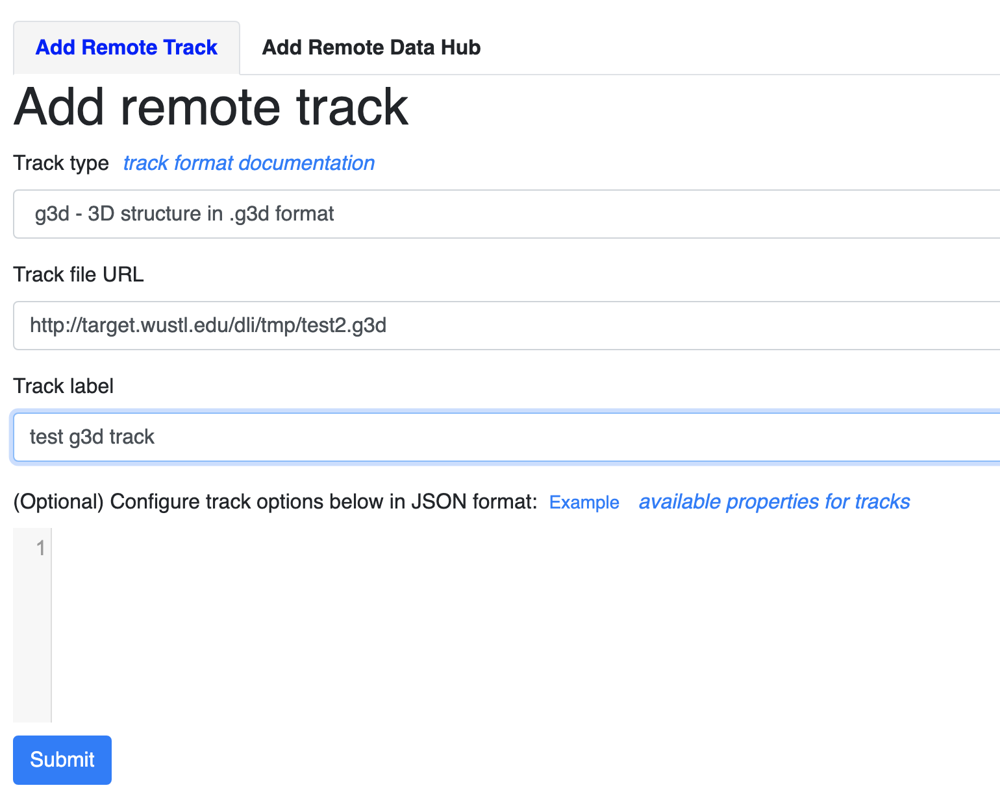

click the `Submit` button, close the Remote track panel, this is how it looks like with default view:

.. image:: _static/g3d_2.png

By default the 3D viewer contains main and thumbnail viewer, if you zoom/rotate in one of them, both of them will be synchronized. Yellow highlighted region indicates browser region, change region in browser will also change the highlighted region in yellow.

.. note:: by default the model will spin after intially loaded, you can disable the spin in configuration menu. Please see the instructions in the sections below.

3D viewer menu
--------------

Clicking the |g3dmenu| button will open the configuration menu for the 3D visulization, which by default floats to the left of the screen, the menu is grouped to control the model data, layout, highlighting & labeling, painting, animation and export. Each group can be clicked to toggle expansion.

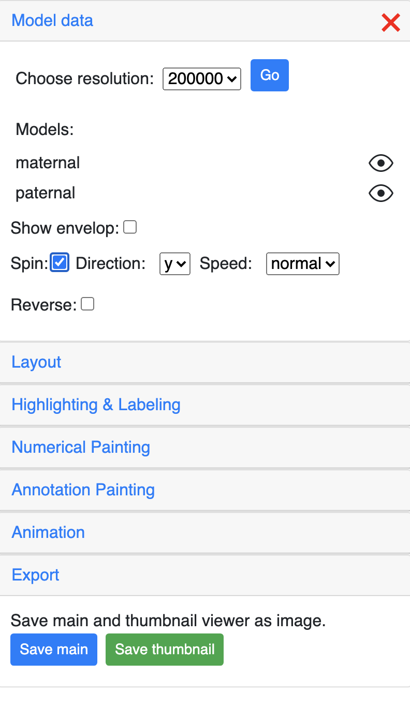

The menu icon position can also be adjusted using the dropdown menu on the 3D viewer:

Config 3D model data
--------------------

The `Model data` section can control the resolution of the g3d data. 

All the models in the g3d file will be listed here and can be displayed or hidden using the eye icon button. The example screenshot below indicates the `maternal` model is hidden by click the its eye icon:

Show nuclear envelop
~~~~~~~~~~~~~~~~~~~~

The 3d viewer uses an outer sphere to mimic the display of the nuclear envelop. Envelop can be configed to show or hide, color and opacity can also be customized.

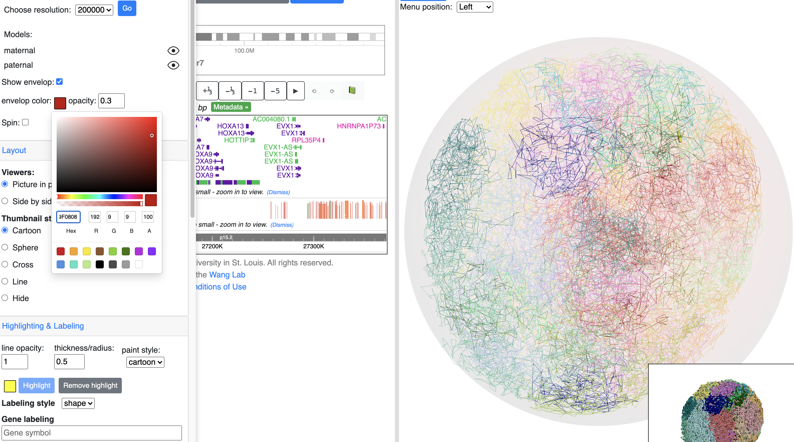

Config the spin of 3d model
~~~~~~~~~~~~~~~~~~~~~~~~~~~

The model will spin after intially load, the ``spin`` section can used to toggle the spin status, and control the direction, speed of the spin.

.. image:: _static/spin.gif

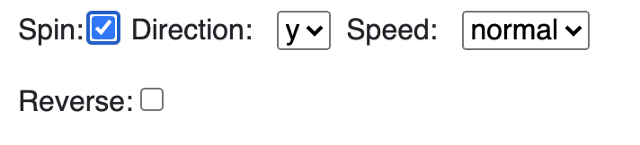

Config 3D viewer layout
-----------------------

The `Layout` section is used to control the layout of main and thumbnail viewer.

Change the view layout to `side by side`:

You can also change how the thumbnail structure looks like, for example, `sphere` style as below:

Highlighting & labeling
-----------------------

Toggle browser region highlighting
~~~~~~~~~~~~~~~~~~~~~~~~~~~~~~~~~~

By default the main viewer would highlight the structure part belongs to current browser region in yellow, the `Highlighting` section is used to control this behaviour, click the `Remove highlight` will turn off the highlighting.

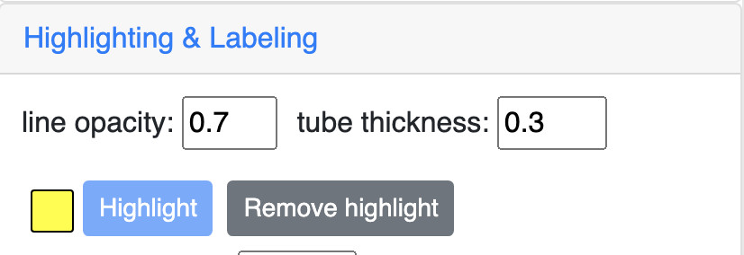

This is how it looks like when the highlighting is turned off:

Customize highlighting
~~~~~~~~~~~~~~~~~~~~~~

Highlighting color and tube thickness can be customized to get a different viewer. As shown below, we changed the color to purple and thickness to 1:

and this is the updated and view:

Labeling by gene
~~~~~~~~~~~~~~~~

Gene symbol can be searched for labeling, start with search any gene symbol, the menu will auto complete the search based on users' input.

.. image:: _static/g3d_33.png

choose the isoform wanted:

the gene will be added as a new label in the label list:

and shown in 3D view:

update the display style of the label:

updated view of the label:

Labeling by region
~~~~~~~~~~~~~~~~~~

User can also manully type a region for highlighting:

the added label by region search by also be updated in the menu control:

the view after added region label:

.. image:: _static/g3d_41.png

Upload a file for labeling
~~~~~~~~~~~~~~~~~~~~~~~~~~

A text file contains list of regions/gene symbols can also be uploaded for batch labeling, as shown below, the text file contains content::

    CYP4A22
    chr10:96796528-96829254
    CYP2A6
    CYP3A4
    chr1:47223509-47276522
    CYP1A2

upload this file:

regions in the file are all labeled:

Pointing using arrows
~~~~~~~~~~~~~~~~~~~~~

instead of using shapes for labels, arrows can also be used to pointing the region desired. Choose label style as arrow:

use either gene search or region labeling:

the new added label will be displayed under arrow list:

and displayed in 3d viewer:

config the style of arrow:

updated arrow style in the viewer:

Interactivity on 3D model
-------------------------

Click on the segments of 3D model will bring up the menu to interact with the Browser:

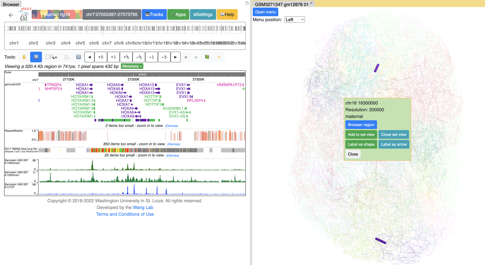

Click ``Browser region`` button will let the browser jump to the region of this segment:

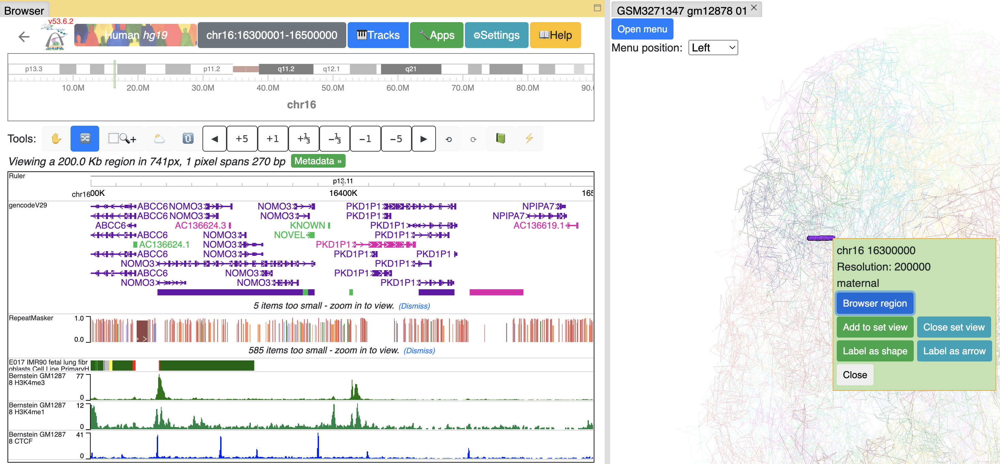

or you can add this segment to current browser reigon by click ``Add to set view`` button, the browser will enter Region set view mode:

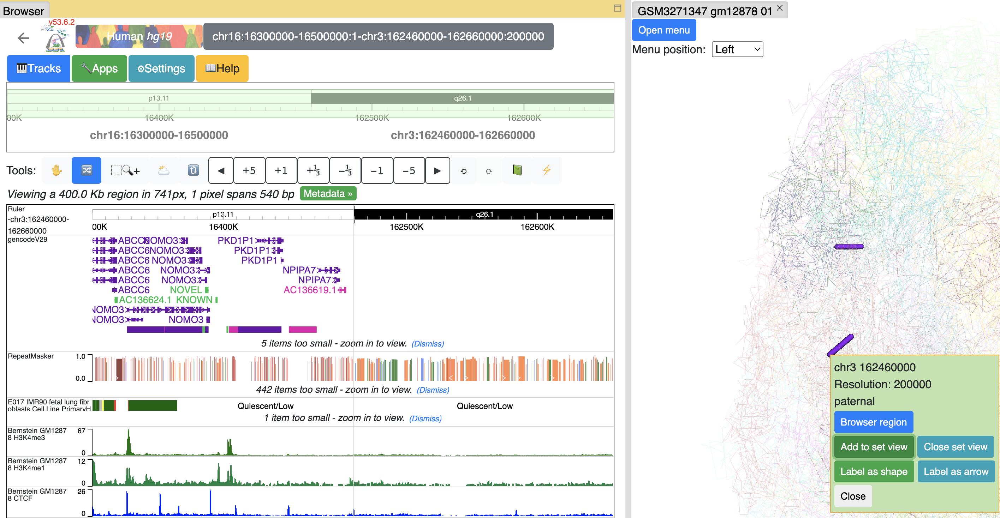

you can keep adding as many segments as you want. Click ``Close set view`` button to restore to the default view.

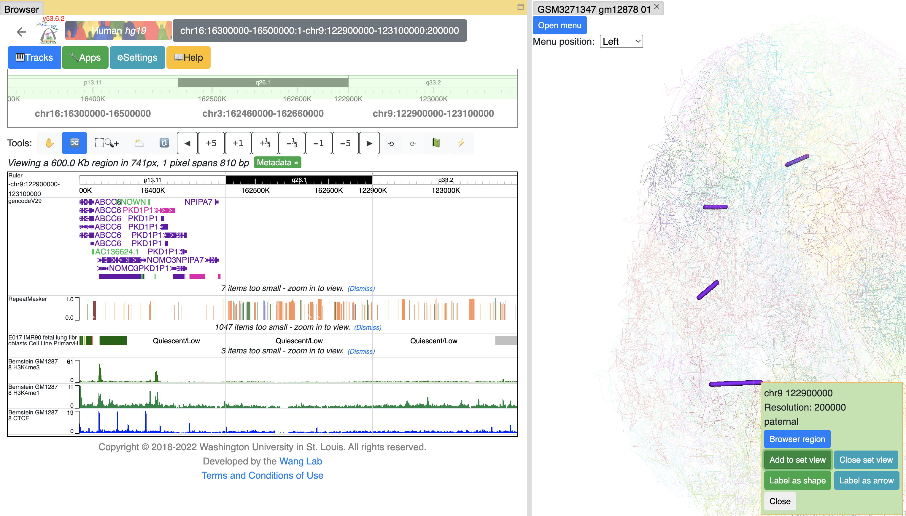

Interactivity on tracks
-----------------------

From certain track types like gene and HiC track, users can choose to display gene or HiC anchors on 3D structure directly. As shown below, the tooltip of the gene has ``Show in 3D`` button, click it will add this gene to the label list and highlight it in 3D view:

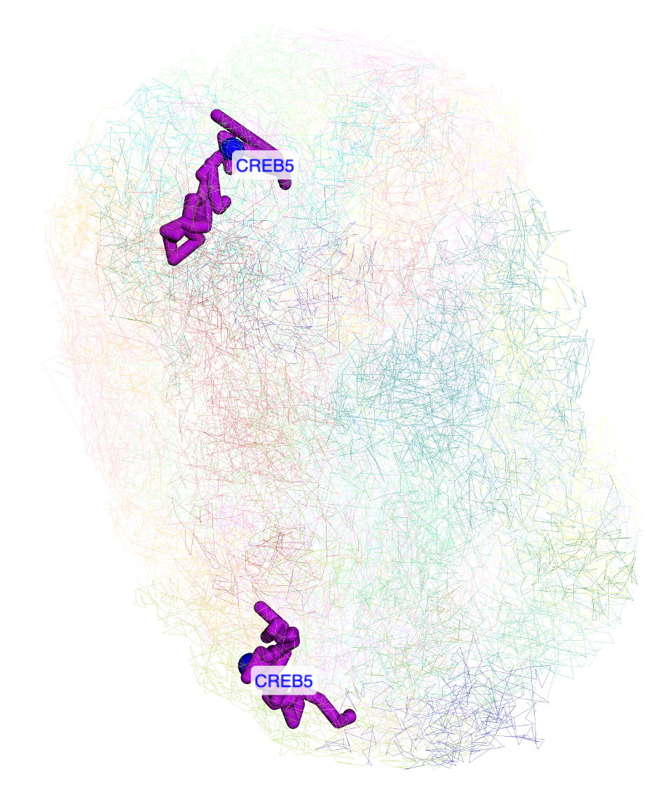

Clicking any dimond on a HiC track will also bring the ``Show in 3D`` button, click it will add both anchors of this contact to the arrow list by default:

arrows pointing both anchors will be displayed in 3D view (there are 2 models in this structure, patenal and maternal, so 4 arrows displayed here): 

Numerical painting
------------------

Numerical painting with bigwig data
~~~~~~~~~~~~~~~~~~~~~~~~~~~~~~~~~~~

The numerical track in ``bigWig`` format can be used to paint the 3D structure. The `Use loaded tracks` check menu allows user to load either loaded bigWig tracks in browser or submit another bigWig track with file URL.

If uncheck `Use loaded tracks`, a URL input will be provided for bigWig URL input:

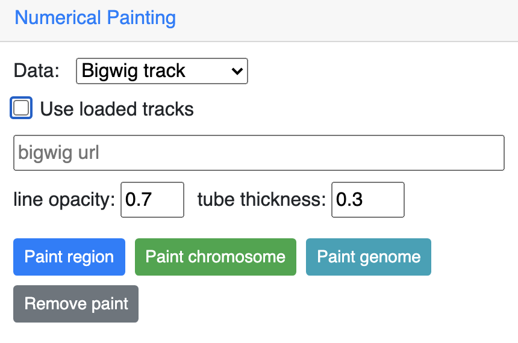

Here we are using the GC percentage data of `hg38` genome as example, add the `GC Percent` track from `Annotation Tracks`:

The GC Percent track is added:

Choose the track from the dropdown menu:

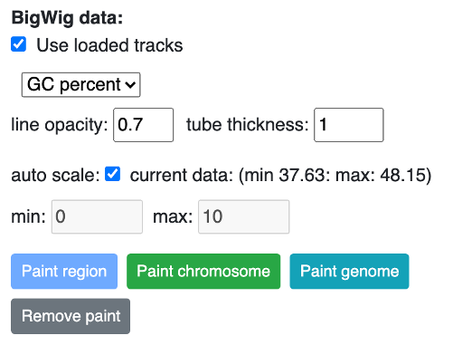

Click `Paint region` button:

you can also paint the whole chromosome by click the `Paint chromosome` button:

Click the color box on the color legend will bring a color palette for choosing colors:

Choose a different color will rerender the structure with color chosen:

Paint the whole genome is also doable, click the `Paint genome` button:

.. note:: by default the color gradient uses the min and max values from the bigwig file, users can also set the min and max value manually by unchecking the ``auto scale`` option.

Click the `Remove paint` button will remove the painting.

Numerical painting with gene expression data
~~~~~~~~~~~~~~~~~~~~~~~~~~~~~~~~~~~~~~~~~~~~

For painting with gene expression data, the data need be organized in the following format::

    chr3	168903366	168921996	ENSG00000242268.2	2.40146671319
    chr18	46756487	46764408	ENSG00000270112.3	0.0287250976522
    chr3	11900011	11901245	ENSG00000225275.4	0.0
    chr15	41921417	41928883	ENSG00000259883.1	0.305029986379
    chr13	98949719	98950447	ENSG00000231981.3	0.0806509326125
    chrX	152682810	152683842	ENSG00000269475.2	0.0
    chr12	44880868	44880969	ENSG00000201788.1	0.0
    chr17	57092145	57096425	ENSG00000263089.1	0.295277363304

This is a 5 column bed format file, each column is chromosome, start, end, gene id or symbol, gene expression value (can be FPKM, RPKM or whatever types of value you want to plot).

Choose `Gene expression` from the dropdown menu, then upload your file, click one the paint button.

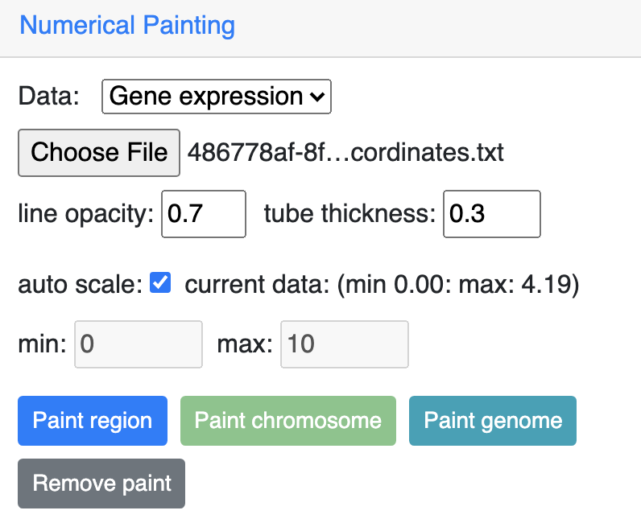

And this is the view after painting with the expresion data, color and scale can be customized as described before:

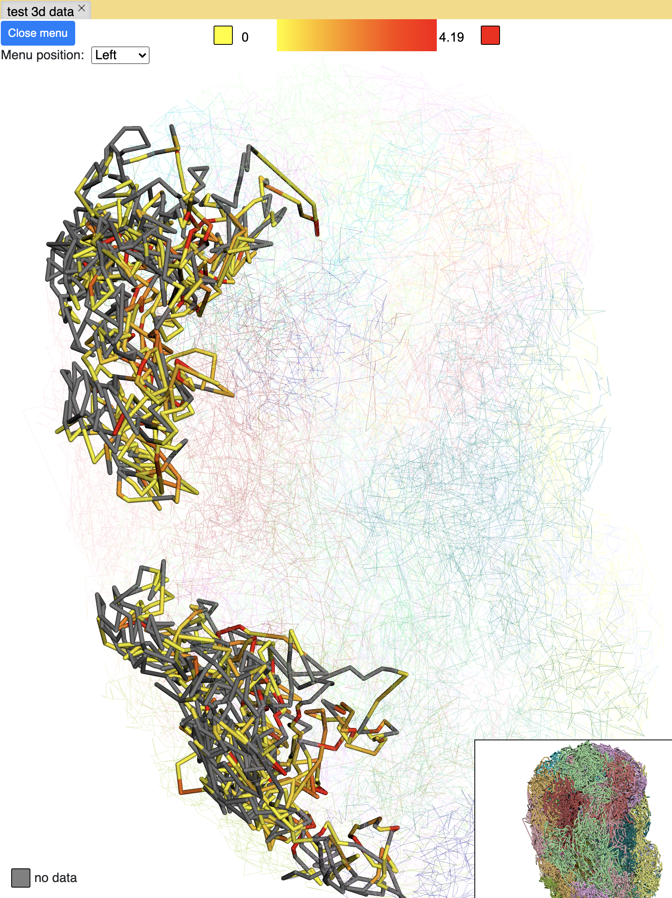

Annotation painting
-------------------

Supported file formats for 3D annotation painting
~~~~~~~~~~~~~~~~~~~~~~~~~~~~~~~~~~~~~~~~~~~~~~~~~

cytoband
^^^^^^^^

For `cytoband` there is no need to upload a file, the cytoband data will be read from current loaded genome data.

refGene
^^^^^^^

The standard `refGene` format from UCSC can be used for painting gene positions on 3D::

    2085	NR_046630	chr3	+	196666747	196669405	196669405	196669405	3	196666747,196667841,196669263,	196666995,196668013,196669405,	0	NCBP2-AS1	unk	unk	-1,-1,-1,
    2051	NR_046598	chr3	+	192232810	192234362	192234362	192234362	2	192232810,192234269,	192233297,192234362,	0	FGF12-AS2	unk	unk	-1,-1,
    1312	NR_046514	chr13	+	95364969	95368199	95368199	95368199	2	95364969,95365891,	95365647,95368199,	0	SOX21-AS1	unk	unk	-1,-1,
    585	NR_106918	chr1	-	17368	17436	17436	17436	1	17368,	17436,	0	MIR6859-1	unk	unk	-1,
    585	NR_107062	chr1	-	17368	17436	17436	17436	1	17368,	17436,	0	MIR6859-2	unk	unk	-1,

bed 9 columns
^^^^^^^^^^^^^

bed file with 9th column as RGB values can be used as well, for example, the chromHMM from Roadmap project looks like::

    chr10	0	94800	15_Quies	0	.	0	94800	255,255,255
    chr10	94800	95600	9_Het	0	.	94800	95600	138,145,208
    chr10	95600	102200	15_Quies	0	.	95600	102200	255,255,255
    chr10	102200	104400	9_Het	0	.	102200	104400	138,145,208
    chr10	104400	110000	15_Quies	0	.	104400	110000	255,255,255
    chr10	110000	111200	9_Het	0	.	110000	111200	138,145,208

bed 4 columns
^^^^^^^^^^^^^

To make things simple, a 4 column bed format is supported as well, with the 4th column has color value::

    chr11	108280000	109080000	#ff0100
    chr11	109080000	109480000	#0000ff
    chr11	109720000	110160000	#018100
    chr11	110200000	111400000	#0064fb
    chr11	111400000	112640000	#ef8c0a
    chr11	112640000	113480000	#7f007f
    chr11	113520000	114520000	#520000
    chr11	114520000	114880000	#39ae00

4DN compartment data
^^^^^^^^^^^^^^^^^^^^

Compartment calls table file can also be used to paint the 3D structure. We supported the compartment calls data `4DNFIL65C8ZI <https://data.4dnucleome.org/files-processed/4DNFIL65C8ZI/>`_ from 4DN data portal. The file is pretty small about 1MB in size. The file can either in raw text file (`example text <https://wangftp.wustl.edu/~dli/tmp/4DNFIL65C8ZI_copy.txt>`_) or in compressed gzip format `example gzipped text <https://wangftp.wustl.edu/~dli/tmp/4DNFIL65C8ZI.txt.gz>`_ for upload.

The 4DN compartment data looks like::

    chrom	start	end	gene_count	gene_coverage	E1	E2	E3
    chr1	0	100000	595	0.8812700000000001			
    chr1	100000	200000	952	1.0			
    chr1	200000	300000	159	0.09797			
    chr1	300000	400000	132	0.05368			
    chr1	400000	500000	471	0.24454			
    chr1	500000	600000	390	0.15467999999999998			
    chr1	600000	700000	229	0.05782999999999999	

Rao et.al compartment data
^^^^^^^^^^^^^^^^^^^^^^^^^^

The paper from Rao et.al published in Cell in 2014 also containes a compartment format, the format looks like below::

    chr19	0	200000	NA	0	.	0	200000	255,255,255
    chr19	200000	500000	B1	-1	.	200000	500000	220,20,60
    chr19	500000	3800000	A1	2	.	500000	3800000	34,139,34
    chr19	3800000	3900000	B1	-1	.	3800000	3900000	220,20,60
    chr19	3900000	5000000	A1	2	.	3900000	5000000	34,139,34
    chr19	5000000	5600000	B1	-1	.	5000000	5600000	220,20,60

.. important:: The uploaded file for annotation painting can be raw text file or compressed with gzip, but `NOT` with bgzip.

Example annotation painting
~~~~~~~~~~~~~~~~~~~~~~~~~~~

Choose the format of your data be used to painting from the dropdown menu:

.. image:: _static/g3d_23.png

Then click one the paint button, the upload file button will appear if the format is not cytoband.

cytoband painting
^^^^^^^^^^^^^^^^^

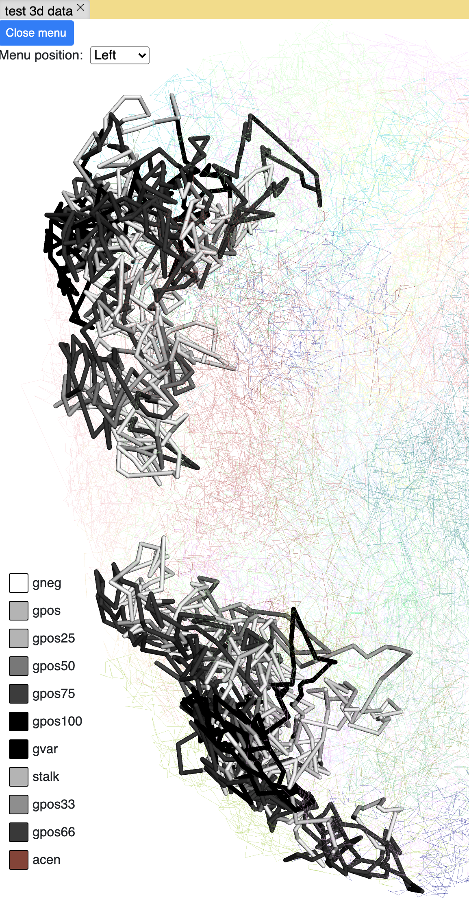

4DN compartment painting
^^^^^^^^^^^^^^^^^^^^^^^^

The screenshot below is an example using the compartment calls table mentioned above to paint the whole chromosome, green part indicates compartment A and red part indicates compartment B, color can also be customized. The operations are similar to numerical painting, and the painting can also be removed with provided button.

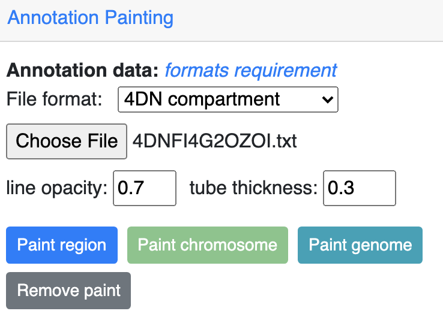

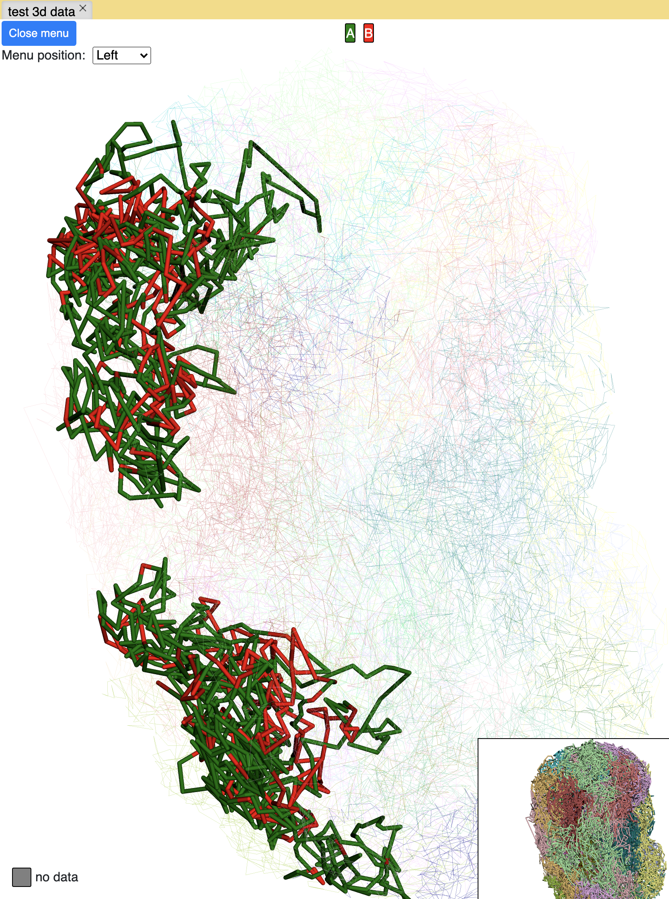

chromHMM painting
^^^^^^^^^^^^^^^^^

The screenshot below is an example using the chromHMM data from Roadmap to paint the whole chromosome.

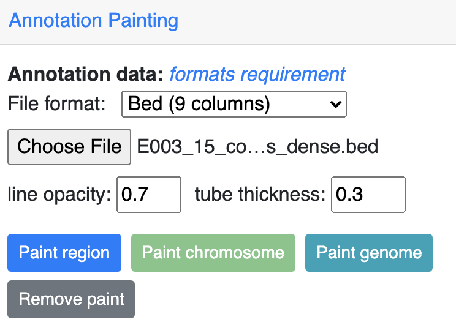

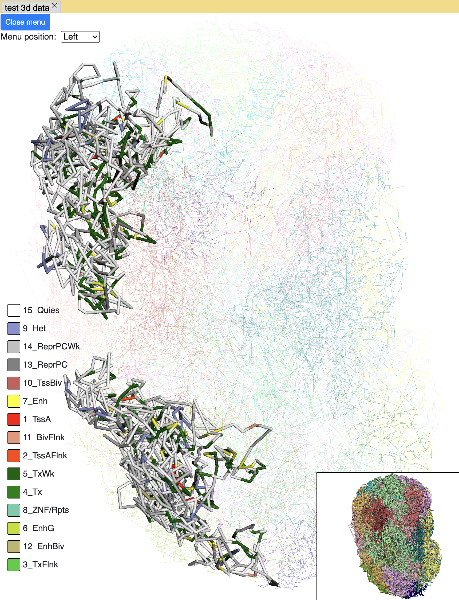

Animations on 3D
----------------

``g3d`` format is designed to be a container file format, it might contain multiple models from haplotypes or different cells/samples, each model may also contain data at different resolution. `This example file <http://target.wustl.edu/dli/tmp/hic-sync-3d/gm12878_cell1-3-5.g3d>`_ contains 3D structure data from 3 different cell at different resolutions. When there are multiple models available, the 3D viewer can play animation while each model will be displayed as a frame and loop over every model. Add this example as g3d track, this is how it looks like:

in the `Animation` section, click the `Play` button the animation will start, `Stop` will stop the animation, and `Reset` will reset the viewer to default view style.

Please check the animation below (speed was adjusted to reduce animation file size for documentation): 

Sync 3D structure with dynamic hic
~~~~~~~~~~~~~~~~~~~~~~~~~~~~~~~~~~

Since the browser have both dynamic hic track type and animation over 3D structures, there is a way to sync the animation between dynamic hic track and 3D structure. The `Sync dynamic HiC` button enables animation synchronization between dynamic hic and models in 3D structure. Please see the animation below for example:

Export 3D images
----------------

The 3D viewer can export current view as image in png format for download. Simplely click the buttons under `Export` section, users can download the image in main and thumbnail viewer.

