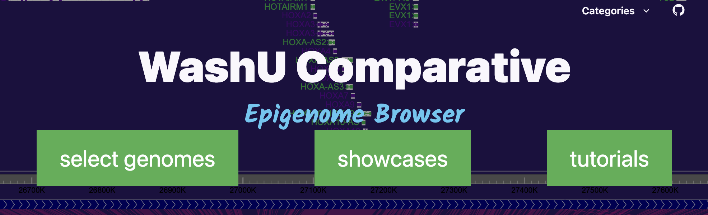
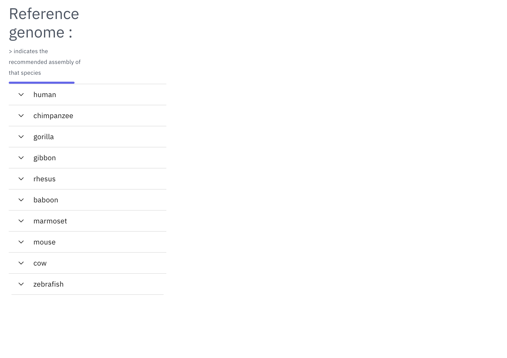
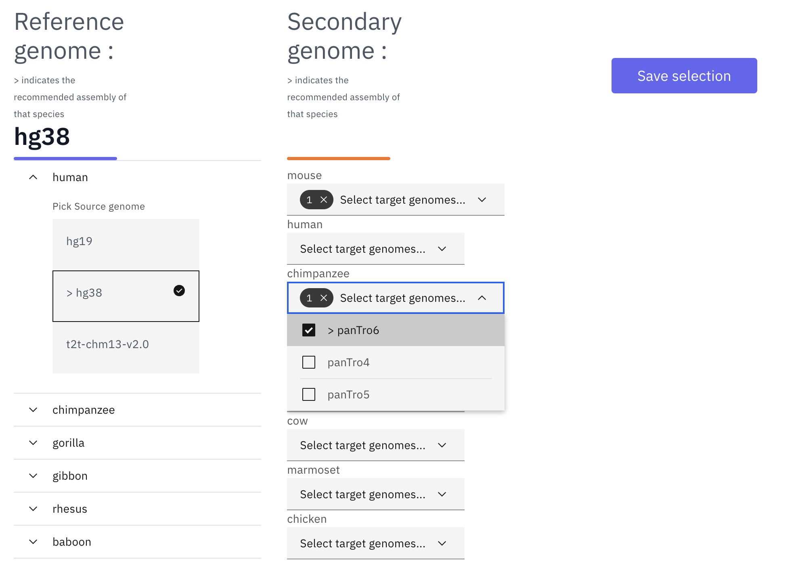
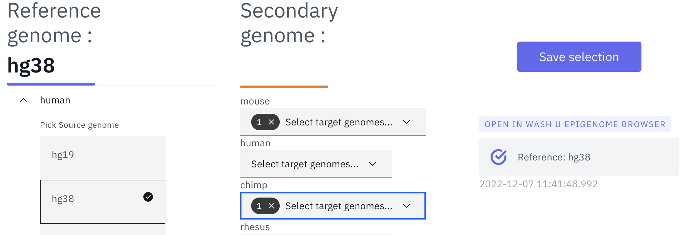
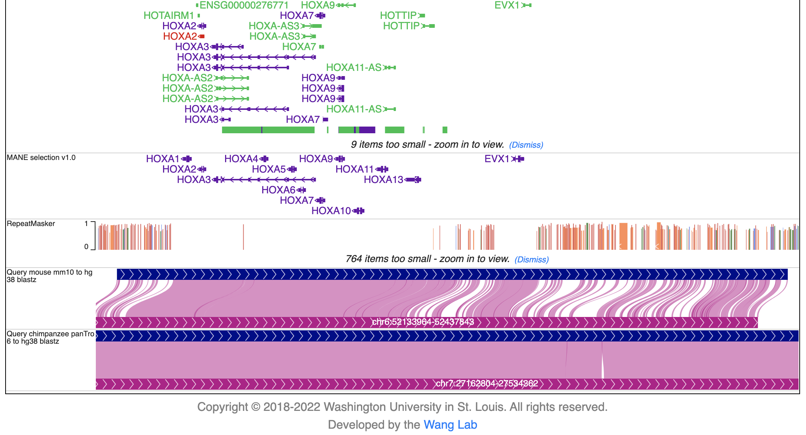
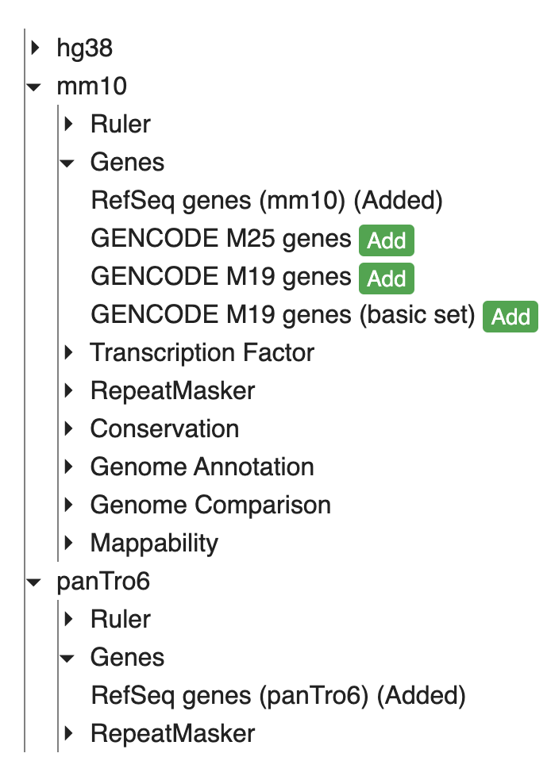
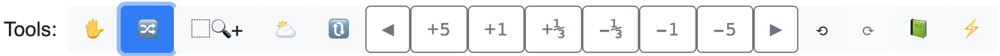
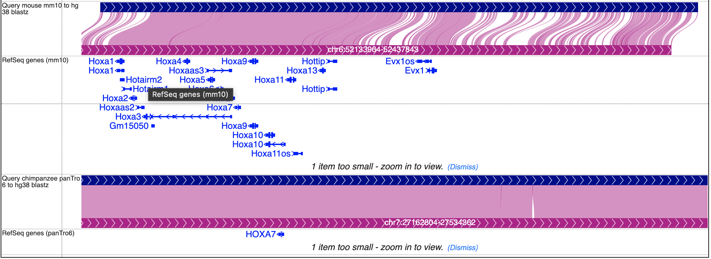

Comparative Browser
===================

Landing page
------------

The WashU Comparative Epigenome Browser is available at http://comparativegateway.wustl.edu/. Users can easily select multiple available species using the interface.

* Click "select genomes" on the page to start selecting species:

Select Reference genome and secondary genomes
---------------------------------------------

Species selection tool allows users to select multiple species.

* The WashU Comparative Epigenome Browser requires a reference genome, which all the other genomes will be compared to. Available assemblies can be found in the dropdown menu:

* After selecting the reference genome, users can select secondary genomes available to the reference genome. In the following example, hg38 is the reference genome, mm10 and panTro6 are selected as secondary genomes:

* With all the desired genomes selected, click "save selection" and a temporary datahub will be generated. Once it is ready, click the datahub link under "OPEN IN WASH U EPIGENOME BROWSER" and a new browser view will be opened in a new tab:

Organizing tracks on the WashU Epigenome Browser
------------------------------------------------

With the new browser tab launched, it only contains basic annotation tracks of the reference genome and the selected genome-align tracks that connects to the secondary genomes. In the example, hg38-mm10 and hg38-panTro6 genome-align tracks are attached to the hg38 reference genome tracks:

To add annotations to the secondary genomes, click "Tracks" -> "Annotation tracks", all the available annotation tracks will be listed in a dropdown menu. Click the checkbox to add the track to the browser view:

Here we added Refseq gene annotations for both mm10 and panTro6, and both gene annotation tracks will be added to the bottom of the browser view.

To change the order of the tracks, click the "Reorder tool" icon on the tools menu:

Now drag the tracks up and down to the desired position, as shown here:

