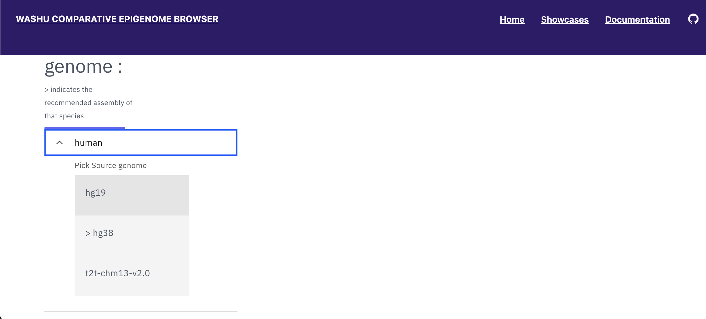
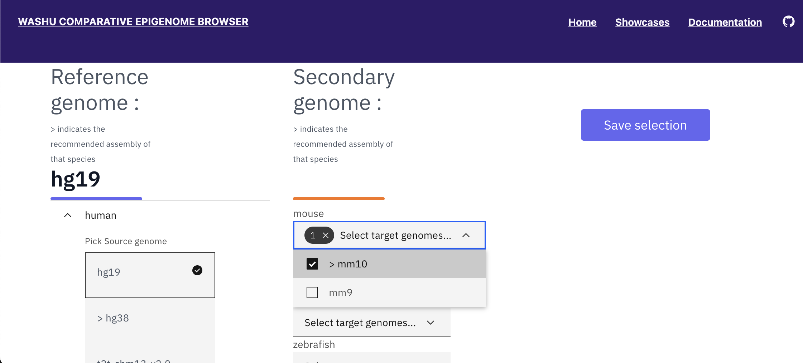
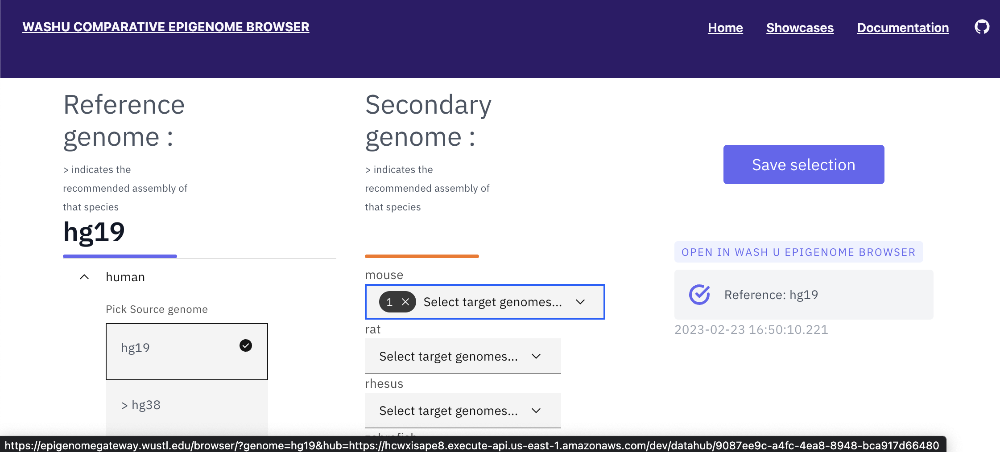
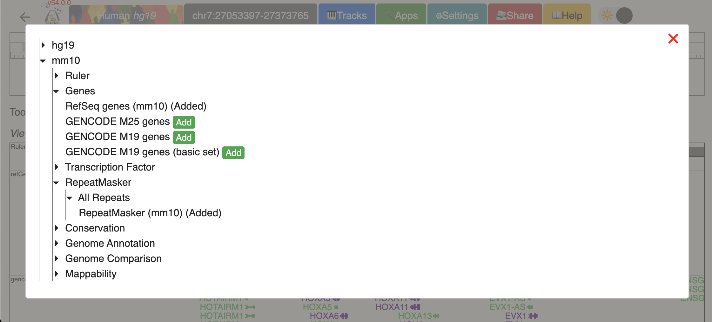
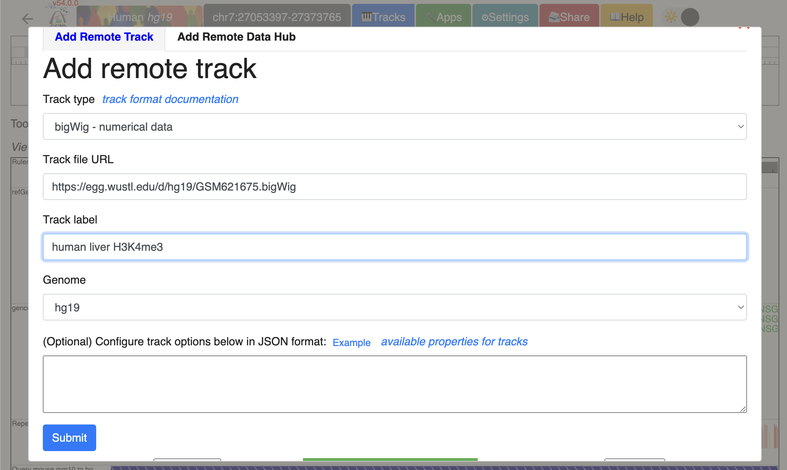
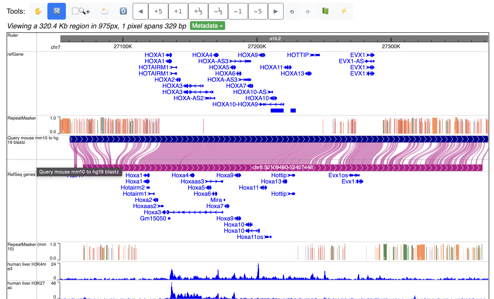
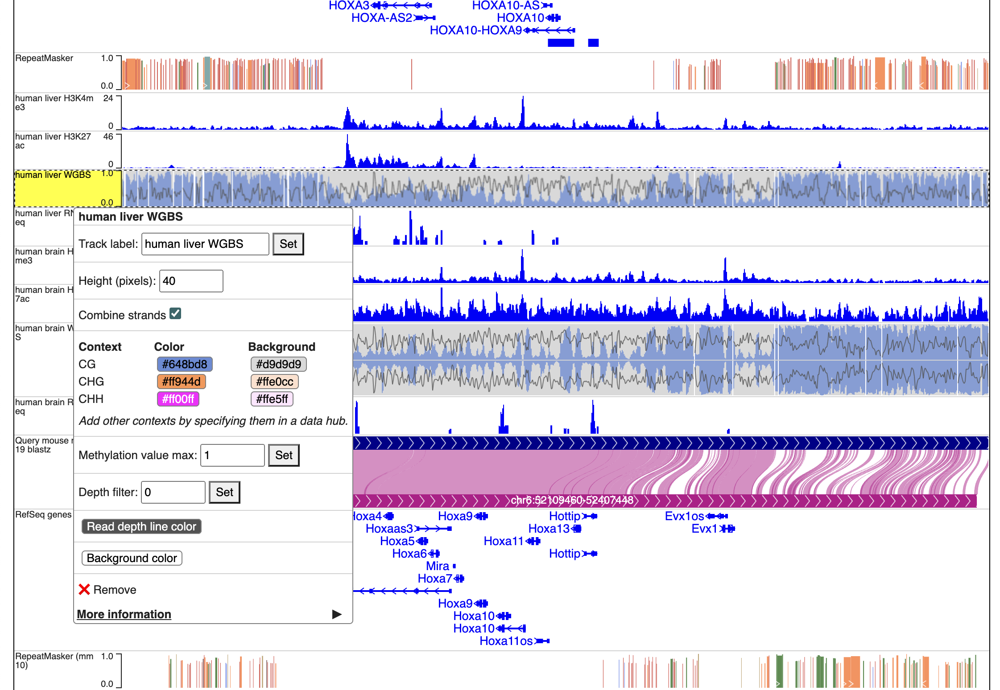
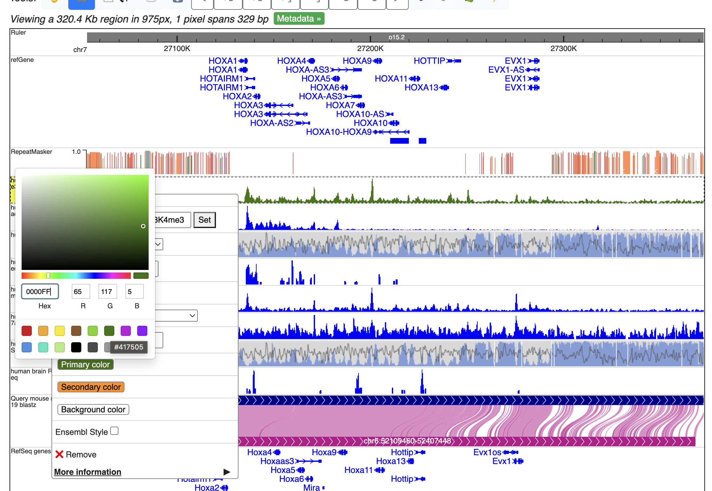
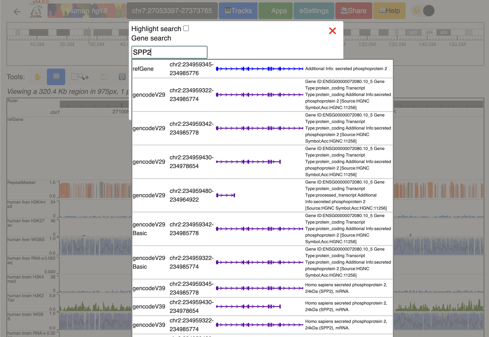
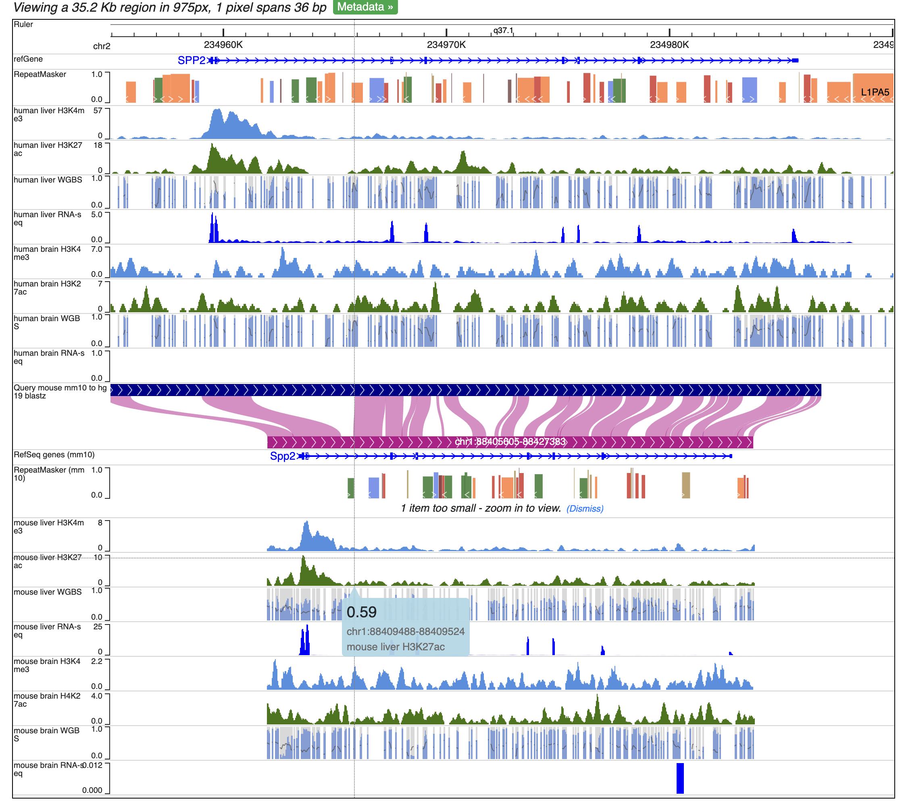

The Comparative Epigenome Browser
=================================

Landing page
------------

The WashU Comparative Epigenome Browser is a valuable resource for scientists studying comparative genomics and epigenomics.
The browser is available at http://comparativegateway.wustl.edu/. It allows users to easily select and compare multiple assemblies from different species.

* Click “select genomes” on the page to begin. A few examples are available as “showcases”, and video tutorials are available on the “tutorials” page:

.. image:: _static/comparative/home.png

Select a reference genome and one or more secondary genomes
-----------------------------------------------------------

After clicking "select genomes", the species selection tool will become available for users to choose a reference genome. Next, users can select one or multiple species to compare to the reference. 
For species with multiple assemblies available, we marked one assembly with a ">" as the recommended assembly based on genome completeness and genome-alignment availability.

* The WashU Comparative Epigenome Browser uses a selected reference genome to compare other genomes. Available assemblies can be found in the dropdown menu:

.. image:: _static/comparative/widget_1.png

* After selecting the reference genome, users can select available secondary genome(s). In the following example, after selecting hg38 as the reference genome, both mm10 and panTro6 are selected as secondary genomes:

* With all the desired genomes selected, click “save selection” and a temporary datahub link will be generated. Once it is ready, click the datahub link under “OPEN IN WASHU EPIGENOME BROWSER” and a new browser view will be opened in a new tab:

.. image:: _static/comparative/widget_3.png

Organizing tracks on the WashU Epigenome Browser
------------------------------------------------

The new browser tab contains basic annotation tracks of the reference genome and the selected genome-align tracks that connects the syntenic regions from the reference genome to the secondary genomes.
In the example, hg38-mm10 and hg38-panTro6 genome-align tracks are attached to the hg38 reference genome tracks:

.. image:: _static/comparative/view_1.png

To add annotations to the secondary genomes, click “Tracks” -> “Annotation tracks” and the available annotation tracks will be listed in a dropdown menu. Click the checkbox to add a particular track to the browser view:

Here, we added Refseq gene annotations for both mm10 and panTro6, and both gene annotation tracks will be added to the bottom of the browser view.
To change the order of the tracks, click the “Reorder tool” icon on the tools menu:

.. image:: _static/comparative/tool.png

Now drag the tracks up and down to the desired position, as shown here:

Add data tracks to the Comparative Epigenome Browser
----------------------------------------------------

Add new tracks to the Comparative Epigenome Browser
~~~~~~~~~~~~~~~~~~~~~~~~~~~~~~~~~~~~~~~~~~~~~~~~~~~

With genome-align track loaded, we can start loading additional data tracks onto it and perform analysis.
Here, we have human genome hg38 as the reference genome, mouse mm10 as the secondary genome. We also have gene and repeat annotations mapped to both genomes:

.. image:: _static/comparative/1_Start.png

Now, we can start loading our data. We can load our data from the local file system or from a URL.
Let’s start by loading our data from the URL. Click Tracks -> remote Tracks:
We are using a human liver RNA-seq data from ENCODE (https://www.encodeproject.org/files/ENCFF861FSP/@@download/ENCFF861FSP.bigWig) in the demo.
We will specify the “Track type” as “bigWig”, enter the URL in the “Track file URL” entry, name the track using “Track label” entry, and select “hg38" as the assembly to map to.

Next, let’s load our data from the local file system. Click Tracks -> Local Tracks:
The track file is downloaded from ENCODE (https://www.encodeproject.org/files/ENCFF798FMB/@@download/ENCFF798FMB.bigWig) and renamed MouseLiverRNA-seq.bigWig.
We will choose “bigWig” as the track file type, and choose “mm10" as the assembly it will map to. Click “Choose Files” to select the file.

.. image:: _static/comparative/3_AddLocalTrack.png

Now, we have liver RNA-seq data from both human and mouse, mapped to hg38 and mm10 respectively, loaded at the bottom of the window ready to compare:

.. image:: _static/comparative/4_allTracks.png

Organizing all the tracks in the browser
~~~~~~~~~~~~~~~~~~~~~~~~~~~~~~~~~~~~~~~~

To better compare the data, we can reorder the tracks. Here, we will group the tracks by species and have them separated by the genome-align track.
Click the “Reorder tool”, and drag the “Human liver RNA-seq” track above the genome-align track:

After reordering, the human track is between the human repeatMasker track and the hg38-mm10 genome-align track:

Navigation in the browser
~~~~~~~~~~~~~~~~~~~~~~~~~

The browser allows navigation in the reference genome using either gene name, SNP, or coordinates directly. Click the coordinates box at the top to enter the navigation window. Let’s navigate to the gene “SPP2":

.. image:: _static/comparative/7_Navigation.png

The browser window should display the entirety of SPP2 gene spanning the whole width of the browser window now:

.. image:: _static/comparative/8_Spp2Gene.png

Using tools to zoom in and out
~~~~~~~~~~~~~~~~~~~~~~~~~~~~~~

We built a “tools” bar at the top of the browser window to allow users to perform some basic operations within the browser. There are different buttons to zoom in or out with different resolutions or pan left/right. For example, to zoom out one time, click the “-1" button:

It is possible to zoom into a selected region using the “Zoom-in tool”. Click the “Zoom-in tool”, then click and drag over the region you want to zoom to:

To zoom into the SPP2 gene’s promoter region, click and drag over the regions that covers the promoter and the first extron of SPP2:

.. image:: _static/comparative/11_ZoominDrag.png

Now, the browser displays the comparison between human SPP2 gene’s promoter region with the orthologous Spp2 gene promoter in mouse, with gene annotation, repeat annotation and liver RNA-seq data tracks from both species mapped to the hg38 and mm10, respectively:

.. image:: _static/comparative/12_Promoter.png

Example: create a human-mouse multiple tracks comparison view using the Comparative Epigenome Browser
------------------------------------------------------------------------------------------------------

Here we will create a human-mouse multiple tracks comparison view using the Comparative Epigenome Browser. We will use remote tracks to add the following data tracks to the browser and recreate the browser view for Figure 3b from the paper (https://www.biorxiv.org/content/10.1101/2022.11.29.518374v1):

Select assemblies and annotations
~~~~~~~~~~~~~~~~~~~~~~~~~~~~~~~~~

Click "select genomes", the species selection tool will become available for users to choose a reference genome. Select human, hg19. 

With hg19 selected as the reference genome, available secondary genomes will be available. Select mouse, mm10.

Click “Save selection”, and click the datahub link under “OPEN IN WASHU EPIGENOME BROWSER” to open a the browser window in a new browser tab.

Click "Tracks" -> "Annotation Tracks", and add "mm10":"Genes":"RefSeq genes" and "mm10":"RepeatMasker":"All Repeats":"RepeatMasker" tracks to the browser window.

Add Epigenomic data tracks to the comparative epigenome browser window.
~~~~~~~~~~~~~~~~~~~~~~~~~~~~~~~~~~~~~~~~~~~~~~~~~~~~~~~~~~~~~~~~~~~~~~

We collected the following epigenomic dataset from ENCODE and roadmap projects:

human liver H3K4me3 ChIP-seq bigwig file mapped on hg19:
https://egg.wustl.edu/d/hg19/GSM621675.bigWig

human liver H3K27ac ChIP-seq bigwig file mapped on hg19:
https://egg.wustl.edu/d/hg19/GSM1112809_1.bigWig

human liver WGBS methylC track file mapped on hg19:
https://remc.wustl.edu/dli/WGBS/E066.methylc2.gz

human liver RNA-seq bigwig file mapped on hg19:
https://www.encodeproject.org/files/ENCFF975NSG/@@download/ENCFF975NSG.bigWig

human brain H3K4me3 ChIP-seq bigwig file mapped on hg19:
https://egg.wustl.edu/d/hg19/GSM773012.bigWig

human brain H3K27ac ChIP-seq bigwig file mapped on hg19:
https://egg.wustl.edu/d/hg19/GSM773015.bigWig

human brain WGBS methylC track file mapped on hg19:
https://remc.wustl.edu/dli/WGBS/E071.methylc2.gz

human brain RNA-seq bigwig file mapped on hg19:
https://www.encodeproject.org/files/ENCFF386BQW/@@download/ENCFF386BQW.bigWig

mouse liver H3K4me3 ChIP-seq bigwig file mapped on mm10:
https://epgg-test.wustl.edu/d/mm10/ENCFF072QFI.bigWig

mouse liver H3K27ac ChIP-seq bigwig file mapped on mm10:
https://epgg-test.wustl.edu/d/mm10/ENCFF041ONG.bigWig

mouse liver WGBS methylC track file mapped on mm10:
https://vizhub.wustl.edu/public/comparativeBrowser/tracks/mouseAdultLiver.sort.methylC.gz

mouse liver RNA-seq bigwig file mapped on mm10:
https://epgg-test.wustl.edu/d/mm10/ENCFF697PQZ.bigWig

mouse brain H3K4me3 ChIP-seq bigwig file mapped on mm10:
https://epgg-test.wustl.edu/d/mm10/ENCFF389PES.bigWig

mouse brain H3K27ac ChIP-seq bigwig file mapped on mm10:
https://epgg-test.wustl.edu/d/mm10/ENCFF269ZNW.bigWig

mouse brain WGBS methylC track file mapped on mm10:
https://vizhub.wustl.edu/public/comparativeBrowser/tracks/mouseForebrain.sort.methylC.gz

mouse brain RNA-seq bigwig file mapped on mm10:
https://epgg-test.wustl.edu/d/mm10/ENCFF368ACN.bigWig

Use the "Tracks" -> "Remote tracks" function to add them one by one to the Browser window.
Using human liver H3K4me3 ChIP-seq bigwig file as an example:

Repeat the process to load all the tracks from the list above.
With All tracks added, Click "Reorder tool" in the tools bar, and drag tracks up and down to order all the tracks by genomes and tissue.

If only CpG methylation were characterized, we can also check "Combine strands" to merge both strands in all the methylC tracks. 

We can then change the peak display color by right click each track, and change the primary color.

Click genome coordinates on the top and navigate to any gene or coordinates. Here we are navigating to gene SPP2.

Zoom out 1/3 times, and we can see the whole SPP2 gene with all the data tracks marked by different colors.

