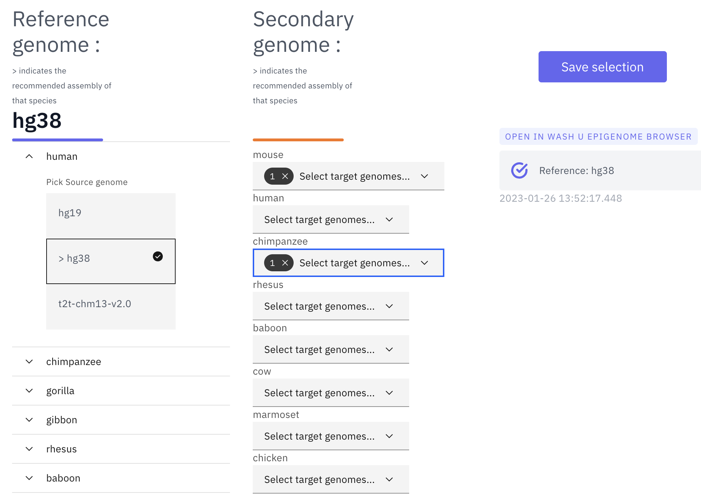

The Comparative Epigenome Browser
=================================

Landing page
------------

The WashU Comparative Epigenome Browser is a valuable resource for scientists studying comparative genomics and epigenomics. 
The browser is available at http://comparativegateway.wustl.edu/ and allows users to easily select and compare multiple assemblies from different species.

* Click "select genomes" on the page to start selecting species. A few examples are available as "showcases", and video tutorials are available on the "tutorials" page:

.. image:: _static/comparative/home.png

Select Reference genome and secondary genomes
---------------------------------------------

After clicking "select genomes", the species selection tool will become available. The recommended assembly is marked by ">". Users can now use it to select multiple species to compare with. 

* The WashU Comparative Epigenome Browser requires a reference genome, which all the other genomes will be compared to. Available assemblies can be found in the dropdown menu:

* After selecting the reference genome, users can select secondary genomes available to the reference genome. In the following example, after selecting hg38 and the reference genome, both mm10 and panTro6 are selected as secondary genomes:

.. image:: _static/comparative/widget_2.png

* With all the desired genomes selected, click "save selection" and a temporary datahub will be generated. Once it is ready, click the datahub link under "OPEN IN WASH U EPIGENOME BROWSER" and a new browser view will be opened in a new tab:

Organizing tracks on the WashU Epigenome Browser
------------------------------------------------

With the new browser tab launched, it only contains basic annotation tracks of the reference genome and the selected genome-align tracks that connects the syntenic regions from the reference genome to the secondary genomes.
In the example, hg38-mm10 and hg38-panTro6 genome-align tracks are attached to the hg38 reference genome tracks:

To add annotations to the secondary genomes, click "Tracks" -> "Annotation tracks", all the available annotation tracks will be listed in a dropdown menu. Click the checkbox to add the track to the browser view:

.. image:: _static/comparative/track.png

Here we added Refseq gene annotations for both mm10 and panTro6, and both gene annotation tracks will be added to the bottom of the browser view.

To change the order of the tracks, click the "Reorder tool" icon on the tools menu:

Now drag the tracks up and down to the desired position, as shown here:

.. image:: _static/comparative/view_2.png

Add data tracks to the Comparative Epigenome Browser
----------------------------------------------------

Add new tracks to the Comparative Epigenome Browser
~~~~~~~~~~~~~~~~~~~~~~~~~~~~~~~~~~~~~~~~~~~~~~~~~~~

With genome-align track loaded, we can start loading data tracks into it, and then we can start to perform some analysis.
Here we have human genome hg38 as the reference genome, mouse mm10 as the secondary genome. We also have gene and repeat annotations mapped to both genomes:

.. image:: _static/comparative/1_Start.png

Now we can start loading our data. We can load our data from the local file system, or we can load it from a URL.

Let's start loading our data from the URL. Please click Tracks -> remote Tracks:
We are using a human Liver RNA-seq data from ENCODE (https://www.encodeproject.org/files/ENCFF861FSP/@@download/ENCFF861FSP.bigWig) in the demo.
We will specify the "Track type" as "bigWig", enter the URL in the "Track file URL" entry, type "Human liver RNA-seq" into the "Track label" entry, and select "hg38" as the assembly to map to.

.. image:: _static/comparative/2_AddRemoteTrack.png

Next let's load our data from the local file system. Please click Tracks -> Local Tracks:
The track file is downloaded from ENCODE (https://www.encodeproject.org/files/ENCFF798FMB/@@download/ENCFF798FMB.bigWig) and renamed MouseLiverRNA-seq.bigWig.
We will choose "bigWig" as the track file type, and choose "mm10" as the assembly it will map to. Click "Choose Files" to select the file.

Now we have liver RNA-seq data from both human and mouse, mapped to hg38 and mm10 respectively, loaded at the bottom of the window ready to compare:

Organizing all the tracks in the browser
~~~~~~~~~~~~~~~~~~~~~~~~~~~~~~~~~~~~~~~~

To better compare the data, we can reorder the tracks. Here we will group the tracks by species and have them separated by the genome-align track.
Please click the "Reorder tool", and drag the "Human liver RNA-seq" track above the genome-align track:

.. image:: _static/comparative/5_Reorder.png

After reodering, the human track is between the human repeatMasker track and the hg38-mm10 genome-align track:

.. image:: _static/comparative/6_AfterReorder.png

Navigation in the browser
~~~~~~~~~~~~~~~~~~~~~~~~~

The browser allows navigation in the reference genome using either gene name, SNP, or coordinates directly. Please click the coordinates box on the top to enter the navigation window. Let's navigate to the gene "SPP2":

.. image:: _static/comparative/7_Navigation.png

The browser window should display the entirety of SPP2 gene spanning the whole width of the browser window now:

Using tools to zoom in and out
~~~~~~~~~~~~~~~~~~~~~~~~~~~~~~
We built a "tools" bar on the top of the browser window to allow users to perform some basic operations within the browser. There are different buttons to zoom in or out with different resolutions or pan left/right. To zoom out one time, click the "-1" button:

.. image:: _static/comparative/9_Zoomout.png

It is possible to zoom into a selected region using the "Zoom-in tool" button. Click it, and use the mouse to drag span a region to zoom in:

.. image:: _static/comparative/10_Zoomin.png

To zoom in into the SPP2 gene's promoter region, drag the mouse to select the region covers the promoter and the first extron of SPP2:

Now the browser displays the comparison between human SPP2 gene's promoter region with its orthologous Spp2 gene promoter in mouse, with gene annotation, repeat annotation and liver RNA-seq data tracks from both species mapped to the hg38 and mm10, respectively:

.. image:: _static/comparative/12_Promoter.png
