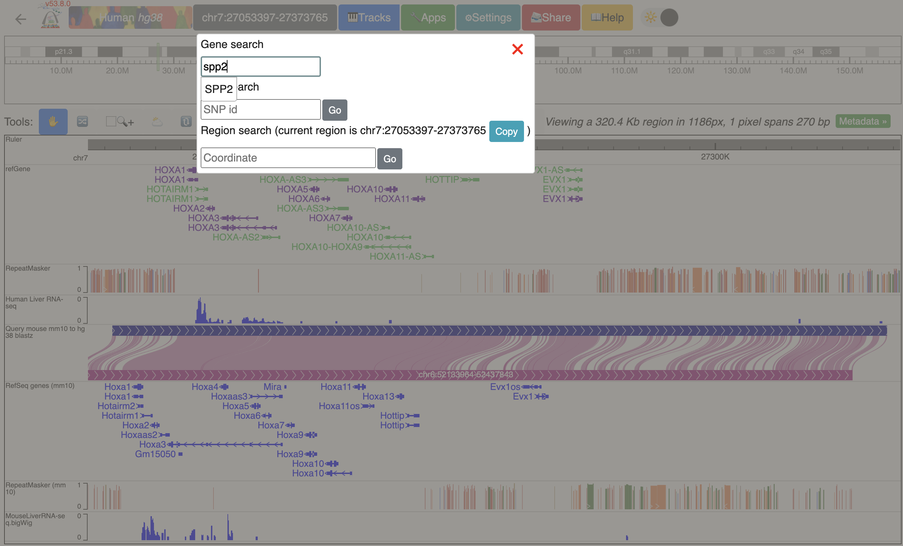
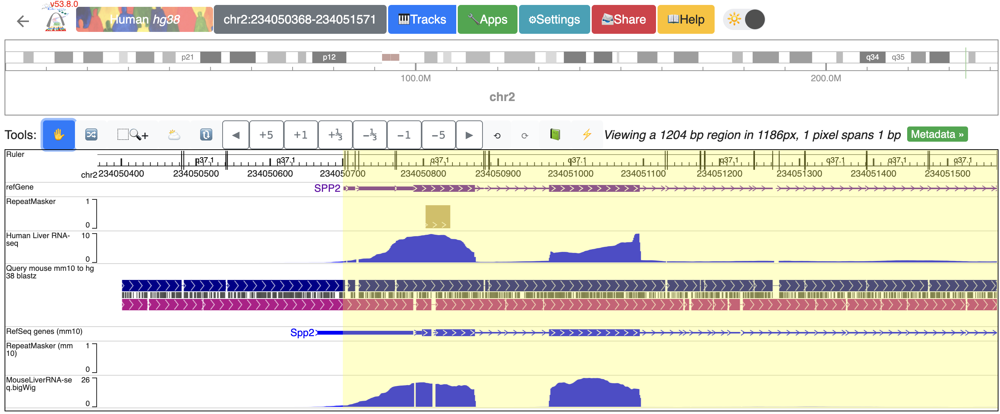

Add data tracks to the Comparative Epigenome Browser
====================================================

Add new tracks to the Comparative Epigenome Browser
---------------------------------------------------
With genome-align track loaded, we can start loading data into it, and then we can start to do some analysis.
Here we have human genome hg38 as the reference genome, mouse mm10 as the secondary genome. We also have gene and repeat annotations mapped to both genomes:

.. image:: _static/comparative/1_Start.png

Now we can start loading our data. We can load our data from the local file system, or we can load it from a URL.

Let's start loading our data from the URL. Please click Tracks -> remote Tracks:
We are using a humna Liver RNA-seq data from ENCODE (https://www.encodeproject.org/files/ENCFF861FSP/@@download/ENCFF861FSP.bigWig) in the demo.

.. image:: _static/comparative/2_AddRemoteTrack.png

Next let's load our data from the local file system. Please click Tracks -> Local Tracks:
The track file is downloaded from ENCODE (https://www.encodeproject.org/files/ENCFF798FMB/@@download/ENCFF798FMB.bigWig) and renamed MouseLiverRNA-seq.bigWig.
We will specify the track type as bigWig, and the track is mapped to mm10. Click "Choose Files" to select the file.

.. image:: _static/comparative/3_AddLocalTrack.png

Now we have liver RNA-seq data from both human and mouse loaded at the bottom of the window:
.. image:: _static/comparative/4_AllTracks.png

Organizing all the tracks in the browser
----------------------------------------
To better compare the data, we can reorder the tracks. We like to group the tracks by species and separated by the genome-align track. Please click the "Reorder tool", and drag the human track on the top of the genome-align track:
.. image:: _static/comparative/5_Reorder.png

After reodering, the human track is between the human repeatMasker track and the hg38-mm10 genome-align track:
.. image:: _static/comparative/6_AfterReorder.png

Navigation in the browser
-------------------------
The browser allows navigation in the reference genome using either gene name, SNP, or coordinates directly. Please click the coordinates box on the top to enter the navigation window. Let's navigate to the gene "SPP2":

The browser window should display SPP2 gene now:

.. image:: _static/comparative/8_SPP2Gene.png

Using tools to zoom in and out
------------------------------
We can use buttons on the top "tools" to zoom in and out. There are different buttons to zoom in or out with different resolution or pan left/right. To zoom out one time, click the "-1" button:

.. image:: _static/comparative/9_Zoomout.png

It is possible to zoom in using the "Zoom-in tool" button. Click it, and use the mouse to drag span a region to zoom in:

.. image:: _static/comparative/10_Zoomin.png

To zoom in into the SPP2 gene's promoter region:

.. image:: _static/comparative/11_ZoominDrag.png

Now the window is zoomed in to the SPP2 gene's promoter region:

    