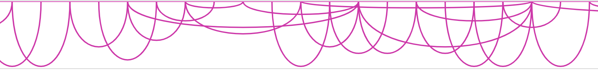
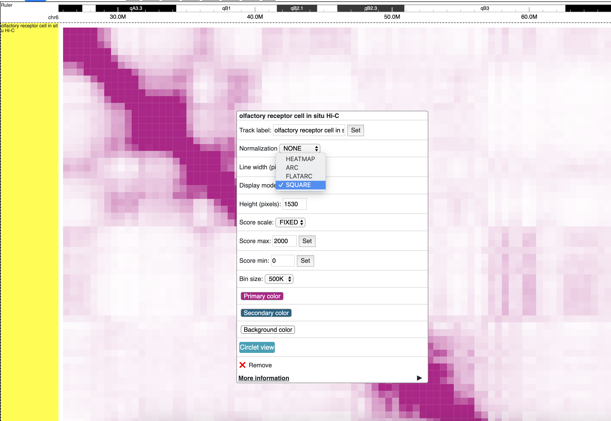
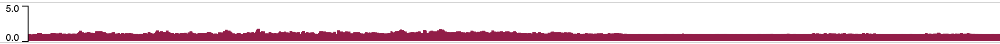
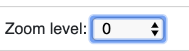
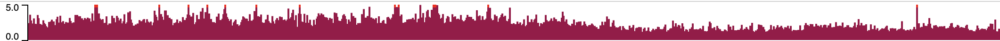

Datahub
=======

A datahub is a JSON_ file descibing a set of tracks in the browser. A datahub file is an array of tracks,
which are also defined in JSON syntax:

.. code-block:: json

    [
        {
        "type": "track_type1",
        "name": "track_name1",
        "url": "track_url1",
        "showOnHubLoad": true,
        "options": {
            "color": "red"
            }
        },
        {
        "type": "track_type2",
        "name": "track_name2",
        "url": "track_url2",
        "showOnHubLoad": true,
        "options": {
            "color": "blue"
            }
        }
    ]

.. _JSON: http://json.org/

.. important:: For each track in datahub, ``showOnHubLoad`` need set to ``true`` for the track to be displayed in browser. Tracks without ``showOnHubLoad`` set to ``true``
               won't be displayed in browser but can be added later in track facet table.

Example data hub
----------------

Pasted below is an example data hub for mouse mm10:

.. code-block:: json

    [
        {
        "type": "bigwig",
        "url": "https://vizhub.wustl.edu/public/tmp/TW463_20-5-bonemarrow_MeDIP.bigWig",
        "name": "MeDIP",
        "options": {
            "color": "red",
            "backgroundColor":"#FFE7AB"
            },
        "metadata": {
            "sample": "bone",
            "assay": "MeDIP"
            }
        },
        {
        "type": "bigwig",
        "url": "https://vizhub.wustl.edu/public/tmp/TW551_20-5-bonemarrow_MRE.CpG.bigWig",
        "name": "MRE",
        "options": {
            "color": "blue",
            "backgroundColor":"#C0E3CC"
            },
        "metadata": {
            "sample": "bone",
            "assay": "MRE"
            }
        }
    ]

Example bigWig track
--------------------

.. code-block:: json

    {
        "type": "bigwig",
        "name": "example bigwig",
        "url": "https://vizhub.wustl.edu/hubSample/hg19/GSM429321.bigWig",
        "options": {
            "color": "blue"
        }
    }

Example dynseq track
--------------------

.. code-block:: json

    {
        "type": "dynseq",
        "name": "example dynseq",
        "url": "https://target.wustl.edu/dli/tmp/deeplift.example.bw",
        "options": {
            "color": "blue",
            "height: 100
        }
    }

Example methylC track
----------------------

.. code-block:: json

  {
    "type": "methylc",
    "name": "H1",
    "url": "https://vizhub.wustl.edu/public/hg19/methylc2/h1.liftedtohg19.gz",
    "options": {
      "label": "Methylation",
      "colorsForContext": {
        "CG": { "color": "#648bd8", "background": "#d9d9d9" },
        "CHG": { "color": "#ff944d", "background": "#ffe0cc" },
        "CHH": { "color": "#ff00ff", "background": "#ffe5ff" }
      },
      "depthColor": "#01E9FE"
    },
  }

Example categorical track
-------------------------

.. code-block:: json

  {
    "type": "categorical",
    "name": "ChromHMM",
    "url": "https://egg.wustl.edu/d/hg19/E017_15_coreMarks_dense.gz",
    "options": {
        "category": {
            "1": {"name": "Active TSS", "color": "#ff0000"},
            "2": {"name": "Flanking Active TSS", "color": "#ff4500"},
            "3": {"name": "Transcr at gene 5' and 3'", "color": "#32cd32"},
            "4": {"name": "Strong transcription", "color": "#008000"},
            "5": {"name": "Weak transcription", "color": "#006400"},
            "6": {"name": "Genic enhancers", "color": "#c2e105"},
            "7": {"name": "Enhancers", "color": "#ffff00"},
            "8": {"name": "ZNF genes & repeats", "color": "#66cdaa"},
            "9": {"name": "Heterochromatin", "color": "#8a91d0"},
            "10": {"name": "Bivalent/Poised TSS", "color": "#cd5c5c"},
            "11": {"name": "Flanking Bivalent TSS/Enh", "color": "#e9967a"},
            "12": {"name": "Bivalent Enhancer", "color": "#bdb76b"},
            "13": {"name": "Repressed PolyComb", "color": "#808080"},
            "14": {"name": "Weak Repressed PolyComb", "color": "#c0c0c0"},
            "15": {"name": "Quiescent/Low", "color": "#ffffff"}
        }
    }
  }

Supported options: backgroundColor_, color_, color2_, yScale_, yMax_, and yMin_.

Example longrange track
-----------------------

.. code-block:: json

    {
        "type": "longrange",
        "name": "ES-E14 ChIA-PET",
        "url": "https://egg.wustl.edu/d/mm9/GSE28247_st3c.gz"
    }

Example bigInteract track
-------------------------

.. code-block:: json

    {
        "type": "biginteract",
        "name": "test bigInteract",
        "url": "https://epgg-test.wustl.edu/dli/long-range-test/interactExample3.inter.bb"
    }

Example repeatmasker track
--------------------------

.. code-block:: json

    {
        "type": "repeatmasker",
        "name": "RepeatMasker",
        "url": "https://vizhub.wustl.edu/public/mm10/rmsk16.bb"
    }

Example geneAnnotation track
----------------------------

.. code-block:: json

    {
        "type": "geneAnnotation",
        "name": "refGene",
        "genome": "mm10"
    }

.. note:: Please specify the ``genome`` attibute for gene annotation tracks.

Example bigbed track
--------------------

.. code-block:: json

    {
        "type": "bigbed",
        "name": "test bigbed",
        "url": "https://vizhub.wustl.edu/hubSample/hg19/bigBed1"
    }

Example bed track
-----------------

.. code-block:: json

    {
        "type": "bed",
        "name": "mm10 bed",
        "url": "https://epgg-test.wustl.edu/d/mm10/mm10_cpgIslands.bed.gz"
    }

Example refbed track
--------------------

.. code-block:: json

    {
        "type": "refbed",
        "name": "mm10 gencode basic",
        "url": "https://vizhub.wustl.edu/public/tmp/gencodeM18_load_basic_Gene.bed.gz",
        "options": {
                "categoryColors": {
                    "coding": "rgb(101,1,168)",
                    "nonCoding": "rgb(1,193,75)",
                    "pseudo": "rgb(230,0,172)",
                    "problem": "rgb(224,2,2)",
                    "other":"rgb(128,128,128)"
                }
            }
    }

.. note:: ``categoryColors`` designates colors for the gene type as indicated in the 9th column. The default scheme is shown above for
          the five classes created by the ``Converting_Gencode_or_Ensembl_GTF_to_refBed.bash`` script, but any number of categories can
          be defined.

Example HiC track
-----------------

.. code-block:: json

    {
        "type": "hic",
        "name": "test hic",
        "url": "https://epgg-test.wustl.edu/dli/long-range-test/test.hic",
        "options": {
            "displayMode": "arc"
        }
    }

Example cool track
------------------

.. code-block:: json

    {
        "type": "cool",
        "name": "Aiden et al. (2009) GM06900 HINDIII 1kb",
        "url": "Hyc3TZevQVm3FcTAZShLQg",
        "options": {
            "displayMode": "arc"
        }
    }

.. note:: please note we are using the uuid ``Hyc3TZevQVm3FcTAZShLQg`` here from `higlass API server`_ instead of a file URL
          to represent a cool track.

.. _`higlass API server`: http://higlass.io/api/v1/tilesets

Example genomealign track
-------------------------

.. code-block:: json

    {
        "name": "hg19 to mm10 alignment",
        "type": "genomealign",
        "metadata": {
            "genome": "mm10"
        }
    }

Example qBED track
------------------

.. code-block:: json

    {
        "type":"qbed",
        "url":"https://htcf.wustl.edu/files/RdNgrGeQ/HCT116-PBase.qbed.gz",
        "name":"piggyBac insertions",
        "showOnHubLoad":"true",
        "options":{
            "color":"#D12134",
            "height":100,
            "logScale":"log10",
            "show":"sample",
            "sampleSize":1000,
            "markerSize":5,
            "opacity":[50],
          },
    }

.. note:: Default qBED track options are ``"logScale":"none"``, ``"show":"all"``, ``"markersize":3``, and ``"opacity":[100]``.
          Log-scaling can be set by specifying ``"logScale":"log10"``. To change opacity, pass a single value in brackets, as in the above example.
          qBED tracks will, by default, plot all entries in view. For information-dense regions, this can lead to excessive memory consumption.
          To plot a random subsample instead, specify ``"show":"sample"`` and pass the number of points to visualize to ``"sampleSize"``, e.g.
          ``"sampleSize":1000``

Example matplot track
---------------------

.. code-block:: json

    {
        "type": "matplot",
        "name": "matplot wrap",
        "tracks": [
            {
            "type": "bigwig",
            "url": "https://vizhub.wustl.edu/public/tmp/TW463_20-5-bonemarrow_MeDIP.bigWig",
            "name": "MeDIP",
            "options": {
                "color": "red",
                "backgroundColor":"#FFE7AB"
                },
            "metadata": {
                "sample": "bone",
                "assay": "MeDIP"
                }
            },
            {
            "type": "bigwig",
            "url": "https://vizhub.wustl.edu/public/tmp/TW551_20-5-bonemarrow_MRE.CpG.bigWig",
            "name": "MRE",
            "options": {
                "color": "blue",
                "backgroundColor":"#C0E3CC"
                },
            "metadata": {
                "sample": "bone",
                "assay": "MRE"
                }
            }
        ]
    }

Example g3d track
-------------------------

.. code-block:: json

    {
        "type": "g3d",
        "url": "https://wangftp.wustl.edu/~dli/tmp/test.g3d",
        "name": "example 3d track",
        "showOnHubLoad": true
    }

Example Ruler track
--------------------

.. code-block:: json

    {
        "type": "ruler",
        "name": "Ruler"
    }

Track properties
----------------

type
~~~~

*Requried*. ``type`` specifies the track type, currently supported track types:

* bigWig
* bedGraph
* dynseq
* methylC
* categorical
* hic
* bed
* bigbed
* refbed
* repeatmasker
* geneAnnotation
* genomealign
* longrange
* bigInteract
* qBED
* matplot
* snp
* ruler

.. note:: ``type`` is case insensitive.

name
~~~~

*Requried*. ``name`` specifies the track name used internally by the browser. It is also
displayed as the track legend if no label_ speficied. Value can be any string.

label
~~~~~

*Optional*. ``label`` specifies the track legend displayed in the browser. It overrides the name_ arrtibute.
Value can be any string.

url
~~~

*Requried*. ``url`` contains the URL to the track file and needs to be HTTP or HTTPS location string.

.. important:: A ``url`` is requried for all the tracks in binary format. Gene annotaion tracks,
               like ``refGene``, do not need a ``url`` as they are stored in the Mongo database.
               Additional annotation tracks, such as the ``ruler`` track, also do not need a ``url``.

.. caution:: Each user-provided ``url`` must link to a publically available website, without password
             protection, so that the browser can read in the file.

.. note:: ``url`` can use a relative child path to the datahub url, say you have a file ``a.bigWig`` with your
            datahub ``http://your.host/your.hub.json``, when you add the track entry for ``a.bigWig``, the ``url`` can
            be either ``http://your.host/a.bigWig`` or just ``a.bigWig``.

showOnHubLoad
~~~~~~~~~~~~~

*Optional*. If specified to ``true``, the track will be displayed when hub is loaded. Default value: ``false``.

metadata
~~~~~~~~

*Optional*. An object specifying the metadata of the track.

In this basic example the value of each metadata term is a **string**. ::

    "metadata": {
        "sample": "bone",
        "assay": "MRE"
    }

You can also use this syntax for customized color::

     "sample": {"name"" "bone", "color": "#FF0000"}
    
The value of color can also be “red”, “blue”, and any CSS color.

This example public Roadmap data hub has more complex metadata definitions and makes use of a **list of strings**
to build a *hierarchical structure*. ::

    {
        "url": "https://egg.wustl.edu/d/hg19/GSM997242_1.bigWig", 
        "metadata": {
            "Sample": [
                "Adult Cells/Tissues",
                "Blood", 
                "Other blood cells", 
                "CD4+_CD25-_Th_Primary_Cells"
            ],
            "Donor": [
                "Donor Identifier",
                "Donor_332"
            ],    
            "Assay": [
                "Epigenetic Mark", 
                "Histone Mark", 
                "H3", 
                "H3K9", 
                "H3K9me3"
            ],    
            "Institution": [
                "Broad Institute"
            ]     
        },    
        "type": "bigwig", 
        "options": {
            "color": "rgb(159,0,72)"
        },    
        "name": "H3K9me3 of CD4+_CD25-_Th_Primary_Cells"
    }

The list of metadata is ordered from more generic to more specific and 
helps build the facet table hierarchy making the **search** and **filter** functions 
in track table easier.

details
~~~~~~~

*Optional*. If you want to add more information for each track then the ``details`` attribute is helpful.
After right clicking on the track you can click **More Information** and see the 
``details``, ``url``, and ``metadata`` for each track in the dropdown menu. ::

    "details": {
        "data source": "Roadmap Project",
        "date collected": "May 7 2016"
    }

queryEndPoint
~~~~~~~~~~~~~

*Optional*. Most time this parameter will be used with geneAnnotation track. When users deal with custom genome, or genome not listed in NCBI
or Ensembl database, gene search link would not work, so in such case, user can specify a custom database to query detailed information. For example,
for some trypanosome genome, gene search should be queried through TriTryDB, we can define the track like this then::

    {
        type: "geneAnnotation",
        name: "gene",
        label: "TriTrypDB genes",
        genome: "TbruceiLister427",
        queryEndpoint: { name: "TriTrypDB", endpoint: "https://tritrypdb.org/tritrypdb/app/search?q=" },
    }

options
~~~~~~~

*Optional*. All track render options are placed in an object called ``options``.
This object can have the following properties:

color
^^^^^

``color`` is used to define the color for each track. A color name, RGB values, or hex color code can be used.
For more about color name or RGB please see https://www.w3schools.com/css/css_colors.asp.

color2
^^^^^^

``color2`` is used to define the color for negative values from the track data. The default is
the same as color_.

backgroundColor
^^^^^^^^^^^^^^^

``backgroundColor`` defines the background color of the track.

height
^^^^^^

``height`` controls the height of the track which is specified as a number and displayed in *pixels*.

ensemblStyle
^^^^^^^^^^^^

currently for `bigwig` track, specify ``ensemblStyle`` option to `true` can enable data with chromosome names as 1, 2, 3...work in the browser

yScale
^^^^^^

``yScale`` allows you to configure the track's y-scale. Options include *auto* or *fixed*.
*auto* sets the y-scale from 0 to the max value of values in the view region for a given track.
*fixed* means you can specify the *minimal* and *maximal* value.

yMax
^^^^

``yMax`` is used to define the *maximum* value of a track's y-axis. Value is number.

yMin
^^^^

``yMin`` is used to define the *minimum* value of a track's y-axis. Value is number.

.. important:: If you need the track to be in *fixed* scale, you need to specify ``yScale`` to *fixed*
               besides of set ``yMax`` and ``yMin``.

group
^^^^^

Numerical tracks can be grouped to same group, tracks from same group will share y-axis scale settings. For example, when 2 tracks are
in one group, the y-axis will both set to max value of current views of both tracks. Users can find one example data hub with ``group`` settings from here: https://wangftp.wustl.edu/~dli/test/a-group.json

scoreScale/scoreMax/scoreMin
^^^^^^^^^^^^^^^^^^^^^^^^^^^^

These options work similar as yScale/yMax/yMin, but these are for interaction tracks.

colorAboveMax
^^^^^^^^^^^^^

``colorAboveMax`` defines the color displayed when a *fixed* yScale_ is used and a value exceeds the
yMax_ defined.

color2BelowMin
^^^^^^^^^^^^^^

``color2BelowMin`` defines the color displayed when a *fixed* yScale_ is used and a value is below the
yMin_ defined.

displayMode
^^^^^^^^^^^

``displayMode`` specifies display mode for each tracks. Different tracks have different display modes as listed below.

.. list-table::
   :widths: 25 50
   :header-rows: 1

   * - type
     - display mode
   * - bigWig
     - *auto*, *bar*, *heatmap*
   * - bedGraph
     - *auto*, *bar*, *heatmap*
   * - geneAnnotation
     - *full*, *density*
   * - HiC
     - *arc*, *heatmap*, *flatarc*, *square*
   * - genomealign
     - *rough*, *fine*

flatarc mode
""""""""""""

For interaction track. ``flatarc`` mode is like ``arc`` mode, sometimes the curve would be displayed flatter, in fact it's a cubic curve.

square mode
"""""""""""

For interaction track. ``square`` mode gives JuiceBox style like view for HiC maps.

aggregateMethod
^^^^^^^^^^^^^^^

At high zoom-out level when 1 on-screen pixel spans >1bp, the underlying track data needs to be
summarized into a single value for browser display.
``aggregateMethod`` is used to control how the data is summarized. Supported values include:
``MEAN``, ``SUM``, ``COUNT``, ``MAX``, ``MIN``. Default value is ``MEAN``.

smooth
^^^^^^

``smooth`` option allows you to smooth the graph of a quantitative track using window mean values.
The browser will use the mean values from region [current_position - smooth, current_position + smooth].
Default value is 0 (no smooth applied).

maxRows
^^^^^^^

``maxRows`` options controls the number of rows for the annotation track, like a geneAnnotation track.

hiddenPixels
^^^^^^^^^^^^

For annotation tracks, when an element spans less than `hiddenPixels` in the screen,
this item will not be displayed. Default value is 0.5 pixel. Set to 0 will display all elements.

isCombineStrands
^^^^^^^^^^^^^^^^

For methylC tracks, ``isCombineStrands`` will specificy if the strands should be combined ``true`` or not combined ``false``. We recommend combining stands for viewing CpG methylation, but leaving strand information for non-CpG methylation.

depthFilter
^^^^^^^^^^^

For methylC tracks a ``depthFilter`` can be set to filter out any bases with less than the depth(coverage) specified.

depthColor
^^^^^^^^^^

For methylC tracks specify a ``depthColor`` for the depth line that overlays the bars.

maxMethyl
^^^^^^^^^

For methylC tracks specify the y-axis max (for both strands) using ``maxMethyl``. Options range from (0-1].

zoomLevel
^^^^^^^^^

For ``bigWig`` track only. ``bigWig`` files usually contain multiple resolutions, when viewing a large region,
the Browser usually fetches a lower resolution for faster response, user can change this behaviour by changing this option.

The example below first show viewing a bigWig track in a big region with ``AUTO`` zoom level, you can see the data is pretty flat,
when we change zoom level to 0, 1, etc, we can see more details from the data, but takes more time to load.

Automatical zoom level:

Right click, change zoom level to 0: (can also setup in data hub under ``options``)

View changed after change zoom level to 0:

alwaysDrawLabel
^^^^^^^^^^^^^^^

For ``bed`` and ``categorical`` tracks only. Usually for each ``bed`` and ``categorical` item in those tracks,
the label are only drawn only when there are enough space inside the item block, by specificy this option to `true`,
the label will always be drawn in the screen.

.. image:: _static/bed_label.png
