Dynamic Tracks
==============

Dynamic tracks is a new track type in the Browser to show dynamics of data as animations.
Currently numerical data and HiC chromatin interaction data can be visualized with this new track type.

Use dynamic bedgraph format
---------------------------

For the dynamic track visualization, we developed a new and easy to use format called `dynamic bedgraph`, it's almost
same as regular bedgraph format, except last column is an array of values::

    chr6    52424961        52425161        [10,9,8,7,6,5,4,3,2,1]
    chr6    52425286        52425296        [1,2,3,4,5,6,7,8,9,10]

Format the file with bgzip and tabix, this example file can be accessed from https://vizhub.wustl.edu/public/misc/dynamicTrack/dynamic-hubs/test.dbg.gz, you can submit the new track file as a remote track:

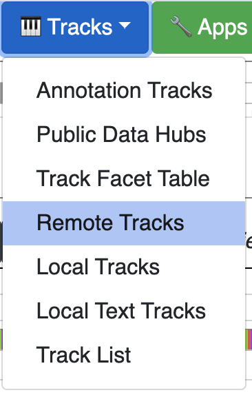

Use the URL to the track file and choose track type as ``dbedgraph``:

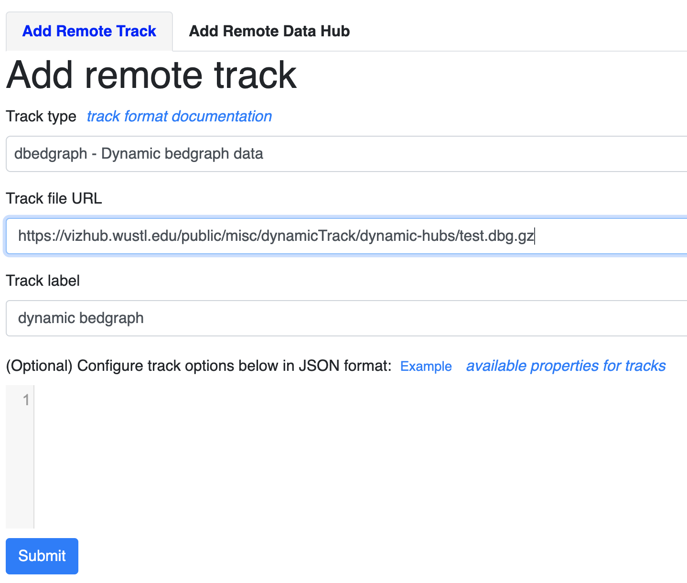

After click *Submit* button, the new track will be added:

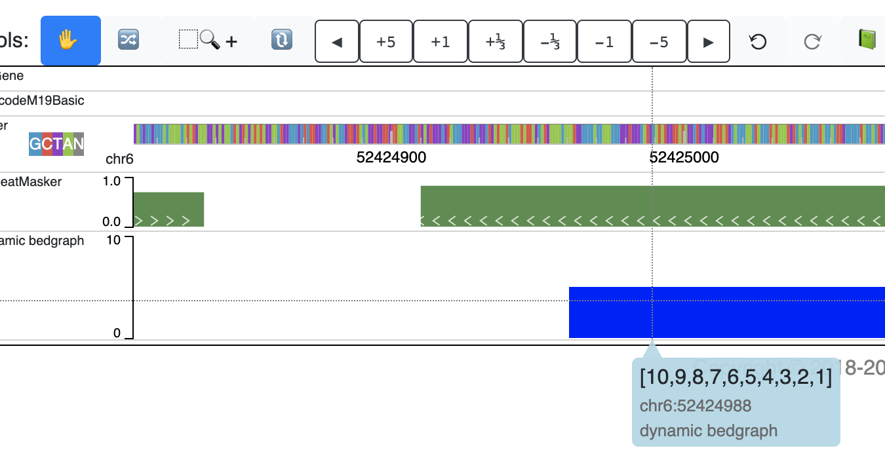

An animated version is here:

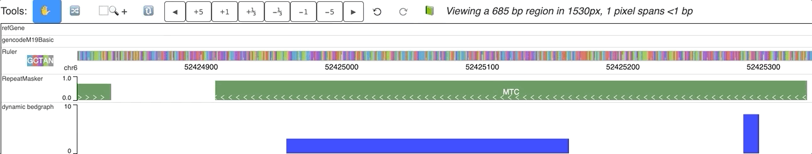

Dynamic labels with dynamic track
~~~~~~~~~~~~~~~~~~~~~~~~~~~~~~~~~

The track file above can also be used to prepare a data hub file as below, specify the ``dynamicLabels`` at same time:

.. code-block:: json

    [
        {
            "type": "dbedgraph",
            "url": "https://vizhub.wustl.edu/public/misc/dynamicTrack/dynamic-hubs/test.dbg.gz",
            "options": {
                "dynamicLabels": ['stage1','stage2','stage3','stage4','stage5','stage6','stage7','stage8','stage9','stage10']
            },
            "showOnHubLoad": true
        }
    ]

When you submit this file as a data hub, you could see the labels are ploted along with the corresponding data:

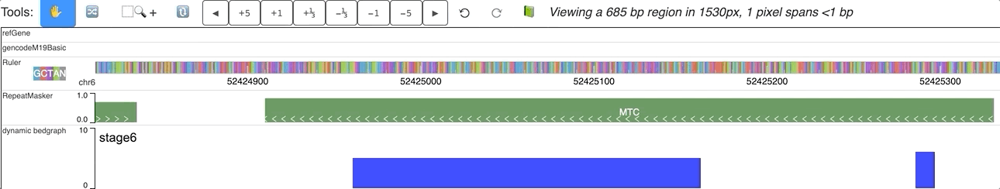

Make dynamic plot track from user interface
-------------------------------------------

Dynamic tracks can also be made from multiple existing numerical tracks, without any further reformat.
In the screenshot below we have 3 bigWig tracks loaded to mm9 genome:

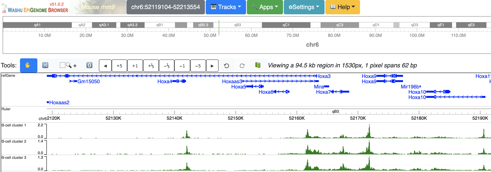

Select these 3 tracks while holding Shift key, then choose ‘Dynamic plot’ menu:

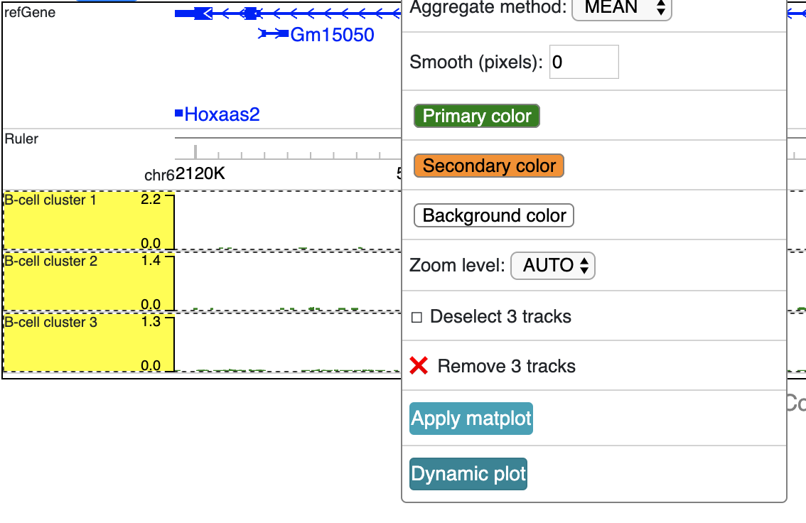

A new dynamic track will be displayed:

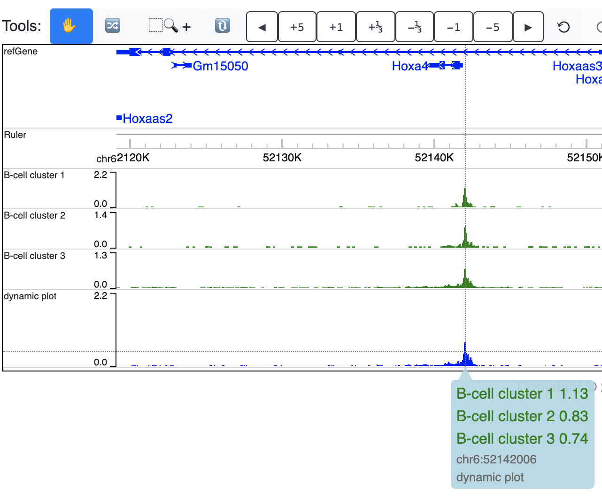

Right click the track gives your configuration menu:

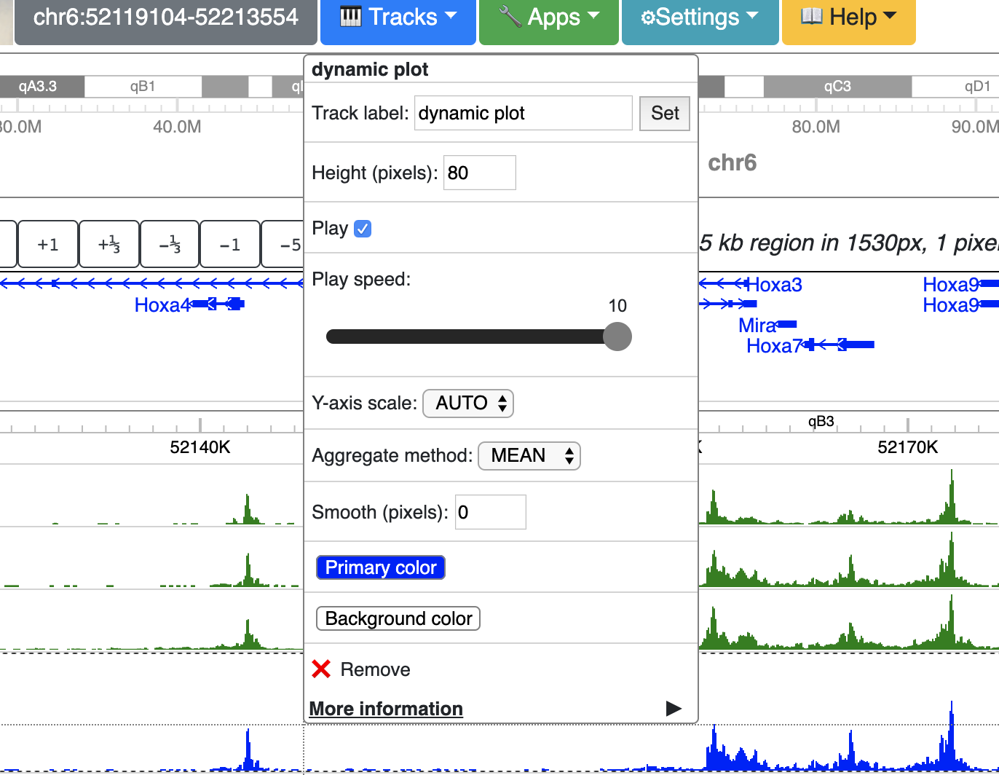

An animated version can be seen below:

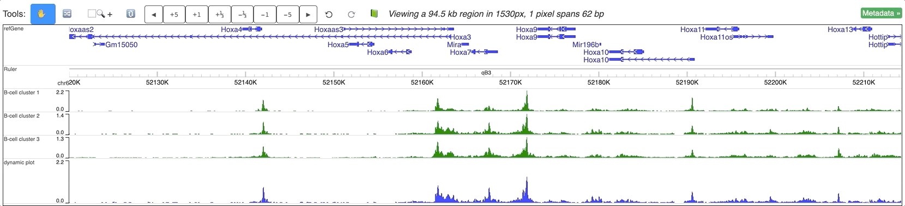

Make dynamic plot track using data hub
--------------------------------------

Dynamic tracks can also be submitted to the browser by using the remote data hub function, just same as existing data hub syntax, dynamic tracks are coded in the JSON format as below:

.. code-block:: json

    [
        {
            "type": "dynamic",
            "name": "dynamic plot example",
            "showOnHubLoad": true,
            "tracks": [
            {
                "type": "bigwig",
                "url": "https://vizhub.wustl.edu/public/misc/dynamicTrack/markers/ENCFF051LQD_H3K4me1.bigWig",
                "name": "CH12 H3K4me1"
            },
            {
                "type": "bigwig",
                "url": "https://vizhub.wustl.edu/public/misc/dynamicTrack/markers/ENCFF096TSJ_H3K27ac.bigWig",
                "name": "CH12 H3K27ac"
            },
            {
                "type": "bigwig",
                "url": "https://vizhub.wustl.edu/public/misc/dynamicTrack/markers/ENCFF011TAF_H3K4me3.bigWig",
                "name": "CH12 H3K4me3"
            },
            {
                "type": "bigwig",
                "url": "https://vizhub.wustl.edu/public/misc/dynamicTrack/markers/ENCFF700XWH_H3K36me3.bigWig",
                "name": "CH12 H3K36me3"
            }
            ]
        }
    ]

Please notice the track type is ``dynamic``, the `tracks` attribute indicates the member tracks of this dynamic track.

This hub is also available at https://vizhub.wustl.edu/public/misc/dynamicTrack/dynamic-hubs/plot.hub

Open the Remote tracks menu:

Then choose remote hub and load the hub from your hub’s URL:

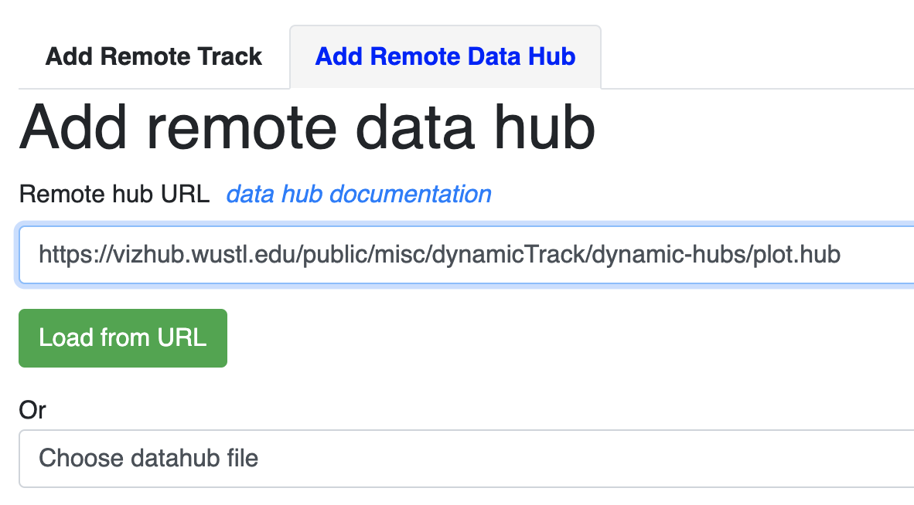

The track will be loaded as below:

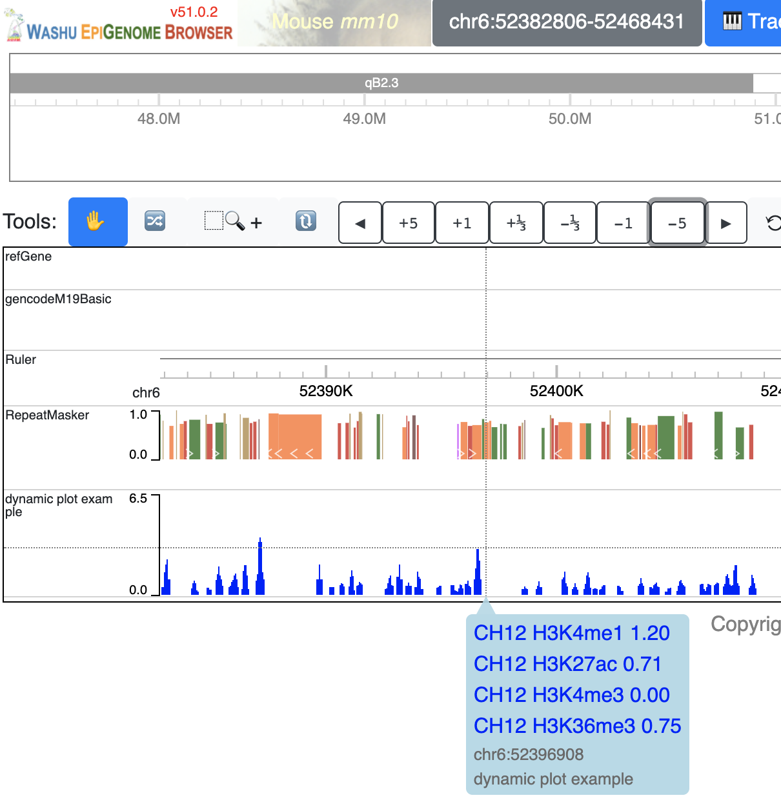

Make dynamic HiC maps from the user interface
---------------------------------------------

Load more than 2 HiC tracks, selct all of them by holding *Shift* key, and click the `Dynamic HiC` button:

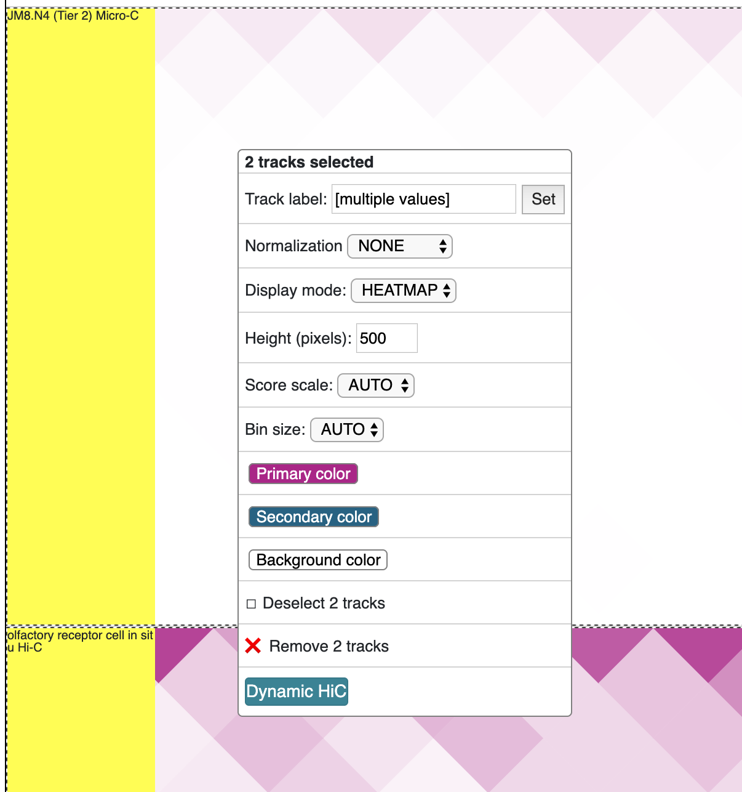

The new track is added as below:

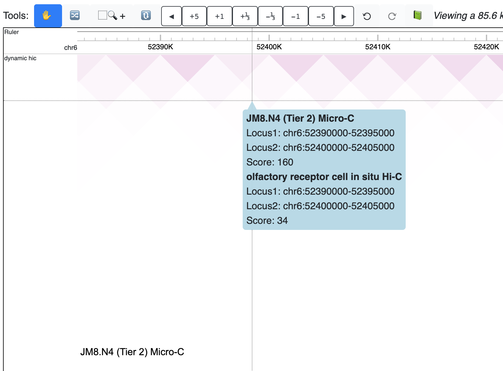

Check the animated verison below:

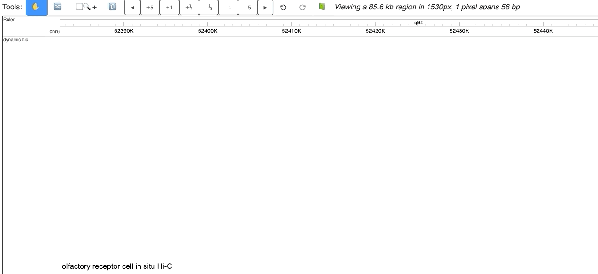

Make dynamic HiC maps using data hub
------------------------------------

Dynamic HiC tracks can also be submitted using remote data hub function. Prepare a data hub file like below:

.. code-block:: json

    [
    {
        "name": "dynamic hic",
        "type": "dynamichic",
        "tracks": [
        {
            "name": "olfactory receptor cell in situ Hi-C [4DNFIT4I5C6Z]",
            "type": "hic",
            "url": "https://data.4dnucleome.org/files-processed/4DNFIT4I5C6Z/@@download/4DNFIT4I5C6Z.hic"
        },
        {
            "name": "olfactory receptor cell in situ Hi-C [4DNFIXKC48TK]",
            "type": "hic",
            "url": "https://data.4dnucleome.org/files-processed/4DNFIXKC48TK/@@download/4DNFIXKC48TK.hic"
        }
        ],
        "showOnHubLoad": true
    }
    ]

This hub is located at: https://vizhub.wustl.edu/public/misc/dynamicTrack/dynamic-hubs/dhic.hub

Submit this link as a remote data hub:

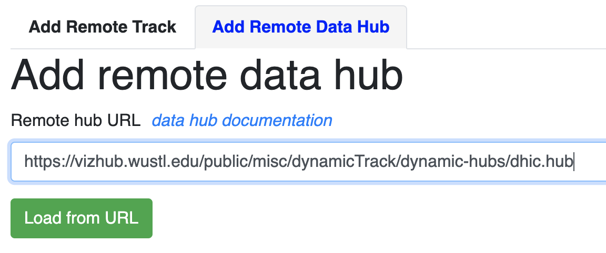

The new dynamic HiC track is added:

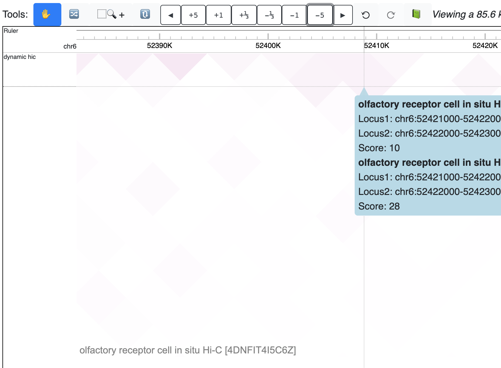

Check the animated version below:

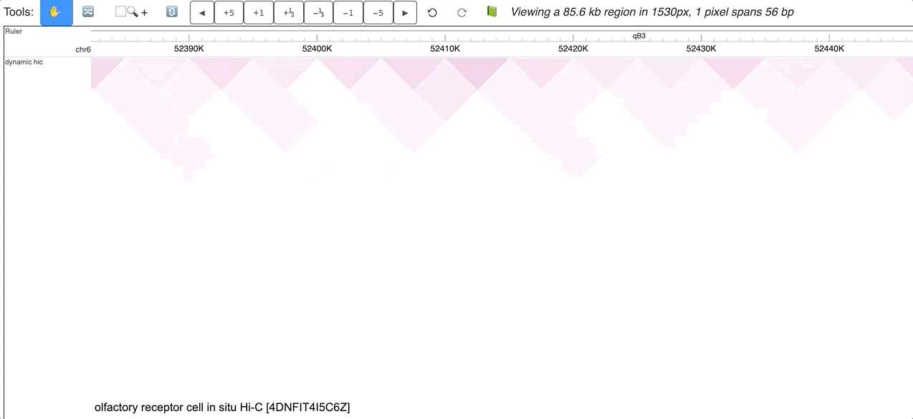

Dynamic track options
---------------------

Besides regular propeties like ``color``, ``backgroundColor`` and ``height`` etc, dynamic track has a set of propeties just for this track type.

playing
-------

``playing`` indicates if the track animation is playing or paused, value can be `true` or `false`

speed
-----

``speed`` indicates the playing speed of the animation, range from 1 to 10 where 1 is the slowest and 10 is the fastest.
Value need be set in an array format, like ``[1]`` or ``[5]``

dynamicLabels
-------------

for ``dbedgraph`` track only. specify the labels with each data points. Values should be an array of strings.
