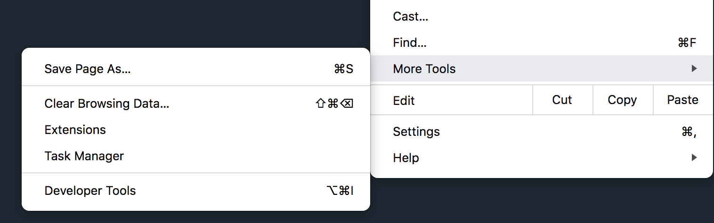

FAQ
===

Hard Reload
-----------

Sometimes your web browser might cached old Javascript code of the browser, if you didn't see updated feature
after refresh, you can do a ``Hard Reload``. This is how you do this on Google Chrome:

Open *Developer Tools*:

Click and Hold the Refresh button for a while, then you can see the *Hard Reload* option:

.. image:: _static/hard2.png

Data fetch failed
-----------------

Please check the URL to your file is correct. If yes, most case, your webserver doesn't enable CORS.
Please see :doc:`tracks` page for how to enable CORS settings.

Use HTTP or HTTPS?
------------------

Both our main site and AWS mirror support both HTTP and HTTPS protocol, since webpage
hosted through HTTPS cannot access resource hosted by HTTP, you should use our HTTP site.
For example, when you visit https://epigenomegateway.wustl.edu/browser, and you want to display
a custome track hosted at http://your.track.url.bigwig, the browser will display ``Data fetch failed``
for that track because due to security settings, the browser in HTTPS page cannot access HTTP resource.
In such case you can use http://epigenomegateway.wustl.edu/browser instead (without the ``s``).
