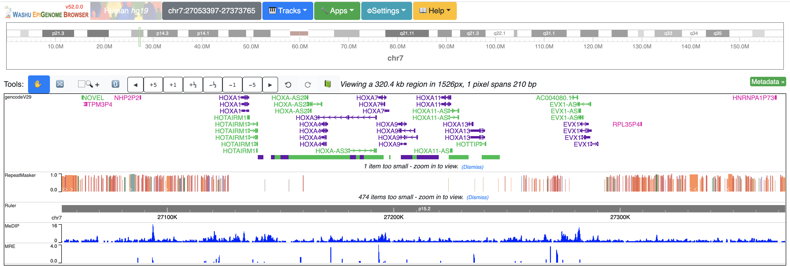
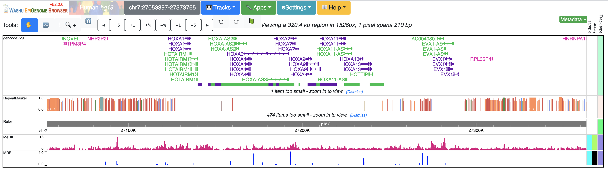

FAQ
===

Hard Reload
-----------

Sometimes your web browser might cached old Javascript code of the browser, if you didn't see updated feature
after refresh, you can do a ``Hard Reload``. This is how you do this on Google Chrome:

Open *Developer Tools*:

.. image:: _static/hard1.png

Click and Hold the Refresh button for a while, then you can see the *Hard Reload* option:

.. image:: _static/hard2.png

Data fetch failed
-----------------

Please check the URL to your file is correct. If yes, most case, your webserver doesn't enable CORS.
Please see :doc:`tracks` page for how to enable CORS settings.

Use HTTP or HTTPS
-----------------

Both our main site and AWS mirror support both HTTP and HTTPS protocol, since webpage
hosted through HTTPS cannot access resource hosted by HTTP, you should use our HTTP site.
For example, when you visit https://epigenomegateway.wustl.edu/browser, and you want to display
a custome track hosted at http://your.track.url.bigwig, the browser will display ``Data fetch failed``
for that track because due to security settings, the browser in HTTPS page cannot access HTTP resource.
In such case you can use http://epigenomegateway.wustl.edu/browser instead (without the ``s``).

Firebase fetal error
--------------------

After you installed a new mirror, when you start your mirror instance by running ``npm start``, if you see
a Firebase fetal error like following:

.. image:: _static/firebase_error.png

This means you need to setup a Firebase database for the Session/Live function to work properly,
check :ref:`Firebase_setup` please

Local track security
--------------------

Local track function is perfect for view protected or private data, since there is no data transfer on the web. 
More discussions about this please check here_.

.. _here: https://github.com/lidaof/eg-react/issues/114

What's the different between ``hub`` and ``sessionFile`` URL parameter
----------------------------------------------------------------------

Both browser links with ``hub`` or ``sessionFile`` can be shared with others or be used for publication purpose. ``sessionFile`` not only contains all the *tracks*
as ``hub``, it also contains genomic coordinates, metadata, show/hide of genome navigator etc.

So ``sessionFile`` link contains more information than ``hub`` link, as the ``sessionFile`` contains more contents only used by the browser (it's much more complex than ``hub`` file syntax).

Examples links:

`hub link <https://epigenomegateway.wustl.edu/browser/?genome=hg19&hub=https://wangftp.wustl.edu/~dli/test/a.json>`_

`sessionFile link <https://epigenomegateway.wustl.edu/browser/?genome=hg19&sessionFile=https://wangftp.wustl.edu/~dli/test/eg-session-Hl4320IQ8-5b4bcd10-cbcd-11ea-b1b4-6196abf220ba.json>`_

Publish with the browser
------------------------

First thank you very much for considering publishing figures, datahubs and session links using the Browser.
For best result, please put all your track files on a permenant web location (like your own web server or Amazon S3), 
then  use :ref:`hub` or :ref:`sessionFile` URL parameter for browser hub URL. Browser URL with ``hub`` or ``sessionFile`` is permenant as long as your track files from your web server stay.

.. note:: using ``session bundle Id`` is not recommended as session Id is suppose to be shared with trusted people, share the session Id in a public enviroment may result unwanted edits to your session.
