Image Tracks
============

The browser currently supports loading image data from Omero server hosted by `4DN data portal <https://data.4dnucleome.org/>`_  and `Image Data Resource (IDR) <https://idr.openmicroscopy.org/>`_. An example interface after loading one image track is illustrated below:

.. image:: _static/image_track_example.png

view human image data from IDR
------------------------------

Go the browser, choose hg38:

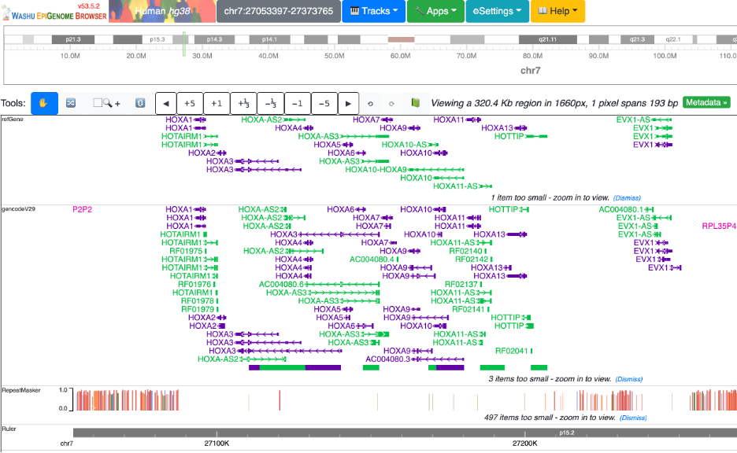

Go to Tracks, public data hubs, load the IDR image data hub:

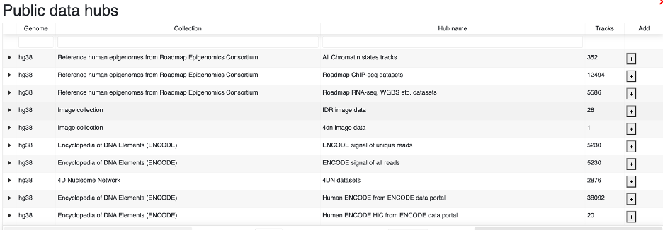

You can see the browser window is load with the image track:

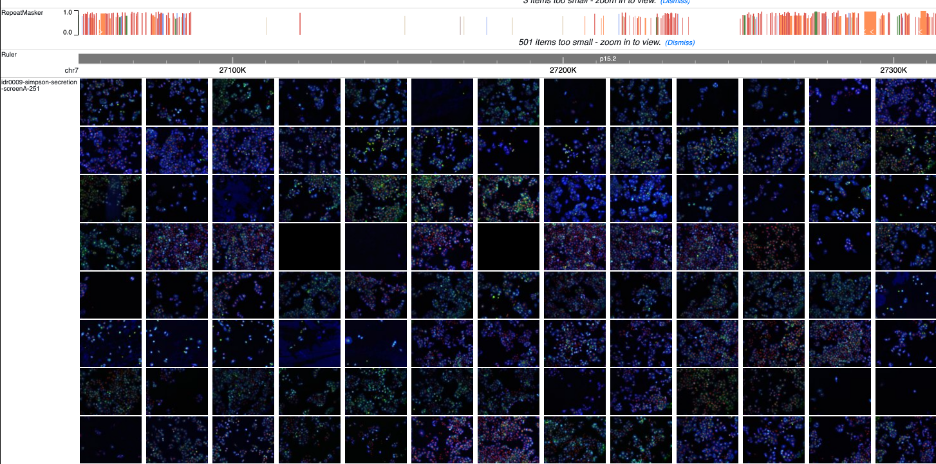

Click any of the image to show metadata popup:

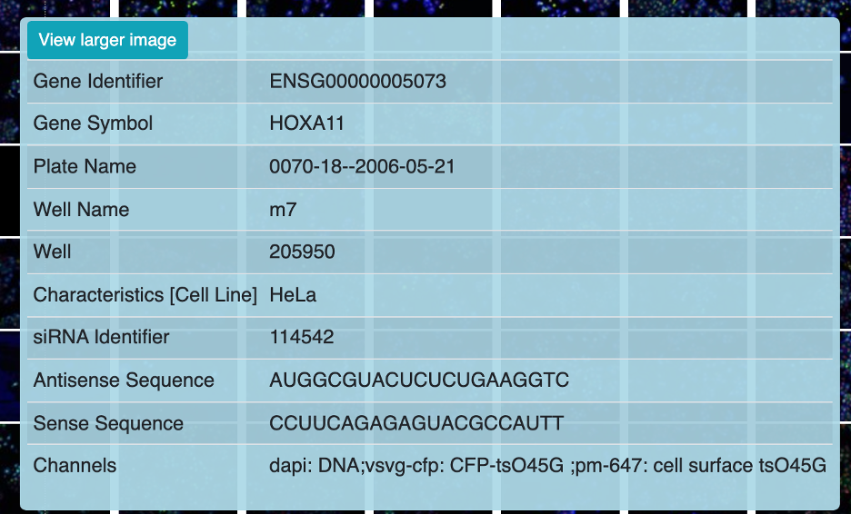

Click View larger image button to see the image in a new panel:

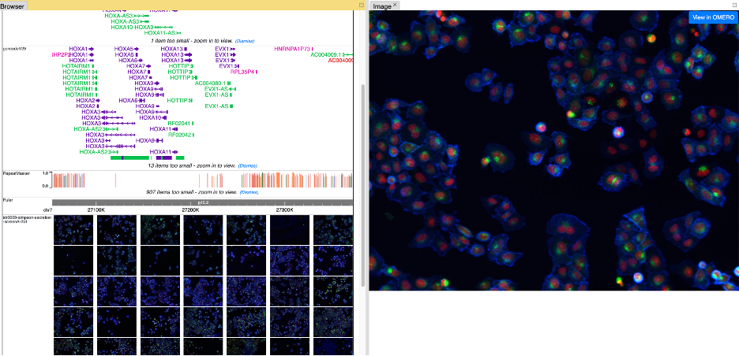

Click ``View in Omero`` button in the new panel to see the image details in IDR website:

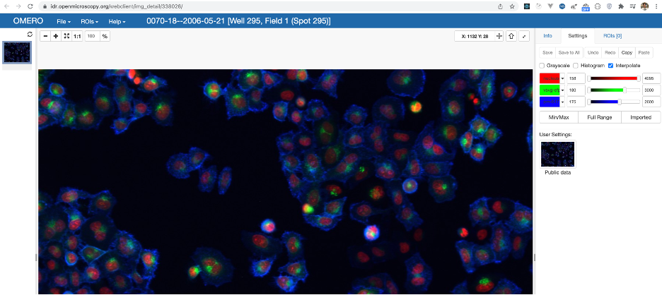

view mouse image data from 4DN
------------------------------

Go to the browser, load mm10 genome, since the image data is sparse in mm10, we would navigate to ``chr15:83831936-84793920`` first:

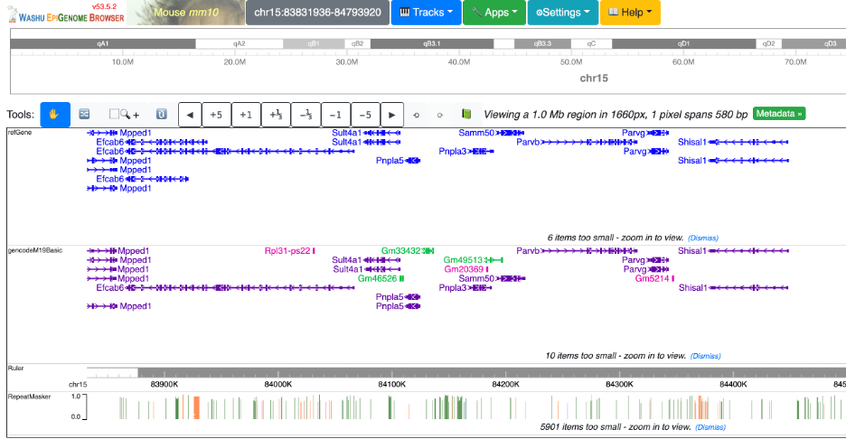

Go to Tracks, public data hubs, load the 4DN image data hub:

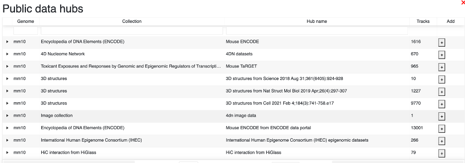

You can see the image track is loaded, and you can check metadata, open image in new panel:

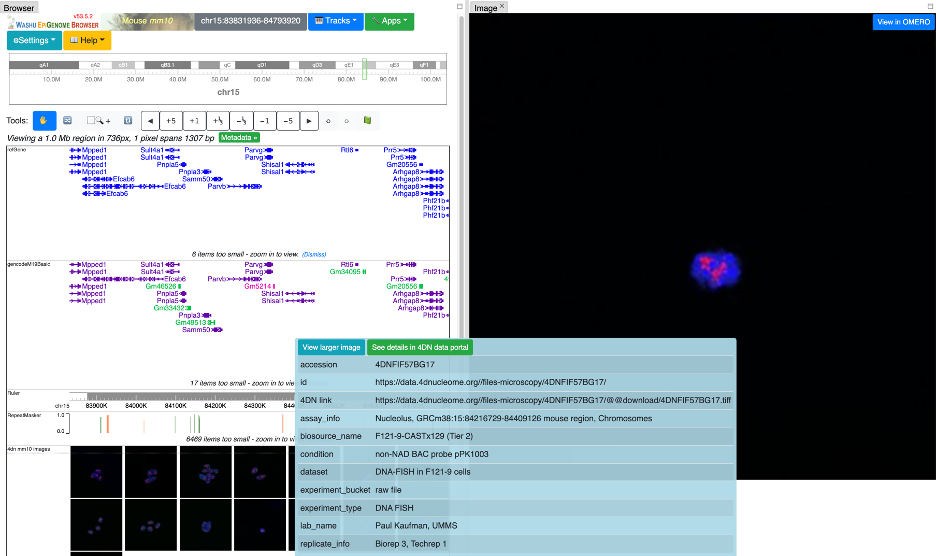

Besides the link to Omero server is provided, there is also a button which links you to the 4DN details page:

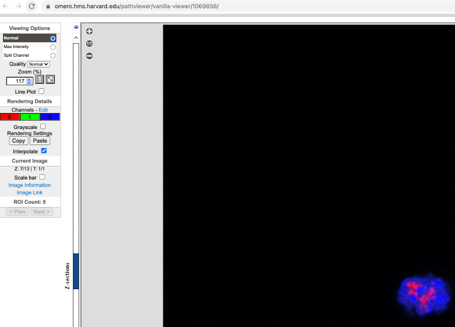

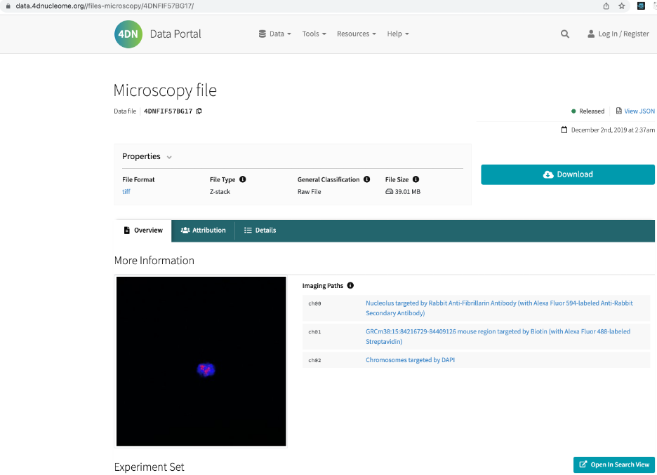
