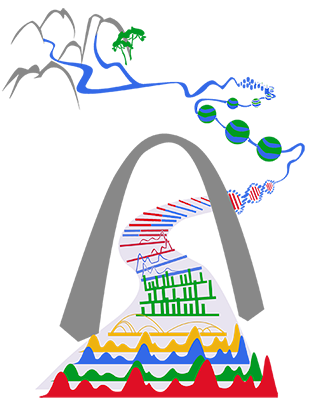

.. WashU Epigenome Browser documentation master file, created by
   sphinx-quickstart on Mon Sep 10 16:27:18 2018.
   You can adapt this file completely to your liking, but it should at least
   contain the root `toctree` directive.

WashU Epigenome Browser
=======================

            Gateway to the epigenome. (Art by **Ting Wang**)

.. toctree::
    :maxdepth: 2
    :caption: Contents:

    usage
    tracks
    datahub
    url
    local
    text
    dynamic
    3d
    image
    installation
    add
    faq
    contact

Indices and tables
==================

* :ref:`genindex`
* :ref:`search`
