Local track files
=================

We realized that not every group can setup a web server with CORS enabled, since version 48.0.0,
we added the ability to read local track files or entire folder as a datahub, which means you can *upload* track files on
from your hard drive to the browser. The formats for the track files are the same as the ones used for
being hosted on a webserver.

.. note:: the track *uploaded* through the file upload dialog *cannot* be saved to browser's local
          storage, thus, when you refresh the browser, your local tracks will gone. You need to
          re-upload them (like re-grant the permission to the browser to read your local files).
          This is a security setup of Javascript. You can create a ``hub.config.json`` file
          to speicify files as a local datahub. Even though after every refresh your tracks are gone,
          but it woule be easier to just upload the local datahub again then uploading individual tracks separately.

.. important:: Since the user need to give permission to the web browser to access
               the files at local hard drive, so the local track **can not** be saved
               into ``Session``. Please consider use HTTP(S) hosted tracks to work with the session function.

Upload files as tracks
----------------------

To use your local track files, format your files to the correct format, open the ``Upload Track``
menu from ``Tracks``:

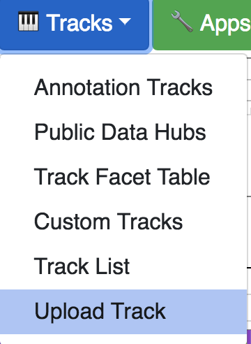

By default, you will be at ``Add Local Track`` tab. First, choose your track file format:

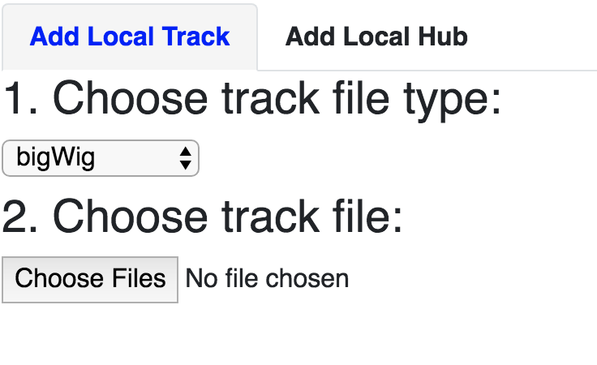

Second, choose your files, you can choose many files of same type if your track only contains one
file, like ``bigWig``, ``bigBed``, ``HiC``, ``bigInteract``, or you can only choose 2 (a pair of) files
if your track need an **index** file, like ``bedGraph``, ``methylC`` etc.

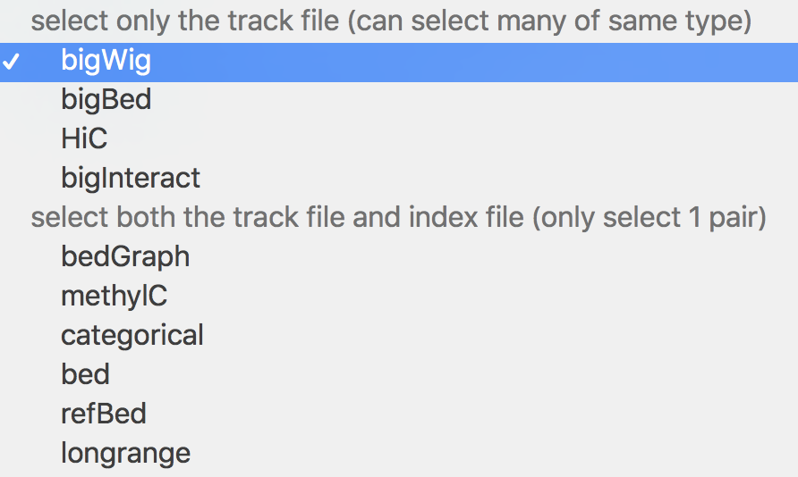

Example of choose 2 local bigWig files:

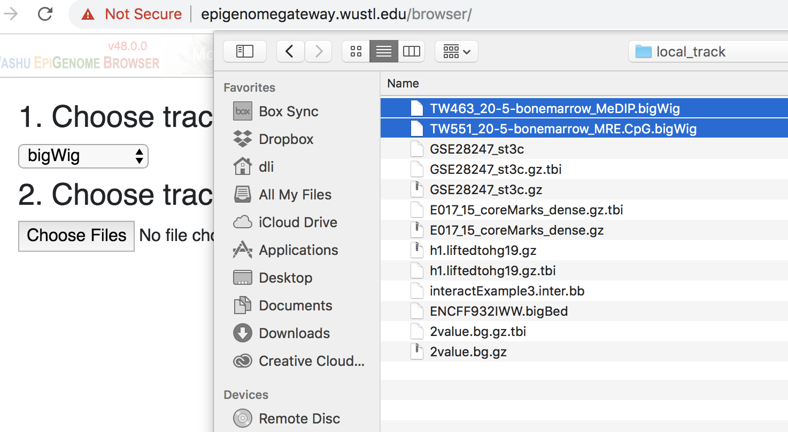

The 2 bigWig tracks are added:

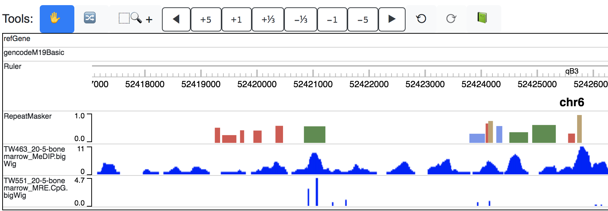

Example if choose 1 local bedGraph track, (please choose both track file and index file):

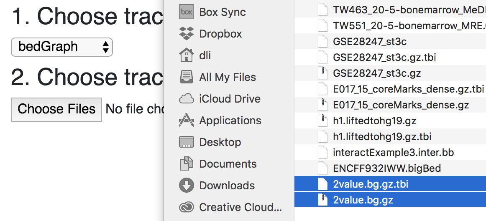

The bedGraph track is added:

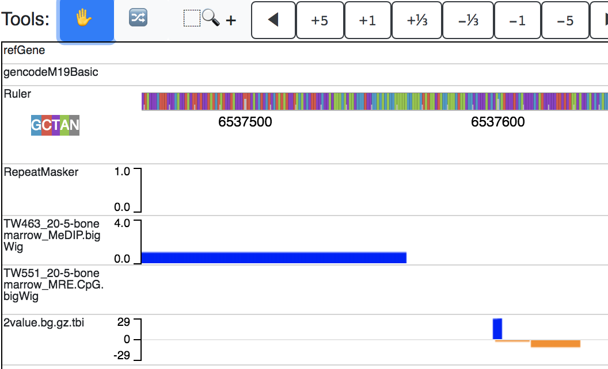

Upload files or folder as datahub
---------------------------------

If you want to upload many different types of track files to the browser, you can do that too!
Choose the ``Add Local Hub`` tab from the track upload menu as before:

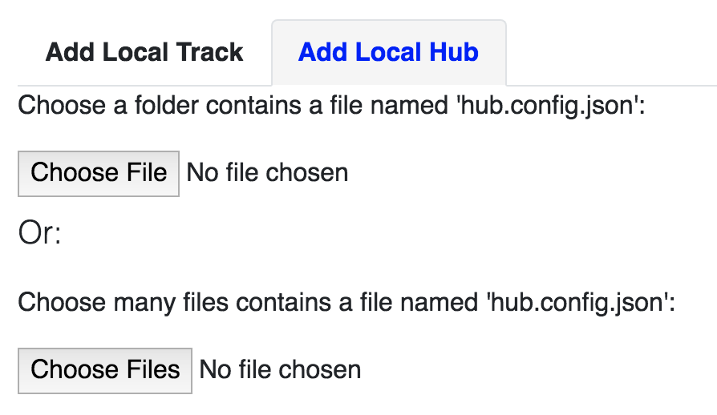

You would need to create a file called ``hub.config.json`` for the browser to configure your local data hub, an
example below::

    [
        {
            "filename": "2value.bg.gz",
            "type": "bedgraph",
            "name": "test bedgraph",
            "options": {"height": 100}
        },
        {
            "filename": "TW463_20-5-bonemarrow_MeDIP.bigWig",
            "type": "bigwig",
            "name": "MeDIP",
            "options": {"color": "pink"}
        },
        {
            "filename": "TW551_20-5-bonemarrow_MRE.CpG.bigWig",
            "type": "bigwig",
            "name": "MRE",
            "options": {"color": "red"}
        },
        {
            "filename": "h1.liftedtohg19.gz",
            "type": "methylc"
        }
    ]

.. note:: Please note the ``name`` and ``options`` attribute specified in the file, the syntax is same as a remote datahub file.

.. note:: Track files not specified in ``hub.config.json`` will be skipped.

You can either choose an entire folder by clicking the first button:

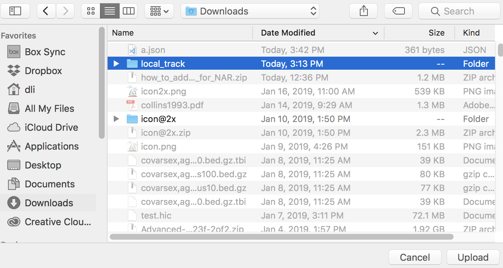

or choose many files by clicking the second button:

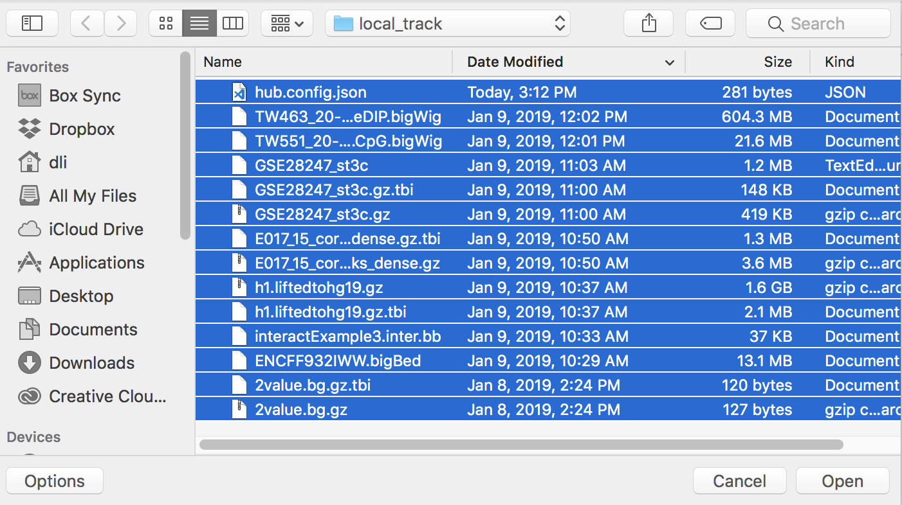

After upload either a folder or many files, your local datahub will be displayed: (please note the ``name``
and ``options`` specified in your ``hub.config.json`` file will be applied too)

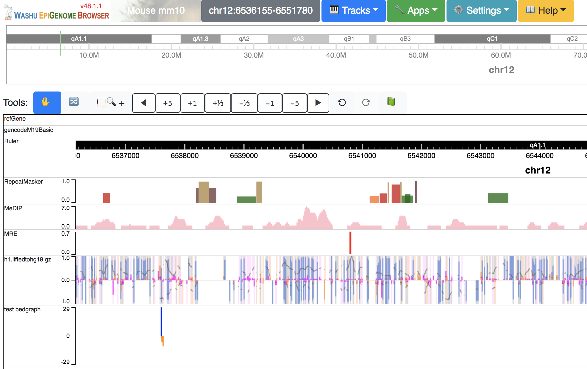
