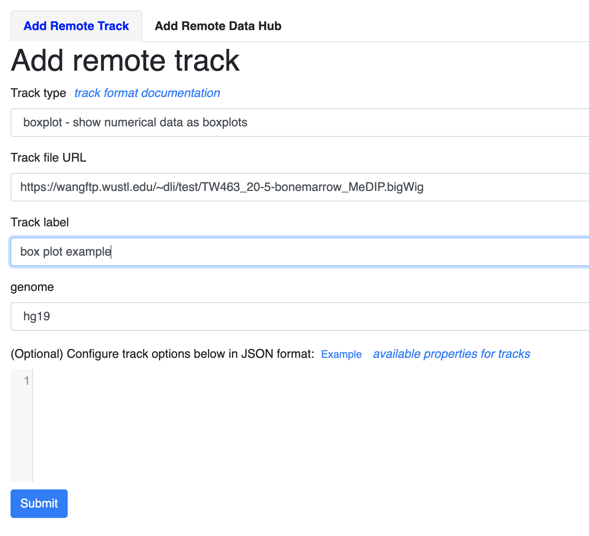
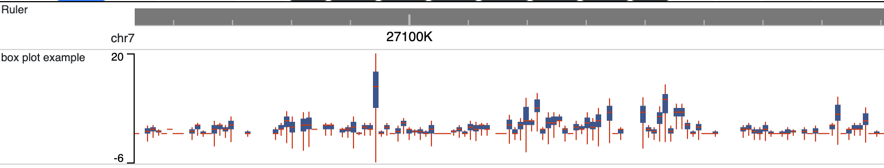
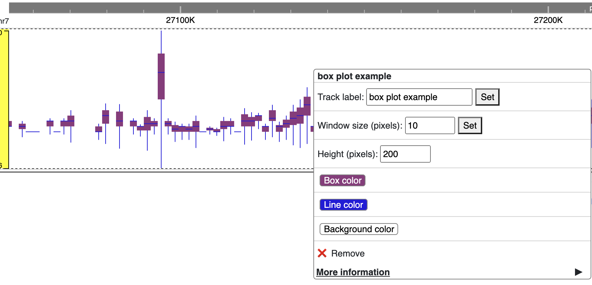

Statistical Tracks
==================

boxplot
-------

``boxplot`` is a track type that show data as boxplots. It accepts numberical data (:ref:`bigWig` or :ref:`bedGraph`) as track files. 
To submit a `boxplot` track, it' same as submit a numerical track, instead choose `boxplot` from the track type dropdown menu:

The default view after submit a boxplot track:

Right clicking the track brings the configuration menu, from which window size, height, box and line colors etc can be customized:

