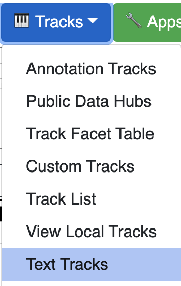
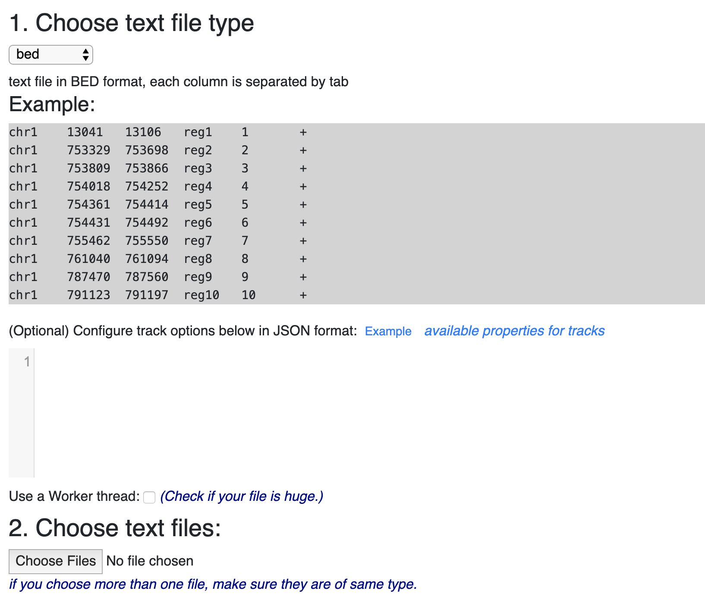
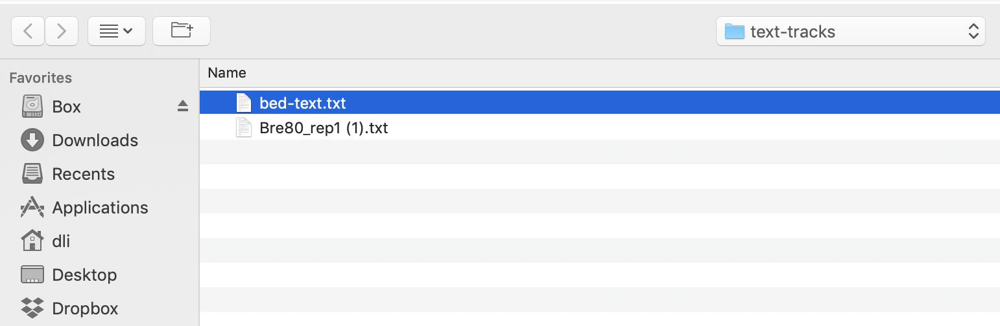
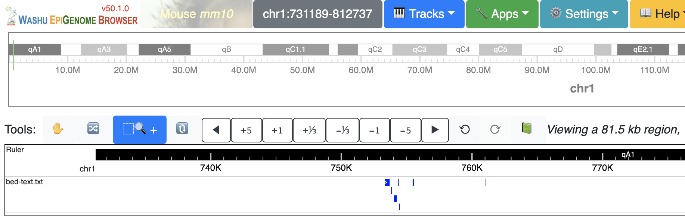
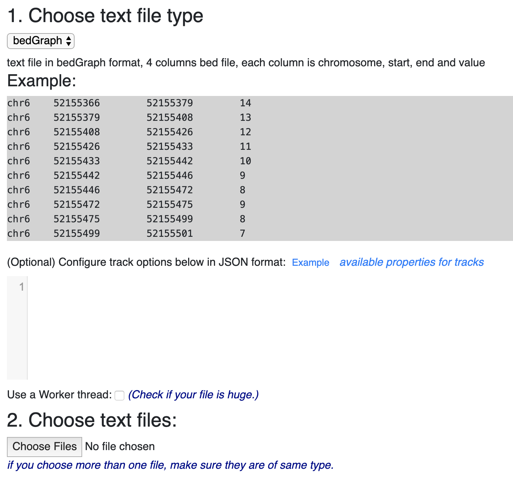
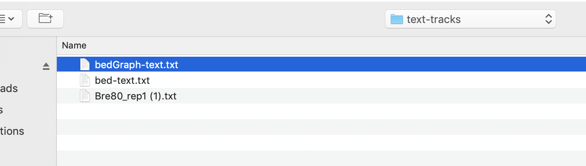
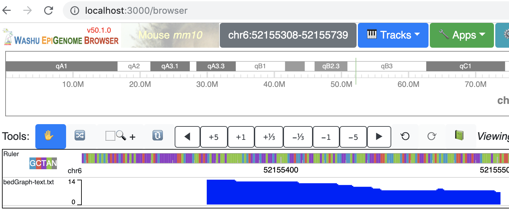
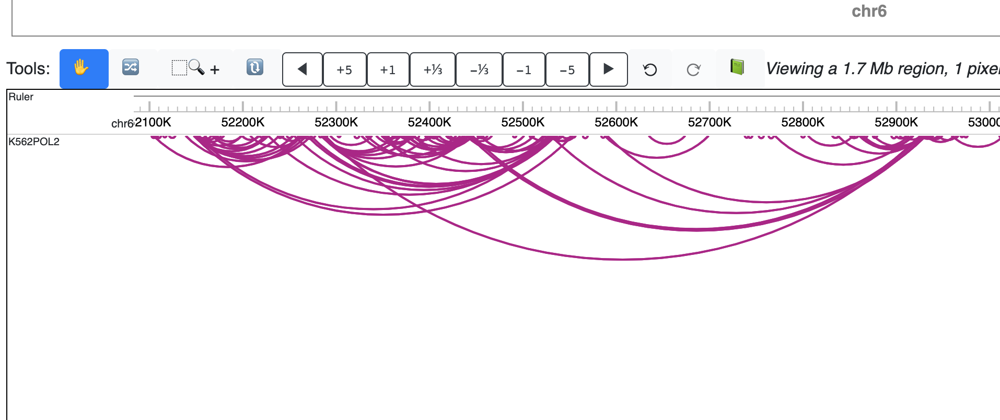
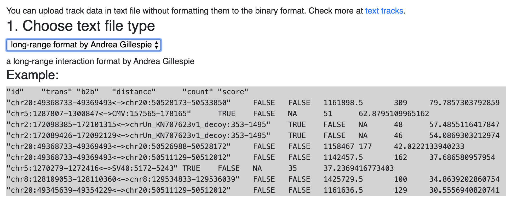
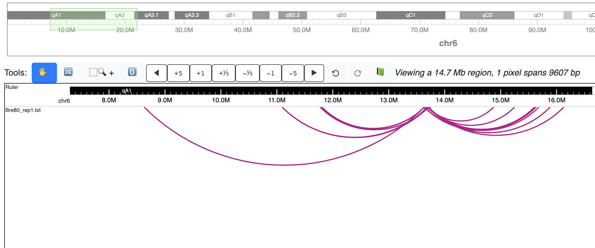

Text Tracks
===========

Tracks are usually prepared in binary format for efficient region access, like `bigWig`, `bigBed`, `HiC` and etc.
Text file format is very flexible, thus caused some trouble for us to standardize the data input.
While there are some circumstances that text track files could also be useful, it can be very convenient to just upload a text
file and visualize the data on the browser without formatting the data to a binary format. Once added, text tracks can be very fast since
there is no more network requests or transfers, also we have received requests that
adding text files as tracks from our users.

bed
---

The most common text file would in `bed` format, like this one below::

    chr1	13041	13106	reg1	1	+
    chr1	753329	753698	reg2	2	+
    chr1	753809	753866	reg3	3	+
    chr1	754018	754252	reg4	4	+
    chr1	754361	754414	reg5	5	+
    chr1	754431	754492	reg6	6	+
    chr1	755462	755550	reg7	7	+
    chr1	761040	761094	reg8	8	+
    chr1	787470	787560	reg9	9	+
    chr1	791123	791197	reg10	10	+

Say if we have a text file named ``bed-text.txt`` with the content above. Open the ``Text Tracks`` menu:

This will bring the text track UI:

Choose `bed` as the text file type, the choose our text file:

After we submit this file, the track is added with the content of our text file:

bedGraph
--------

``bedGraph`` is also very common, it's typically 4 columns bed file like below::

    chr6	52155366	52155379	14
    chr6	52155379	52155408	13
    chr6	52155408	52155426	12
    chr6	52155426	52155433	11
    chr6	52155433	52155442	10
    chr6	52155442	52155446	9
    chr6	52155446	52155472	8
    chr6	52155472	52155475	9
    chr6	52155475	52155499	8
    chr6	52155499	52155501	7

Choose `bedGraph` from the track track UI:

The choose the bedGraph text file:

The text track file is added:

longrange
---------

The `longrange` format can also be uploaded directly as text file, choose `longrange` in the text type dropdown menu:

.. image:: _static/long_text_1.png 

Choose the text file in `longrange` format:

.. image:: _static/long_text_2.png 

The track will be added as below (adjust region and display style as arc):

customized long-range format
----------------------------

One of our user proposed the long-range format as below:

We also added the support and the file in this format can be loaded as track:

`Feel free to contact us if you need more formats supported.`

What if the text file is huge?
------------------------------

If your text track if huge in size, convert to binary format is recommended. However, you can still use the text file if you want.
Make sure you check the `Use a Worker thread` checkbox, the browser will use a background thread for text file loading.

