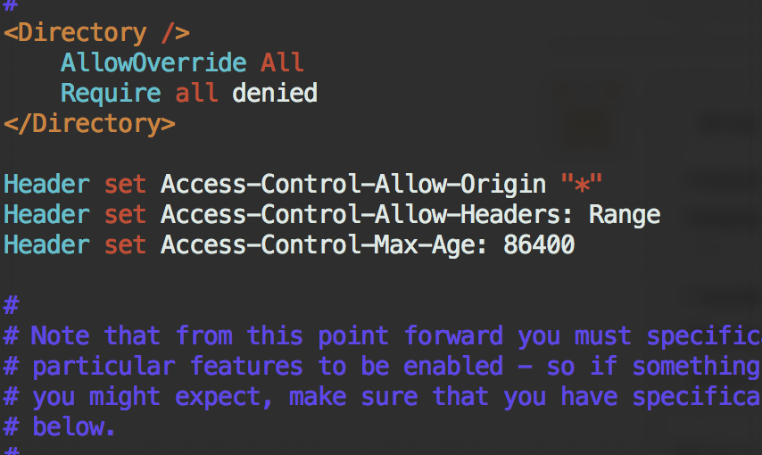
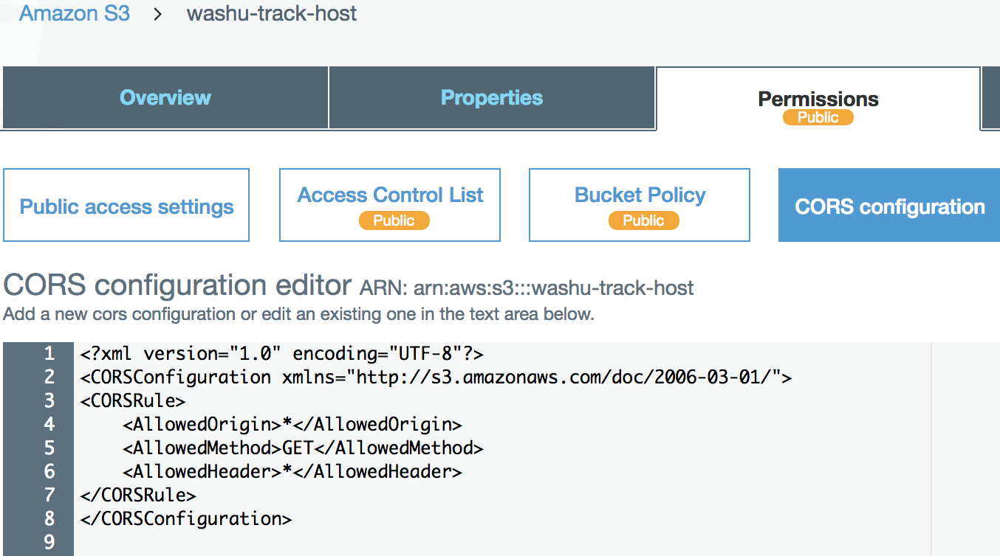
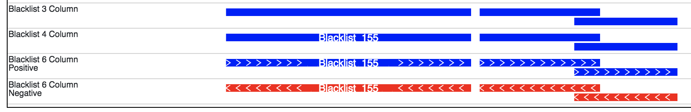
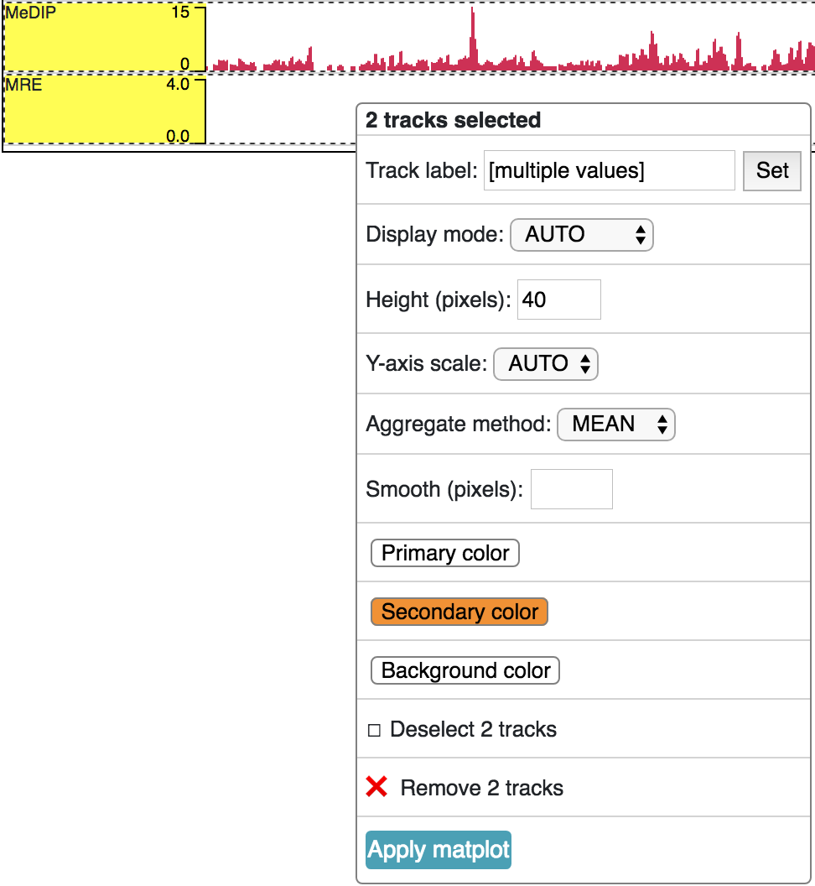
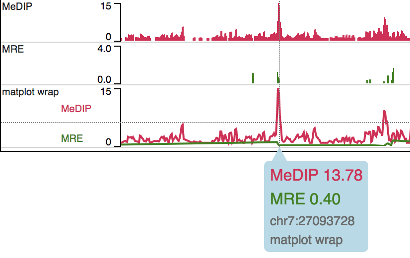
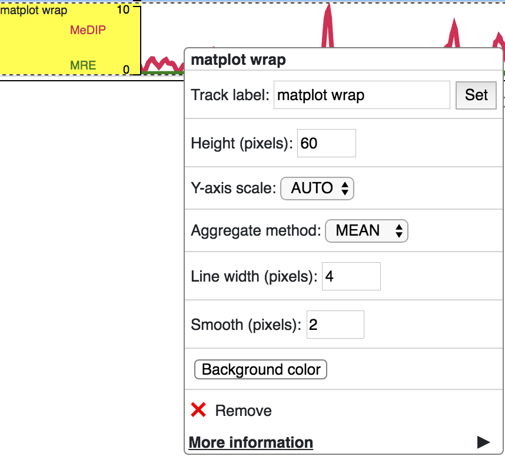
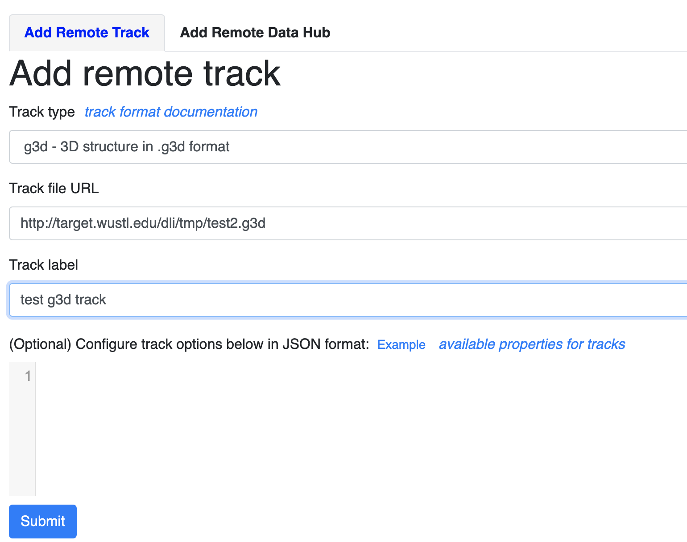
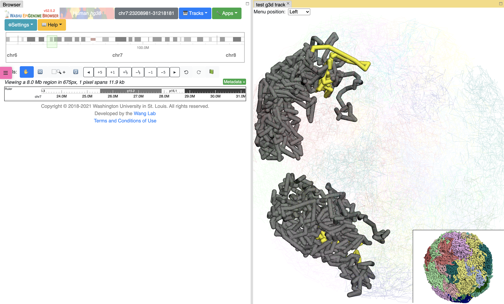

Tracks
======

.. important:: Since all tracks are hosted on the web with HTTP/HTTPS links provided
               for submission as tracks, the webservers which are hosting the track
               files need Cross-Origin Resource Sharing (CORS) enabled.

Quoted from MDN_::

    Cross-Origin Resource Sharing (CORS) is a mechanism that uses additional
    HTTP headers to tell a browser to let a web application running at
    one origin (domain) have permission to access selected resources
    from a server at a different origin. A web application makes
    cross-origin HTTP request when it requests a resource that has
    a different origin (domain, protocol, and port) than its own origin.

.. _MDN: https://developer.mozilla.org/en-US/docs/Web/HTTP/CORS

Configure your webserver to enable CORS
---------------------------------------

Most likely the browser domain is different from the server the tracks are hosted on. The hosting server
needs CORS enabled. For any Apache web server, you might try the either following approach.

Enable CORS on Apache2 under Ubuntu
~~~~~~~~~~~~~~~~~~~~~~~~~~~~~~~~~~~

For an Apache web server in Ubuntu this setup (add this to the enabled .conf file) would work::

    Header always set Access-Control-Allow-Origin "*"
    Header always set Access-Control-Allow-Headers: Range
    Header always set Access-Control-Max-Age: 86400

Then restart your Apache server.

Enable CORS on Apache2 under CentOS
~~~~~~~~~~~~~~~~~~~~~~~~~~~~~~~~~~~~

Try add this to the main configuration file ``/etc/httpd/conf/httpd.conf``::

    Header always set Access-Control-Allow-Origin "*"
    Header always set Access-Control-Allow-Headers: Range
    Header always set Access-Control-Max-Age: 86400

in ``/etc/httpd/conf.modules.d/00-base.conf``, the header module should be enabled:

Then restart your Apache server.

Enable CORS on Amazon S3 bucket
~~~~~~~~~~~~~~~~~~~~~~~~~~~~~~~

We have setup a test s3 bucket at http://washu-track-host.s3-website-us-east-1.amazonaws.com and tried bigWig_ files,
the link http://washu-track-host.s3-website-us-east-1.amazonaws.com/bigwig/TW551_20-5-bonemarrow_MRE.CpG.bigWig can be
displayed at the browser with following CORS setup::

    <?xml version="1.0" encoding="UTF-8"?>
    <CORSConfiguration xmlns="http://s3.amazonaws.com/doc/2006-03-01/">
    <CORSRule>
        <AllowedOrigin>*</AllowedOrigin>
        <AllowedMethod>GET</AllowedMethod>
        <AllowedHeader>*</AllowedHeader>
    </CORSRule>
    </CORSConfiguration>

Prepare track files
-------------------

The browser accesses track files from their URL. Only a portion of the data, that within
the specific view region, are transferred to the browser for visualization. Thus, all
the track files need be hosted in a web accssible location using HTTP or HTTPS.
The following sections introduce the track types that the browser supports.

Binary track file formats like bigWig_ and HiC_ can be used directly with the browser.

bedGraph_, methylC_, categorical_, longrange_ and bed_ track files need to
be `compressed by bgzip and indexed by tabix`_ for use by the browser.
The resulting index file with suffix ``.tbi`` needs to be located
at the same URL with the ``.gz`` file.

Bed like format track files need be sorted before submission. For example, if we have a track file named ``track.bedgraph``
we can use the generic Linux ``sort`` command, the ``bedSort`` tool from UCSC, or the ``sort-bed`` command from BEDOPS.
Here is an example command using each of the three methods::

    # Using Linux sort
    sort -k1,1 -k2,2n track.bedgraph > track.bedgraph.sorted
    # Using bedSort
    bedSort track.bedgraph track.bedgraph.sorted
    # Using sort-bed
    sort-bed track.bedgraph > track.bedgraph.sorted

Then the file must be compressed using bgzip and indexed using tabix::

    bgzip track.bedgraph.sorted
    tabix -p bed track.bedgraph.sorted.gz

Move files "track.bedgraph.sorted.gz" and "track.bedgraph.sorted.gz.tbi" to a web server.
The two files must be in the same directory. Obtain the URL to "track.bedgraph.sorted.gz" for submission.

.. _`compressed by bgzip and indexed by tabix`: http://www.htslib.org/doc/tabix.html

SAM files first need to be compressed to BAM_ files. BAM_ files need to be coordinate sorted and
indexed for use by the browser.
The resulting index file with suffix ``.bai`` needs be located
at the same URL with the ``.bam`` file.

Here is an example command::

    # Using samtools view to convert to bam
    samtools view -Sb test.sam > test.bam
    # Using samtools sort to coordinate sort the file
    samtools sort test.bam > test.sorted.bam
    # Using samtools index
    samtools index test.sorted.bam

.. _`coordinate sorting and indexing of bam files`: http://www.htslib.org/doc/samtools.html

Annotation Tracks
-----------------

Annotation tracks represent genomic features or intervals across the genome.
Popular examples include SNP files, CpG Island files, and blacklisted regions.

bed
~~~

``bed`` format files can be used to annotate elements across the genome or to represent reads from a sequencing experiment.
For more about the bed format please check the `UCSC bed`_ page.

Example lines are below::
    
    chr9	3035610	3036180	Blacklist_155	.	+
    chr9	3036200	3036480	Blacklist_156	.	+
    chr9	3036420	3036660	Blacklist_157	.	+

Every line must consist of at least 3 fields separated by the ``Tab`` delimiter. The required fields from
left to right are ``chromosome``, ``start position`` (0-based), and ``end position`` (not included).
A fourth (optional) column is reserved for the name of the interval and the sixth column (optional)
is reserved for the strand. All other columns are ignored, but can be present in the file.

.. note:: The display of a bed file differs by how many columns are provided in the file 
          (see image above). The simplest, 3 column, format just displays blocks for 
          each interval. The four column format displays the name of each element over each interval. 
          If the sixth column is provided in the file then ``>>>`` or ``<<<`` will be displayed over 
          each interval to represent strand information.   

.. _`UCSC bed`: https://genome.ucsc.edu/FAQ/FAQformat.html#format1

This format needs to be compressed by bgzip and indexed by tabix for submission as a track. See `Prepare track files`_.

refbed
~~~~~~

The ``refbed`` format files allows you to upload a custom gene annotation track. It is similar to the
refGene bed-like file downloaded from UCSC but with slight modifications. Each file of
this format contains (each column is separated by *Tab*):

    chr, transcript_start, transcript_stop, translation_start, translation_stop, strand, gene_name, transcript_id, type, exon(including UTR bases) starts, exon(including UTR bases) stops, and additional gene info (*optional*)

This format needs to be compressed by bgzip and indexed by tabix for submission as a track. See `Prepare track files`_.

.. hint:: The 9th column contains gene type, but is simplified from the Gencode/Ensembl annotations to coding, pseudo, nonCoding,
          problem, and other. These classes of gene type are colored differently when the track is displayed on the browser. 

.. hint:: The 10th and 11th columns contain exon starts and ends respectively. Each start or end is seperated by a comma. 

For example::

    start1,start2,start3,start4 stop1,stop2,stop3,stop4
    100,120,140,160 110,130,150,170

.. hint:: The 12th column contains extra information. This information can be manually annotated or we suggest using `Ensembl Biomart`_
          to download paired Transcript stable IDs and Gene descriptions. The information in this column must be seperated by *spaces*
          and not tabs. 

All of the below lines will work for additional information in the 12th column::

    Gene ID:ENSMUSG00000103482.1 Gene Type:TEC Transcript Type:TEC Additional Info:predicted gene, 37999 [Source:MGI Symbol;Acc:MGI:5611227]
    Gene ID:ENSMUSG00000103482.1 Gene Type:TEC Transcript Type:TEC 
    ENSMUSG00000103482.1 TEC
    Additional Info:predicted gene, 37999 [Source:MGI Symbol;Acc:MGI:5611227]
    My Favorite Gene
  
.. _`Ensembl Biomart`: http://useast.ensembl.org/biomart/martview/

Here are a few example lines in refbed format from gencode.vM17.annotation.gtf (mouse mm10 format)::

    chr1	24910461	24911659	24910461	24911659	-	RP23-109H7.1	ENSMUST00000187022.1	pseudo	24911220,24910461	24911659,24910681	Gene       ID:ENSMUSG00000100808.1 Gene Type:processed_pseudogene Transcript Type:processed_pseudogene Additional Info:predicted gene 28594           [Source:MGI Symbol;Acc:MGI:5579300]
    chr1	25203443	25205696	25203443	25205696	-	Adgrb3	ENSMUST00000190202.1	coding	25203443	25205696	Gene                             ID:ENSMUSG00000033569.17 Gene Type:protein_coding Transcript Type:retained_intron Additional Info:adhesion G protein-coupled receptor     B3 [Source:MGI Symbol;Acc:MGI:2441837]
    chr1	25276404	25277954	25276404	25277954	-	RP23-21P2.4	ENSMUST00000193138.1	problem	25276404	25277954	Gene                         ID:ENSMUSG00000104257.1 Gene Type:TEC Transcript Type:TEC Additional Info:predicted gene, 20172 [Source:MGI Symbol;Acc:MGI:5012357]
    chr1	26566833	26566938	26566833	26566938	+	Gm24064	ENSMUST00000157486.1	nonCoding	26566833	26566938	Gene                           ID:ENSMUSG00000088111.1 Gene Type:snoRNA Transcript Type:snoRNA Additional Info:predicted gene, 24064 [Source:MGI                         Symbol;Acc:MGI:5453841]

.. note:: The last optional column is dislayed as a gene description when a gene is clicked on the browser. Our modified format can be
          easily obtained from available refGene.bed file downloads from UCSC. Gencode GTF and Ensembl GTF files can be manipulated to 
          this format using the Converting_Gencode_or_Ensembl_GTF_to_refBed.bash script in scripts_. The script by default puts 
          ``Gene ID:``, ``Gene Type:``, and ``Transcript Type:`` in the additional information column. Run with an annotation file, with 
          columns Transcript_ID and Description (seperated by a tab), the script will also add "Additional Info" to the 12th column. The 
          script depends on bedtools, bgzip, and tabix. Lastly, within the script an ``awk`` array is used to reclassify gene type and 
          can easily be modified for additional gene types. 
          
The script is run as follows::

    bash Converting_Gencode_or_Ensembl_GTF_to_refBed.bash Ensembl my.gtf my_optional_annotation.txt
    bash Converting_Gencode_or_Ensembl_GTF_to_refBed.bash Gencode gencode.vM17.annotation.gtf 
    bash Converting_Gencode_or_Ensembl_GTF_to_refBed.bash Gencode gencode.vM17.annotation.gtf biomart_2col.txt
    
.. warning:: Spaces are used as delimiters in the ``GTF`` files so change gene names with spaces before processing. 

For Example::

  sed -i 's/ (1 of many)/_(1_of_many)/g' Danio_rerio.GRCz10.91.chr.gtf
  
.. _scripts: https://github.com/lidaof/eg-react/tree/master/backend/scripts

Numerical Tracks
----------------

Currently there are two types of numerical tracks:

* bigWig_
* bedGraph_

bigWig
~~~~~~

``bigWig`` is a popular format to represent numerical values over genomic coordinates.
Please check the `UCSC bigWig`_ page to learn more about this format.

.. _`UCSC bigWig`: https://genome.ucsc.edu/goldenpath/help/bigWig.html

bedGraph
~~~~~~~~

``bedGraph`` format also defines values in diffenent genomic locations.
For more about the bedGraph format please check the `UCSC bedGraph`_ page.

Example lines are below::

    chr12   6537598 6537599 28.80914
    chr12   6537599 6537600 28.96908
    chr12   6537599 6537612 -2
    chr12   6537600 6537601 29.30229

Every line consists of 4 fields separated by the ``Tab`` delimiter. The fields from
left to right are ``chromosome``, ``start position`` (0-based), ``end position`` (not included), and ``value``.

.. note:: You can use negative values for reverse strand. Both positive and negative
          values can exist over the same coordinates (they can overlap). In ``bigWig`` format
          negative values can also be specified, but they cannot overlap with positive values.

.. _UCSC bedGraph: https://genome.ucsc.edu/goldenpath/help/bedgraph.html

This format needs to be compressed by bgzip and indexed by tabix for submission as a track. See `Prepare track files`_.

Read Alignment BAM Tracks
-------------------------

BAM
~~~

The ``BAM`` format is a compressed SAM format used to store sequence alignment data.
Please check the `Samtools Documentation`_ page to learn more about this format and how to manipulate these files.

.. _Samtools Documentation: https://samtools.github.io/hts-specs/SAMv1.pdf

Methylation tracks
------------------

Methylation experiments like MeDIP-seq or MRE-seq can use `bigWig`_ or `bedGraph`_ format for data display.
For WGBS if users want to show read depth, methylation context, and methylation
level then the data is best suited for the `methylC`_ format, described below.

methylC
~~~~~~~

Methylation data are formatted in ``methylC`` format, which is a 7 column bed format file::

    chr1    10542   10543   CG      0.923   -       26
    chr1    10556   10557   CHH     0.040   -       25
    chr1    10562   10563   CG      0.941   +       17
    chr1    10563   10564   CG      0.958   -       24
    chr1    10564   10565   CHG     0.056   +       18
    chr1    10566   10567   CHG     0.045   -       22
    chr1    10570   10571   CG      0.870   +       23
    chr1    10571   10572   CG      0.913   -       23

Each line contains 7 fields separated by Tab. The fields are 
``chromosome``, ``start position`` (0-based), ``end position`` (not included),
``methylation context`` (CG, CHG, CHG etc.), ``methylation value``, ``strand``,
and ``read depth``.

This format needs to be compressed by bgzip and indexed by tabix for submission as a track. See `Prepare track files`_.

Categorical tracks
------------------

Categorical tracks represent genomic bins for different categories. The most popular
example is the represnetation of chromHMM data which indicates which region is likely an enhancer, likely a promoter, etc. 
Other uses for the track include the display of different types of methylation 
(DMRs, DMVs, LMRs, UMRs, etc.) or even peaks colored by tissue type.

categorical
~~~~~~~~~~~

The ``categorical`` track uses the first three columns of the standard `bed`_ format
(``chromosome``, ``start position`` (0-based), and ``end position`` (not included)) 
with the addition of a 4th column indicating the category type which can be a string or number::

    chr1    start1  end1    category1
    chr2    start2  end2    category2
    chr3    start3  end3    category3
    chr4    start4  end4    category4

.. important:: when you use numbers like 1, 2 and 3 as category names, in the datahub definition,
            please use it a string for the ``category`` attribute in options, see the example below:
                
            .. code-block:: json

                {
                    "type": "categorical",
                    "name": "ChromHMM",
                    "url": "https://egg.wustl.edu/d/hg19/E017_15_coreMarks_dense.gz",
                    "options": {
                        "category": {
                            "1": {"name": "Active TSS", "color": "#ff0000"},
                            "2": {"name": "Flanking Active TSS", "color": "#ff4500"},
                            "3": {"name": "Transcr at gene 5' and 3'", "color": "#32cd32"}
                        }
                    }
                }

This format needs to be compressed by bgzip and indexed by tabix for submission as a track. See `Prepare track files`_.

Long range chromatin interaction
--------------------------------

Long range chromatin interaction data are used to show relationships between
genomic regions. `HiC`_ is used to show the results from a HiC experiment.

.. _HiC:

HiC
~~~

To learn more about the HiC format please check https://github.com/aidenlab/juicer/wiki/Data.

.. _longrange:

longrange
~~~~~~~~~

The ``longrange`` track is a `bed`_ format-like file type. Each row contains columns from left to right:
``chromosome``, ``start position`` (0-based), and ``end position`` (not included), interaction target
in this format ``chr2:333-444,55``. As an example, interval "chr1:111-222" interacts with 
interval "chr2:333-444" on a score of 55,
we will use following two lines to represent this interaction::

    chr1    111 222  chr2:333-444,55
    chr2    333 444  chr1:111-222,55

.. important:: Be sure to make **TWO** records for a pair of interacting loci,
               one record for each locus.

This format needs to be compressed by bgzip and indexed by tabix for submission as a track. See `Prepare track files`_.

.. _bigInteract:

bigInteract
~~~~~~~~~~~

The bigInteract format from UCSC can also be used at the browser, for more details about
this format, please check the `UCSC bigInteract format`_ page.

.. _`UCSC bigInteract format`: https://genome.ucsc.edu/goldenPath/help/interact.html

cool
~~~~

Thanks to the higlass team who provides the data API, the browser is able to display cool tracks by using the data uuid
from the higlass server, for example, you can use the uuid ``Hyc3TZevQVm3FcTAZShLQg`` to represent the track for *Aiden et al. (2009) GM06900 HINDIII 1kb*,
for a full list of available cool tracks please check http://higlass.io/api/v1/tilesets/?dt=matrix

Calling card track
------------------

Calling card data must be stored in a tab-delimited, plain text format. This format requires a minimum of four columns and can support up to six. The four required columns are CHROM, START, STOP, and COUNT, where COUNT refers to the number of reads for that insertion. The START and STOP columns can be either 0- or 1-indexed. The fifth and sixth columns are optional and represent STRAND and BARCODE, respectively. Here is an example of a four-column calling card file::

    chr1    41954321        41954325        1
    chr1    41954321        41954325        18
    chr1    52655214        52655218        1
    chr1    52655214        52655218        1
    chr1    54690384        54690388        3
    chr1    54713998        54714002        1
    chr1    54713998        54714002        1
    chr1    54713998        54714002        13
    chr1    54747055        54747059        1
    chr1    54747055        54747059        4
    chr1    60748489        60748493        2

Here is an example of a six-column calling card file::

    chr1    51441754        51441758        1       -       CTAGAGACTGGC
    chr1    51441754        51441758        21      -       CTTTCCTCCCCA
    chr1    51982564        51982568        3       +       CGCGATCGCGAC
    chr1    52196476        52196480        1       +       AGAATATCTTCA
    chr1    52341019        52341023        1       +       TACGAAACACTA
    chr1    59951043        59951047        1       +       ACAAGACCCCAA
    chr1    59951043        59951047        1       +       ACAAGAGAGACT
    chr1    61106283        61106287        1       -       ATGCACTACTTC
    chr1    61106283        61106287        7       -       CGTTTTTCACCT
    chr1    61542006        61542010        1       -       CTGAGAGACTGG

our text file must be sorted by the first three columns. If your filename is example.ccf, you sort it with the following command: ``sort -k1V -k2n -k3n example.ccf > example_sorted.ccf``

Note that you can have strand information without a barcode, but you cannot have barcode information without a strand column.

Place your sorted text file in the public folder. Since genomic data is often large, we must compress and index it for fast retrieval. Use the following commands to do so::

    bgzip example_sorted.ccf
    tabix -p bed example_sorted.ccf.gz

Matplot track
-------------

A matplot (also called a line plot) displays multiple numerical tracks on the same X and Y axes to easily compare datasets. Data is plotted as curves instead of bar plots.

To use matplot, choose more than 1 numerical tracks:

Right click, and choose *Apply matplot* button, The new matplot track will be shown:

and it also supports many configurations:

3D genomic structure track
--------------------------

3D genomic structure data can also be displayed at the browser. We developed the flexiable file format called .g3d, documentations
for how to prepare .g3d file is available at `g3dtools documentation <https://g3d.readthedocs.io/en/latest/g3dtools.html>`_.

G3d files can be submitted as custom tracks from ``Tracks -> Custom Tracks``, or using a datahub. Right cilck the g3d track
allows you to customize the background color, height, resolution and data region properties.

change resolution

change data region/Source

display of 3D genomic structure, unselect any Tools, use mouse to zoom in/out, rotate the structure.

