Use the Browser
===============

The Top Menu
------------
.. image:: _static/topnav.png

The top navigation menu (above) controls most of the browser functionality. From left to right are the browser logo with
version information, species and assembly information, genomic region locator, zoom in/out tools, Tracks menu, Apps menu, Settings menu and Documentaion link.

Genomic Region Locator
----------------------
.. image:: _static/region_jump.png

The genomic region locator allows the user to navigate to a region or gene.

Gene Search
~~~~~~~~~~~

You can type a gene name/symbol, like ``Hox``, and when the input content reaches 3 characters
the browser will try to find gene symbols starting with what you typed:

.. image:: _static/gene_search1.png

After a gene is selected a dropdown menu will pop up with isoforms for the gene. After clicking an isoform the browser will navigate you to its genomic region.

.. image:: _static/gene_search2.png

Voice input gene symbol
^^^^^^^^^^^^^^^^^^^^^^^

From this set of buttons, |saygene| , click the **Say a Gene** button, your web browser
will ask you for permission to access your microphone devices, choose *Allow*, and the browser will
start to listen to what you are saying. You can start saying letters one by one, like H, O, X, if you click
the red **stop** button, what you said "HOX" will populate the gene search box and suggested gene symbols will pop up. As before you can then choose the gene and isoform you want to navigate to.

.. |saygene| image:: _static/say_gene.png

.. note:: This feature is dependent on web browser support. A web browser without support for
          speech recognition won't see this UI.

SNP search
~~~~~~~~~~

SNP search is also avaiable from the genomic region locator button:

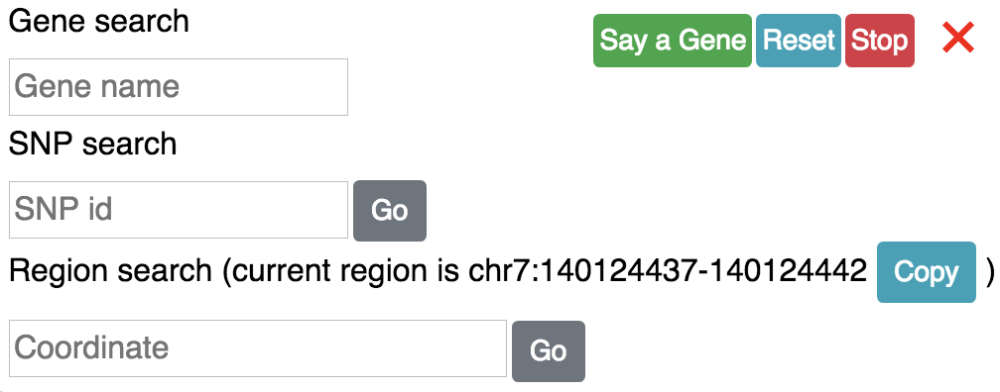

say you input a SNP id: rs1259546924, click the Go button, you will get information about this SNP:

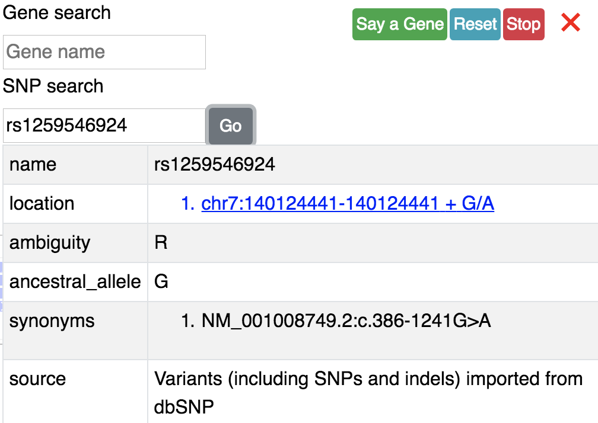

Click the blue postion link can navigate you to this SNP's position:

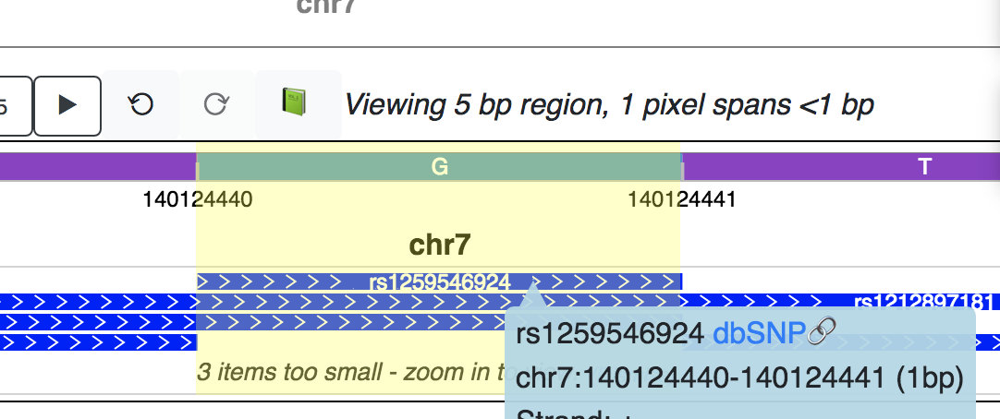

.. note:: SNP search uses the Ensembl API services: https://rest.ensembl.org

Region Search
~~~~~~~~~~~~~

Below the gene search box you can use the region search box to navigate to specific genomic coordinates. Formats such as
``chr6:52258852-52260880`` or ``chr6 52258852 52260880`` are accepted (the browser is not sensitive to the number of spaces or tabs between the `chr`, `start`, and `stop`.

.. image:: _static/coord_search.png

Operations in the Tracks View Container
---------------------------------------

.. image:: _static/tools.png

Right above the tracks on the left hand side there are a bunch of tools for operating on the tracks. From left to right these include the
move, re-order, zoom, undo, redo, and history tools.

Move/Re-order/Zoom tools
~~~~~~~~~~~~~~~~~~~~~~~~

The |movetool| is the default tool selected by the browser. ``Moving``
mode allows the user to drag the mouse right or left and the tracks will move along mouse moving to new regions. The |reordertool| allows
tracks to be ``re-ordered``. The user can drag one or more tracks up or down to change the order of tracks. The |zoomtool|
allows the user to ``zoom in`` on a specific region within the current view using the mouse.

.. |movetool| image:: _static/move_tool.png
.. |reordertool| image:: _static/reorder_tool.png
.. |zoomtool| image:: _static/zoom_tool.png

Undo/Redo/History tools
~~~~~~~~~~~~~~~~~~~~~~~

|historytool| contains the ``Undo``, ``Redo``, and ``History`` tools. For instance if you accidently moved
to another region and forgot what you were looking at before you can click the ``Undo`` button to go back. Clicking the ``Redo`` button allows you to go forward to the step before you clicked ``Undo``. The ``History`` button gives you the 9 most recent
operations and allows you to jump to any of these operations or clear the history.

.. |historytool| image:: _static/history_tool.png

.. image:: _static/view_history.png

Hotkeys
~~~~~~~

#. ``Alt + H`` or ``Alt + D`` for the Drag Tool
#. ``Alt + S`` or ``Alt + R`` for the Reorder/Swap Tool
#. ``Alt + M`` for the Magnify Tool
#. ``Alt + Z`` and ``Alt + X`` to pan one full panel left or right.

Settings
--------

The ``Settings`` menu controls global settings for the browser.

Toggle display of the Genome Navigator
~~~~~~~~~~~~~~~~~~~~~~~~~~~~~~~~~~~~~~

By using the genome navigator (below) users can jump to any genomic region
or chromosome(s).

.. image:: _static/genome_navigator.png

The operations on the genome navigator are:

* Left mouse drag: select
* Right mouse drag: pan
* Mousewheel: zoom

The genome navigator can also be hidden to save space
when viewing tracks. Click ``Settings`` on the top menu and uncheck the box to switch off this feature:

.. image:: _static/show_genome_nav.png

Toggle highlighting of enter region
~~~~~~~~~~~~~~~~~~~~~~~~~~~~~~~~~~~

When a user jumps to a region or gene using the Genomic Region Locator, that region or gene
is highlighted with a light yellow box.

.. image:: _static/highlight.png

This highlighting can be turned off/on by clicking the botton on the ``Settings`` menu:

.. image:: _static/show_highlight.png

Change track label width
~~~~~~~~~~~~~~~~~~~~~~~~

The default width of track labels (below) is 120 pixels.

.. image:: _static/label_width.png

The width of the track label can be configured by the submenu under the ``Settings`` menu:

.. image:: _static/change_label_width.png

Toggle display of VR mode
~~~~~~~~~~~~~~~~~~~~~~~~~

From the ``Settings`` menu the user can choose to toggle the VR display mode
of tracks:

.. image:: _static/show_vr.png

After choose the **Show 3D scene** submenu, a new container with VR view of the tracks will appear:

.. image:: _static/vr.png

You can click the |vricon| icon at the bottom right to toggle the full screen display of VR mode, then you can
use your mouse and keys ``W``, ``A``, ``S`` and ``D`` to control the view of VR mode, like this view below
can show you the interaction between two genomic loci and methylation status along this region in a 3D way.

.. |vricon| image:: _static/vr_icon.png

.. image:: _static/vr2.png

Apps
----

Region set view
~~~~~~~~~~~~~~~

Users can submit a list of regions or genes to the browser, by choose ``Apps`` -> ``Region set view``:

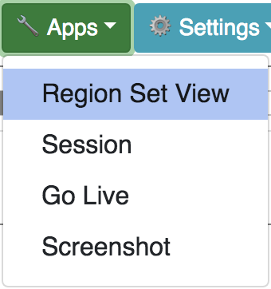

The brings up the region set user interface, here you can enter a list of gene names or coordinates
to make a gene set one item per line.
Gene names and coordinates can be mixed for input.
Coordinate string must be in the form of "chr1:345-678" fields can be joined by space/tab/comma/colon/hyphen.

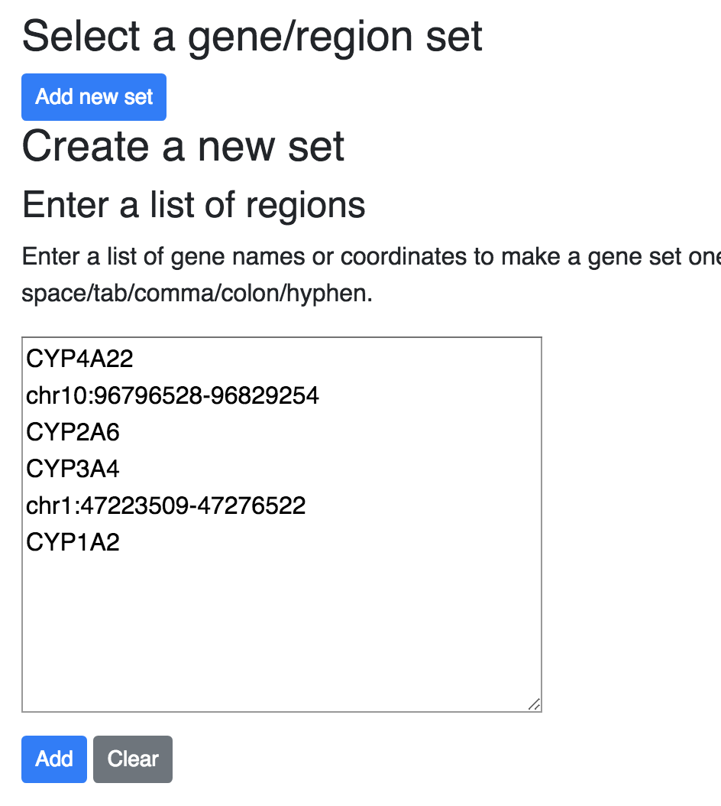

After Click the *Add* button, will bring you to the region set editting interface, you can either add region one
by one, or delete regions from the table, and set the flanking region strategy:

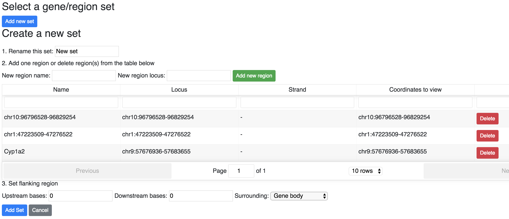

Once you done with edit the set, cick the button *Add set*.
Now you have the option to enter regin set view, click the button *Enter region set view*:

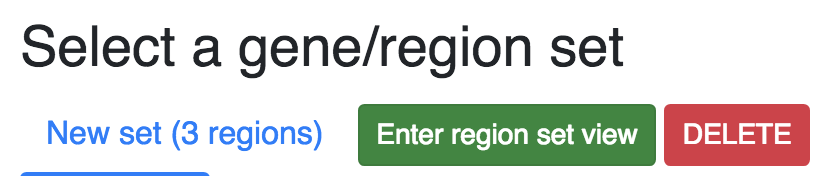

This indicates you are in *region set view* mode and which set you are viewing:

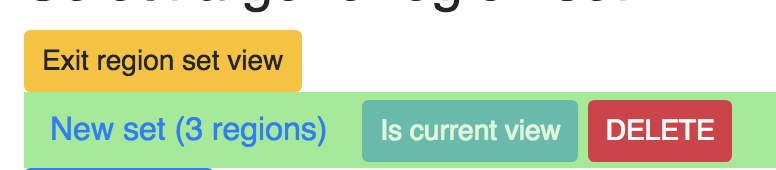

Go back to the browser, you can your browser view is ordered by your region set:

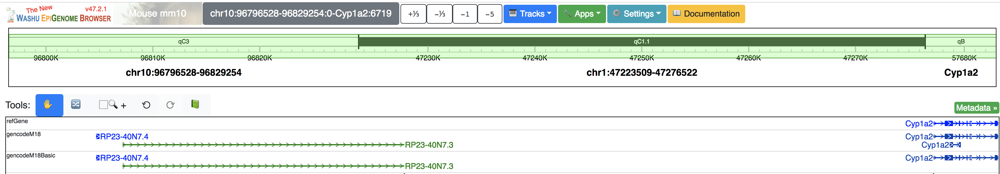

Geneplot
~~~~~~~~

**Geneplot** function allows users to see overall signal of a numerical track over user selected
gene/region sets. Choose ``Geneplot`` from the ``Apps`` menu, if there is no region sets added before,
the browser will bring the region set adding interface:

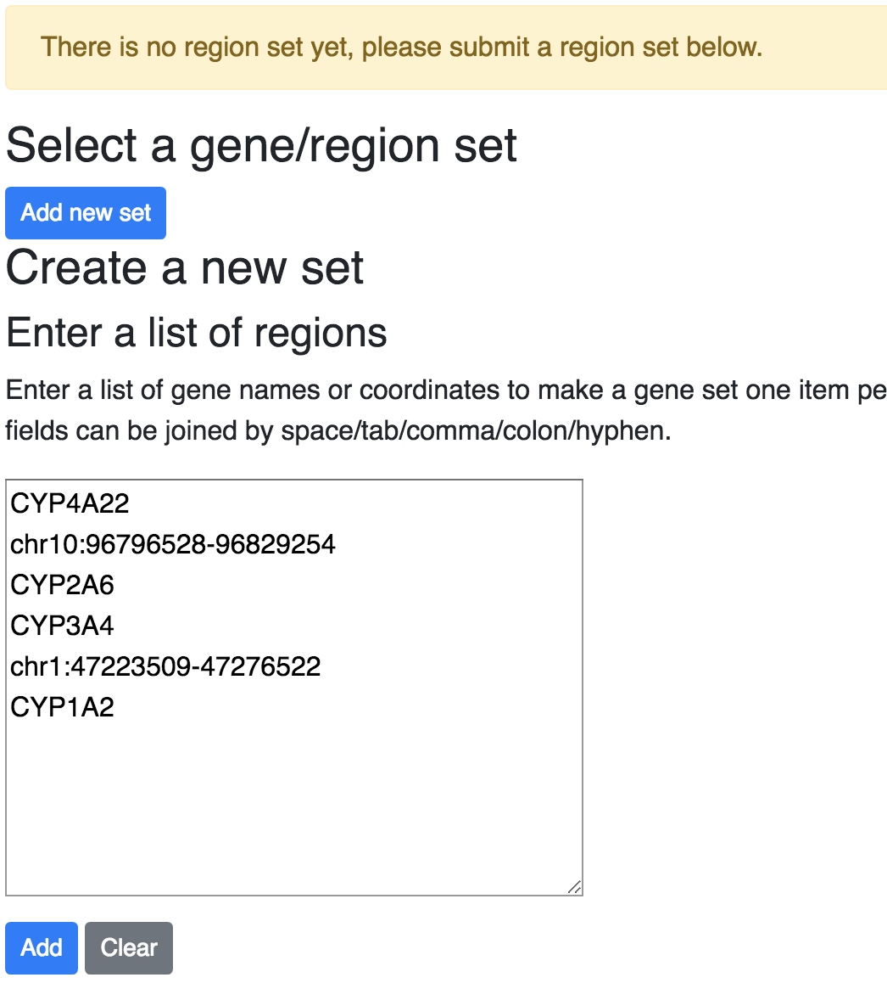

After adding a region set, you can choose the available set from the dropdown in first step:

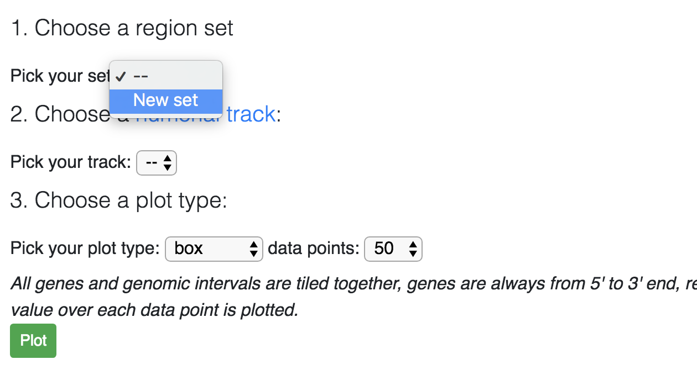

Now you need to choose a numerical track, you can use your custom track or publicly avaiable tracks:

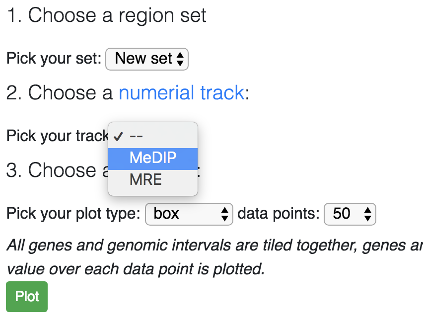

After choose a numerical track, click the **Plot** button, this will generate the boxplot by default:

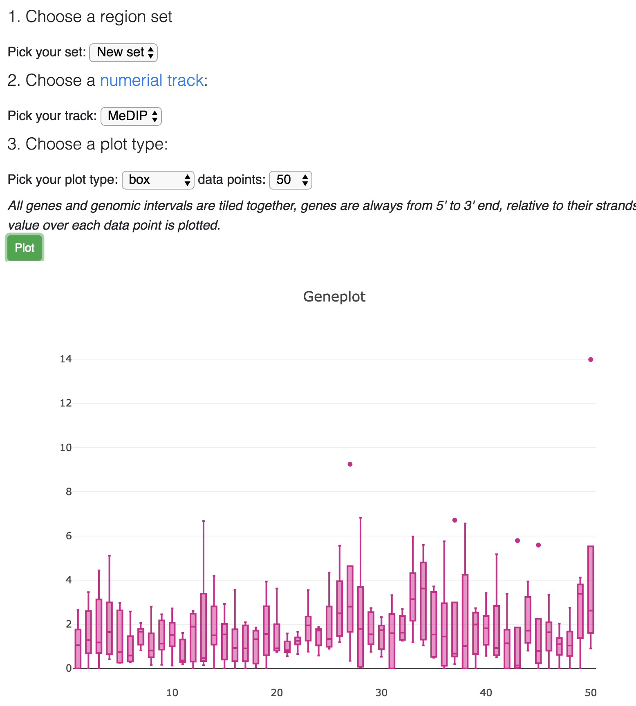

Choose line plot:

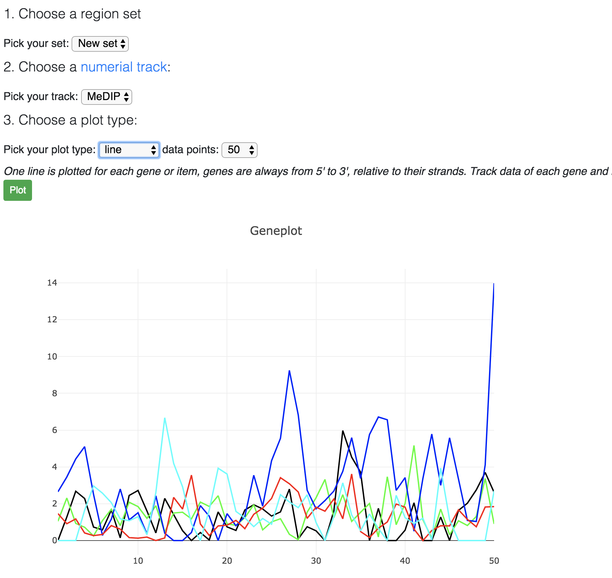

Choose heatmap:

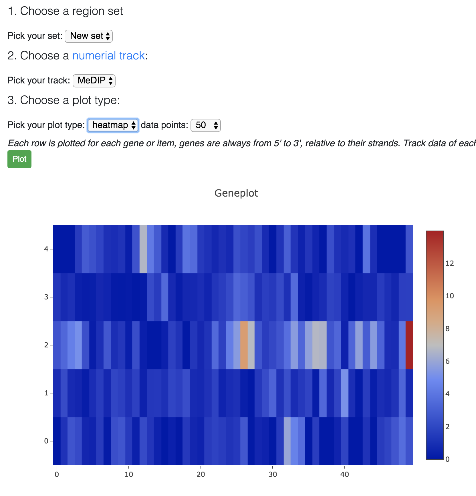

When you mouse over the plot, there is a button for you to download the plot as SVG file:

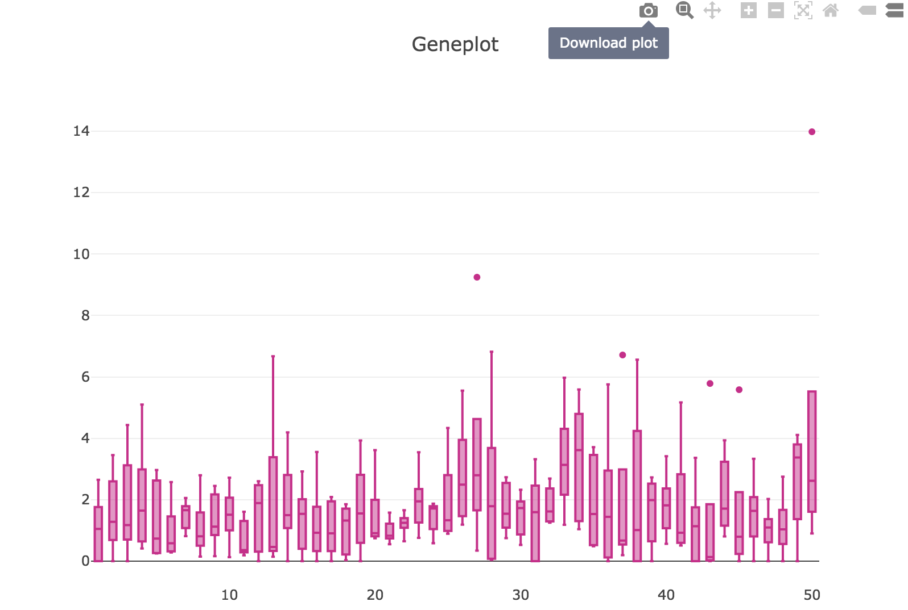

Session
~~~~~~~

Choosing ``Session`` from the ``Apps`` menu will bring you to the session interface
shown below:

.. image:: _static/session.png

Save session
^^^^^^^^^^^^

Click the **Save session** button to save a session. A session
bundle Id will be created which allows the user to retrieve their session at a later date.

.. image:: _static/save_session.png

Retrieve session
^^^^^^^^^^^^^^^^

The **session bundle Id** can be used later to retrieve a session by pasting the session
bundle id in the session interface and clicking the ``Retrieve session`` button.

.. image:: _static/retrieve_session.png

Choose which session status you want to restore:

.. image:: _static/restore_session.png

Click the green *Restore* button and your session will be restored:

.. image:: _static/session_restored.png

Download and Upload session
^^^^^^^^^^^^^^^^^^^^^^^^^^^

Sessions can be downloaded to a json file to your local disk, or can be uploaded from your local drive as well.

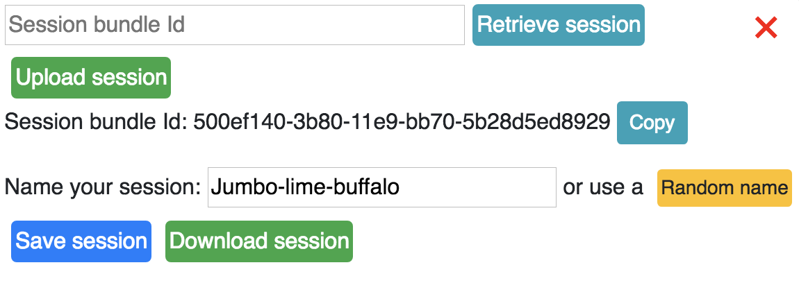

.. note:: The downloaded session file can be put in a URL, then use ``sessionFile`` parameter for fast retrieve
            the session, like ``http://epigenomegateway.wustl.edu/browser/?sessionFile=https://wangftp.wustl.edu/~dli/test/eg-session--1692c5f0-c392-11e9-829c-912864922e1e.json``

Live browsing
~~~~~~~~~~~~~

From the ``Apps`` menu choose **Go Live**, the browser will navigate you to a new
link which you can share with someone else, like your collaborator, your PI,
or your friends. Whatever operations are done by you are mirrored on the displays of the people who opened the same link.

.. image:: _static/live.png

Screenshot
~~~~~~~~~~

Users can create publication quality images using the *Screenshot*  tool from the ``Apps`` menu.
Click the *Screenshot* button and a new window will po pup that re-renders all your
tracks as a new SVG file. Once rendered you can click the green download button to save the
current browser view as a SVG image file.

.. image:: _static/screenshot.png

Fetch Sequence
~~~~~~~~~~~~~~

From the ``Apps`` menu choose **Fetch Sequence**,, this function allows user to retrieve genomic sequence of current view region, or users can also specified a list of regions
to fetch the sequences. Each region should no longer than 10KB.

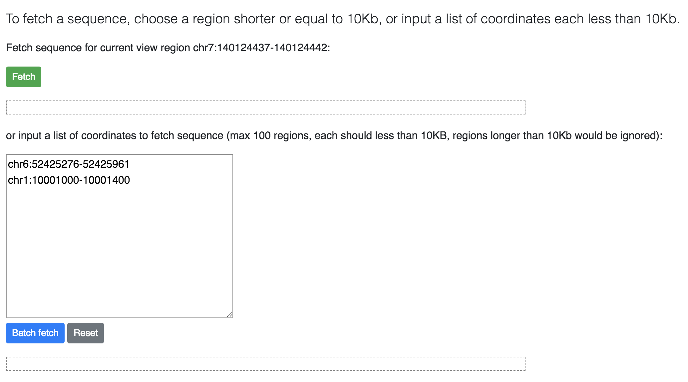

Click the **Fetch** or **Batch fetch** button to fetch the sequence. Click the **Copy** button can copy the fetched sequence
to your clipboard.

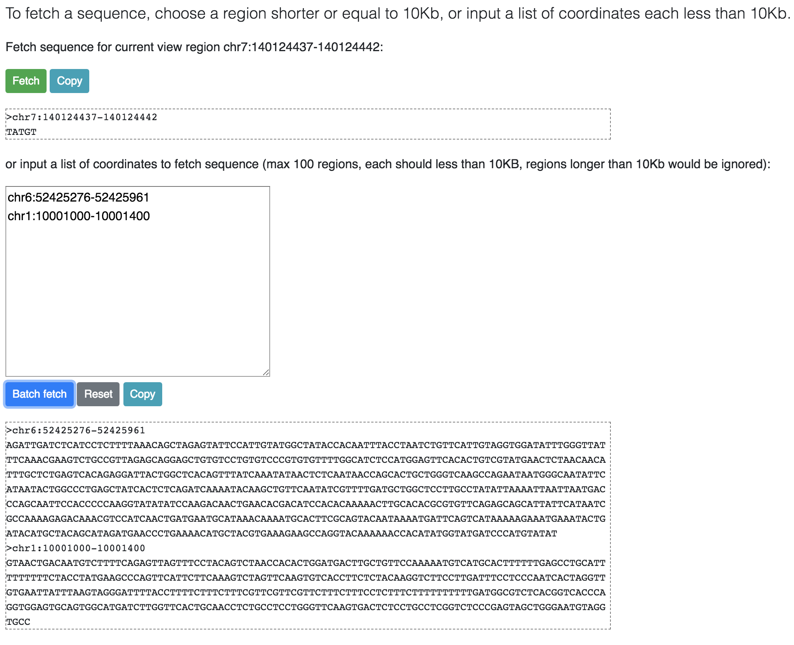

Track management
----------------

The browser collects data from large corsortia like Roadmap Epigenomics, ENCODE,
4DN, TaRGET, etc. The data are called public data/tracks and are organized into different
collections called hubs. Along with these public hubs and tracks users can submit
their own custom tracks and data hubs to allow for easy comparison.

Add tracks from public hubs
~~~~~~~~~~~~~~~~~~~~~~~~~~~

From the ``Tracks`` menu choose **Public Data Hubs**. This will display all of the public data hubbs available for the species and build you are currently working in. For example, using mouse mm10 annotation the *4D Nucleome Network* hub is available. Click the *Add* button to load this hub:

.. image:: _static/mm10_4dn.png

After a hub is added, a ``facet table`` containing all tracks will pop up. This allows you to choose
any tracks you are interested in. The ``facet table`` can also be revisted through the menu when you choose **Track Facet Table**:

.. image:: _static/mm10_4dn_facet.png

You can expand the row and/or column selection by clicking the ``+`` buttons. Row and column displays can also be easily swapped:

.. image:: _static/mm10_4dn_facet2.png

Clicking a cell within the facet table will pop up a new window containing a table with the tacks that match the row and column selections: 

.. image:: _static/mm10_4dn_track.png

Click the *Add* button to add the track(s) you want. You can then view tracks in the browser view window:

.. image:: _static/mm10_4dn_track_added.png

Adding annotation tracks
~~~~~~~~~~~~~~~~~~~~~~~~

Users can add numerous annotation tracks from the ``Tracks`` menu by choosing **Annotation Tracks**. 

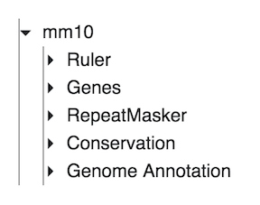

Each header can be expanded to one or more submenus that display tracks that can be added to the browser. The tracks include CpG island information, repeat information, G/C content information, and conservation information to name a few.

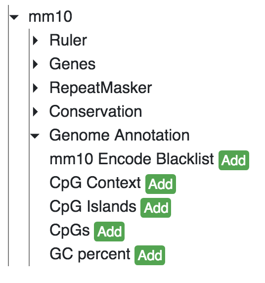

Adding a custom track or data hub
~~~~~~~~~~~~~~~~~~~~~~~~~~~~~~~~~

Users can also submit their own track as a custom track. For example, say we have a bigWig track located at
https://vizhub.wustl.edu/public/tmp/TW463_20-5-bonemarrow_MeDIP.bigWig . From the ``Tracks`` menu choose
**Custom tracks** and a custom track interface will pop up. Fill in the track type, label, and URL before clicking
the green *Submit* button:

.. image:: _static/custom_track.png

You can see the track is added:

.. image:: _static/custom_track_added.png

Adding a custom data hub is similar to the steps above. For example, say you have a hub located at https://vizhub.wustl.edu/public/tmp/a.json . From the ``Tracks`` menu choose **Custom tracks**, switch to the *Add custom data hub* tab, paste the URL of your hub, and then click the green *Load From URL* button. 
from URL.

.. image:: _static/custom_hub.png

The tracks within the custom hub can then be added from the generated facet table.

.. note:: Tracks from custom hubs are hidden by default as users may submit a hub contains hundreds 
          of tracks. Users should add tracks that they want from the facet table.

You can also load a local data hub file in JSON format from your computer using the *file upload* interface, right below the *URL submit* hub interface.

Also see the :doc:`tracks` and :doc:`datahub` sections for how to prepare your tracks and datahub files.

Track Customization
-------------------

Tracks can be customized in a multitude of manners. 

Selecting Tracks
~~~~~~~~~~~~~~~~

An indivdual track can be selected by simply right clicking on the tracking on the track. Multiple tracks can be selected by either holding the *shift* button and left clicking on each track or by holding shift and left clicking on a shared metadata term of consecutive tracks. In this manner, multiple tracks can be customized or moved at the same time. To deselect the tracks simply right click and press the button ``Deselect # tracks`` .

Track Color
~~~~~~~~~~~

Right clicking on ``annotation`` and ``numerical`` tracks will display ``Primary Color``, ``Secondary Color``, and ``Background Color`` which can all be customized using the color picker. For ``methylC`` tracks and ``categorical`` tracks the ``Color`` and ``Background`` of each class of elements (e.g. CG, CHG, and CHH) can be personalized. Additionally, for ``methylC``tracks the ``Read depth line color`` can be customized. 

Track Height
~~~~~~~~~~~~

For each track the height can be customized by right clicking on the track and typing in a number to the panel. At 20 pixels and below for ``numerical`` tracks the track will display as a heatmap. 

Track Display Mode
~~~~~~~~~~~~~~~~~~

For each ``numerical``, ``annotation``, or ``BAM`` track the display can be changed to ``DENSITY`` or ``FULL`` mode by right clicking on the track. 

Track Y-axis Scale
~~~~~~~~~~~~~~~~~~

For each ``numerical`` track the y-axis can be displayed in ``AUTO`` or ``FIXED`` mode by right clicking on the track. The ``AUTO`` mode will scale the axis based on numerical values in the immediate area of the view range. The ``FIXED`` mode allows the user to select ``a Y-Axis min`` or ``Y-axis max``. For values above the set max the ``Primary color above max`` can be set for easy viewing. For values below the set minimum the ``Primary color below min`` can bet set.  

Track Information
~~~~~~~~~~~~~~~~~

If ``details`` were specified for a track in the data hub file these can be viewed by right clicking on the sample and clicking on the arrow to the right. An easy access ``copy`` but is also available to copy the ``URL`` for the track.

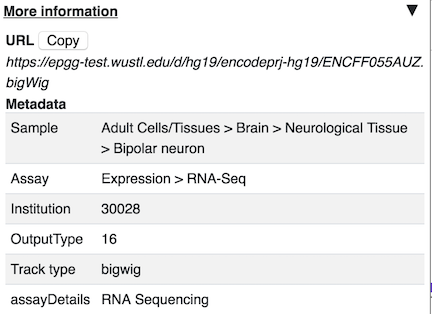

Circlet view for chromatin interaction tracks
---------------------------------------------

For any chromatin interaction track type (:ref:`HiC`, :ref:`longrange`, :ref:`bigInteract`), when you right click the track, you can see the ``Circlet view`` button:

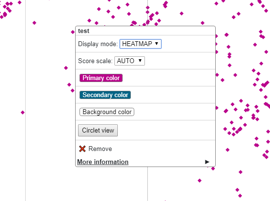

Click the button will bring you to the **Circlet view** interface. 
You can config the layout and/or the data source:

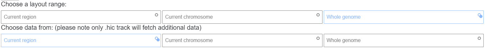

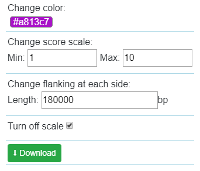

And config the color, scale, flanking region length at each end of one interaction. You also can download the view as a SVG file used for publication.

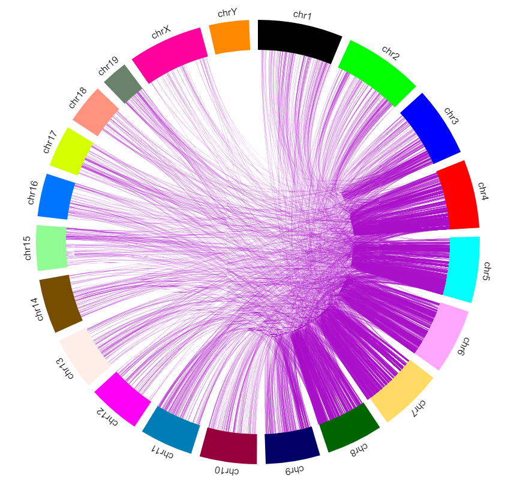

Offline mode
------------

In case your device goes offline (no WIFI or network is down), the use can still use the local track and local text track function. A notice will show as below to indicate
user's device is currently offline.

 .. image:: _static/offline.png

New version notice
------------------

Whenever there is a new version, a notification will show if user still use the old version.

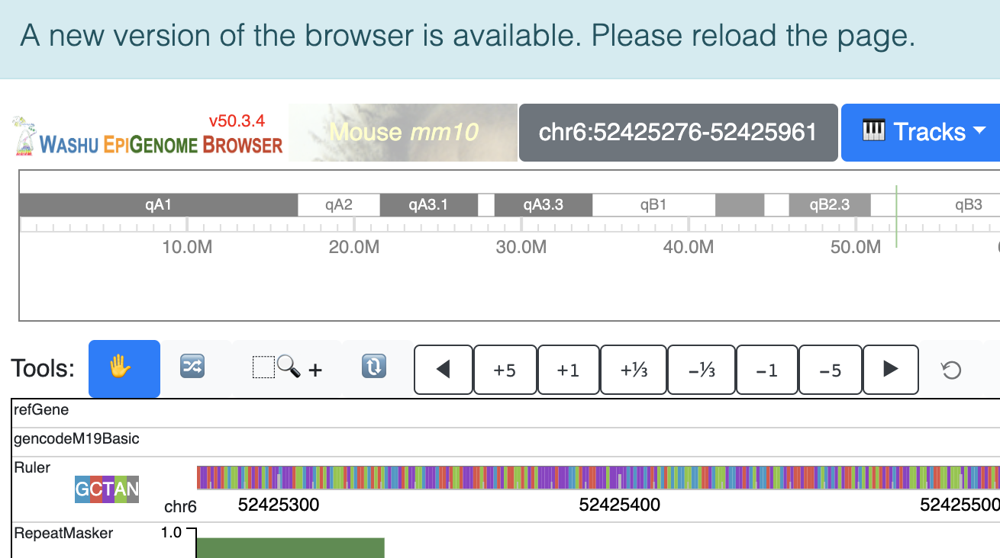
